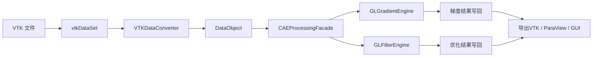
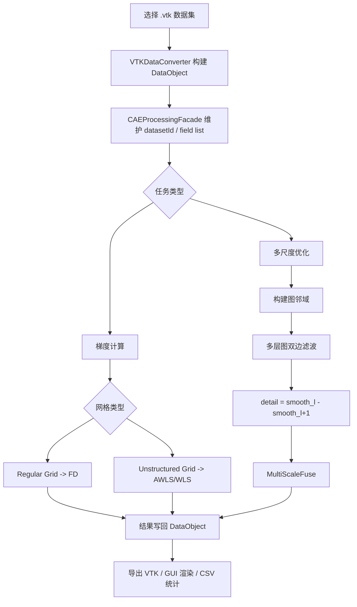
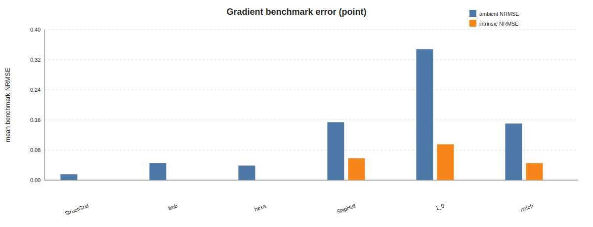
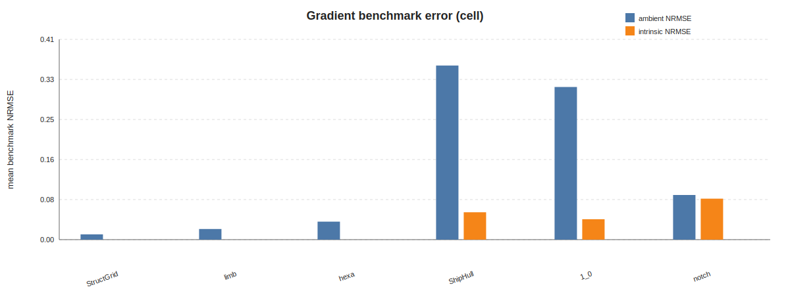
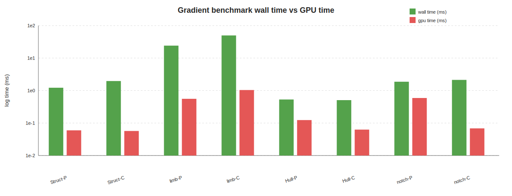
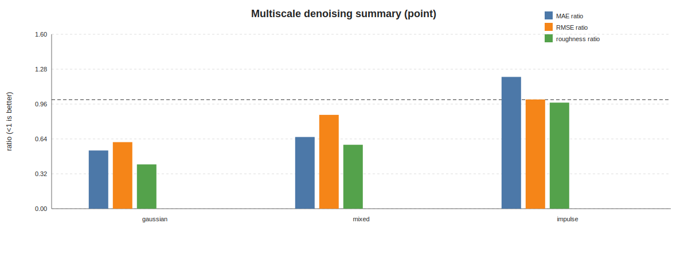
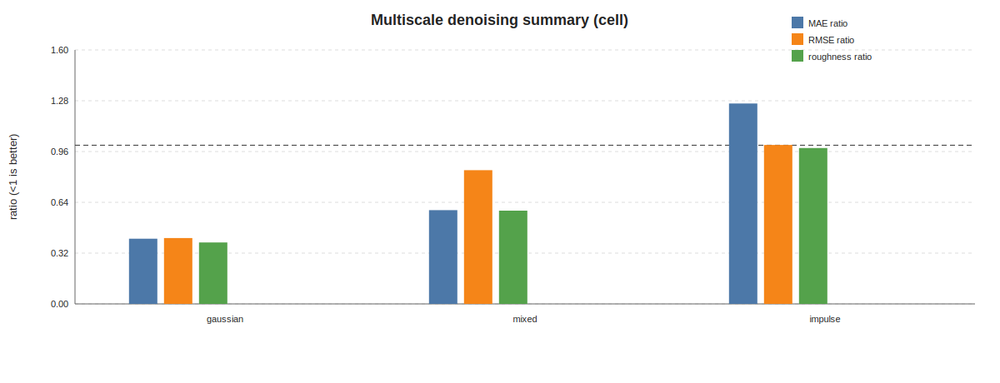

# 毕设教师汇报文档（OpenGLDP）

更新时间：`2026-04-21`

适用场景：中期检查、阶段性汇报、答辩前预演

数据来源：

- 项目代码与已有设计文档
- `results/gradient/*.csv` 梯度实验结果
- `results/mul/*.csv` 多尺度实验结果
- 2026-04-21 检索到的相关论文与官方技术文档

---

## 1. 课题目标与当前定位

本项目的目标是面向 CAE/VTK 后处理数据，构建一个统一的 GPU 计算原型系统，完成两类核心任务：

1. 网格字段梯度计算
2. 数据平滑、细节提取与多尺度融合优化

从当前实现情况看，系统已经完成了：

1. `VTK -> 内部数据结构 -> GPU计算 -> 结果回写 -> VTK导出` 的完整闭环
2. 规则网格梯度计算主线
3. 非结构网格加权最小二乘梯度计算主线
4. 图双边滤波与多尺度融合主线
5. Qt + VTK 图形界面和两套实验程序

因此向老师汇报时，可以把项目定位为：

> 一个面向 CAE 后处理的 OpenGL 并行原型系统。规则网格梯度计算部分较成熟，非结构网格 AWLS 与多尺度优化部分已经完成可运行原型，并通过实验明确了其适用边界、存在问题和后续改进方向。

---

## 2. 系统结构

### 2.1 总体架构



### 2.2 核心模块划分

| 模块 | 代表文件 | 主要职责 |
| --- | --- | --- |
| 输入与界面层 | `app/main.cpp`、`app/MainWindow.cpp` | 加载数据、参数输入、日志输出、VTK渲染 |
| 门面调度层 | `CAEProcessingFacade.*` | 统一管理数据集、方法分派、计时、结果写回 |
| 数据转换层 | `VTKDataConverter.*` | `vtkDataSet` 与内部 `DataObject` 的双向转换 |
| 数据模型层 | `DataObject.*` | 统一存储点、单元、邻域图、字段数组 |
| GPU梯度层 | `GLGradientEngine.*` + `shaders/FD.glsl` + `shaders/WLS.glsl` + `shaders/AdaptiveWLS.glsl` | 规则网格 FD 与非结构网格 WLS/AWLS |
| GPU优化层 | `GLFilterEngine.*` + `shaders/Bilateral.glsl` + `shaders/MultiScaleFuse.glsl` | 图双边滤波、多尺度分解与融合 |
| 实验层 | `TestGradient.cpp`、`TestMultiScale.cpp` | 正确性验证、性能统计、CSV输出 |

### 2.3 功能流程



### 2.4 代码层面的主入口

`CAEProcessingFacade` 是整个系统的统一入口。其作用相当于“总控服务层”，负责：

1. 初始化独立的 OpenGL 计算上下文
2. 管理数据集、字段与结果数组
3. 依据网格类型自动选择算法
4. 汇总 CPU/GPU 计时信息
5. 将结果重新导出给 GUI 或 ParaView

---

## 3. 核心算法原理

## 3.1 规则网格梯度：有限差分 + 坐标映射

对于规则网格，系统采用有限差分法。核心思想是：先在参数空间方向上做差分，再通过 Jacobian 逆矩阵映射到物理空间。

若局部参数坐标为 $(\xi,\eta,\zeta)$，则有：

$$
\nabla \phi =
\begin{bmatrix}
\frac{\partial \xi}{\partial x} & \frac{\partial \eta}{\partial x} & \frac{\partial \zeta}{\partial x} \\
\frac{\partial \xi}{\partial y} & \frac{\partial \eta}{\partial y} & \frac{\partial \zeta}{\partial y} \\
\frac{\partial \xi}{\partial z} & \frac{\partial \eta}{\partial z} & \frac{\partial \zeta}{\partial z}
\end{bmatrix}
\begin{bmatrix}
\frac{\partial \phi}{\partial \xi} \\
\frac{\partial \phi}{\partial \eta} \\
\frac{\partial \phi}{\partial \zeta}
\end{bmatrix}
$$

在内部点处采用中心差分，在边界处退化为单边差分。

项目中的方法分派代码如下：

```cpp
CAEGradientMethod method = req.method;
if (method == CAEGradientMethod::Auto) {
    method = (rec.data.gridType == DATA_OBJECT_TYPE_RegularGrid)
        ? CAEGradientMethod::FiniteDifference
        : CAEGradientMethod::AdaptiveWeightedLeastSquares;
}

if (method == CAEGradientMethod::FiniteDifference) {
    ok = computeByFD(rec, *src, grad);
} else {
    ok = computeByAdaptiveWLS(rec, *src, req, grad);
}
```

`FD.glsl` 中真正完成“差分 + 链式法则映射”的核心代码如下：

```glsl
float dXi   = (uDims.x>1u)? (fXi  * (loadV(ip,c)-loadV(im,c))) : 0.0;
float dEta  = (uDims.y>1u)? (fEta * (loadV(jp,c)-loadV(jm,c))) : 0.0;
float dZeta = (uDims.z>1u)? (fZeta* (loadV(kp,c)-loadV(km,c))) : 0.0;

float gx = xix*dXi + etax*dEta + zetax*dZeta;
float gy = xiy*dXi + etay*dEta + zetay*dZeta;
float gz = xiz*dXi + etaz*dEta + zetaz*dZeta;
```

这一部分的特点是：

1. 规则网格上邻接关系明确，数值稳定
2. 输出梯度分量数恒为 `3 × 输入分量数`
3. 是当前系统中精度和稳定性都最成熟的部分

## 3.2 非结构网格梯度：加权最小二乘 WLS / AWLS

对于非结构网格，系统采用加权最小二乘梯度重构。其基本假设为：在样本 $i$ 的局部邻域内，标量场可近似为一阶线性函数。

对邻域点 $j \in N(i)$，有：

$$
\phi_j - \phi_i \approx \nabla \phi_i \cdot (\mathbf{x}_j - \mathbf{x}_i)
$$

于是可建立目标函数：

$$
\min_{\mathbf{g}_i}
\sum_{j \in N(i)} w_{ij}
\left[
(\phi_j - \phi_i) - \mathbf{g}_i \cdot (\mathbf{x}_j - \mathbf{x}_i)
\right]^2
$$

其中距离权重采用：

$$
w_{ij} = \frac{1}{\|\mathbf{x}_j - \mathbf{x}_i\|^p}
$$

加入正则项后，等价的法方程写作：

$$
\left(\sum_j w_{ij} \mathbf{r}_{ij}\mathbf{r}_{ij}^T + \lambda I\right)\mathbf{g}_i
=
\sum_j w_{ij}(\phi_j-\phi_i)\mathbf{r}_{ij}
$$

其中 $\mathbf{r}_{ij} = \mathbf{x}_j-\mathbf{x}_i$。

### 3.2.1 AWLS 的自适应思想

与普通 3D WLS 相比，项目中的 AWLS 又加入了三项增强：

1. 自适应邻域扩展
2. 局部维度识别
3. 局部正则强度调节

系统先对邻域做局部协方差分析，得到主方向框架 $(e_1,e_2,e_3)$ 与局部维度标签 `dimTag`：

- `dim=1`：线状局部结构
- `dim=2`：面状/壳体局部结构
- `dim=3`：体状局部结构

当局部是曲面型结构时，系统只在切平面 $(e_1,e_2)$ 中做拟合，从而避免法向方向上“虚假的三维梯度”干扰。

二维切空间重构可写作：

$$
\mathbf{g}_i = \alpha e_1 + \beta e_2
$$

其中 $(\alpha,\beta)$ 由二维最小二乘方程求得。

`AdaptiveWLS.glsl` 中的核心分支逻辑如下：

```glsl
uint dim = (uEnableAdaptiveDimension != 0) ? clamp(dimTag[i], 1u, 3u) : 3u;

if (dim == 1u) {
    // 仅沿主方向 e1 拟合
} else if (dim == 2u) {
    // 仅在切平面 (e1, e2) 上拟合
} else {
    // 回退到完整 3D WLS
}
```

### 3.2.2 设计动机

这一设计直接针对非结构网格上的两个难点：

1. 邻域分布不均匀导致法方程病态
2. 曲面/壳体数据如果直接按三维体数据求梯度，会把法向误差也算进去

因此 AWLS 不是简单“比 WLS 多几个参数”，而是把“局部几何维度”显式纳入了梯度求解过程。

## 3.3 图双边滤波与多尺度融合

数据优化模块先在点图或单元图上执行图双边滤波。对样本 $i$，输出值为：

$$
\tilde f_i =
\frac{\sum_{j \in N(i)\cup\{i\}} w^s_{ij} w^r_{ij} f_j}
{\sum_{j \in N(i)\cup\{i\}} w^s_{ij} w^r_{ij}}
$$

其中：

$$
w^s_{ij} = \exp\left(-\frac{\|\mathbf{x}_j-\mathbf{x}_i\|^2}{2\sigma_s^2}\right),
\quad
w^r_{ij} = \exp\left(-\frac{(f_j-f_i)^2}{2\sigma_r^2}\right)
$$

对应的 shader 核心代码如下：

```glsl
float wSpatial = exp(-0.5 * dist2 / sigmaS2);
float wRange = exp(-0.5 * (dv * dv) / sigmaR2);
float w = wSpatial * wRange;

sumW += w;
sumV += w * getVal(j, c);
```

多尺度分解采用逐层平滑方式构造尺度空间：

$$
s_0 = f,\quad s_{l+1} = \mathcal{B}(s_l)
$$

细节层定义为：

$$
d_l = s_l - s_{l+1}
$$

最终融合结果写为：

$$
f_{\text{fused}} = b + \sum_{l=0}^{L-1} w_l d_l
$$

其中 $b = s_L$ 是最深层平滑基底。项目中的 `MultiScaleFuse.glsl` 又把权重进一步写成与局部特征强度相关的自适应形式：

```glsl
float feature = m0 + m1 + m2;
float atten = feature / (feature + max(uEdgeSigma, 1e-8));

float w0 = atten * (m0 / sumM) * uDetailGains.x;
float w1 = atten * (m1 / sumM) * uDetailGains.y;
float w2 = atten * (m2 / sumM) * uDetailGains.z;

outVal[idx] = base + w0 * d0 + w1 * d1 + w2 * d2;
```

这意味着：

1. 平坦区域更靠近 `base`
2. 特征区域允许加回更多 `detail`
3. 三层细节的贡献随局部幅值自适应分配

## 3.4 GPU 实现特点

项目底层采用 OpenGL Compute Shader + SSBO 实现并行计算，其执行模式为：

1. CPU 构建 `DataObject`、邻域图、支撑信息
2. 通过 SSBO 将位置、邻域、字段值上传到 GPU
3. Compute Shader 按样本并行求解
4. 通过 `glGetBufferSubData` 将结果回读到 CPU

这种实现方式的优点是：

1. 不依赖 CUDA，跨平台更友好
2. 方便与现有 Qt + VTK 渲染链路整合
3. 对中等规模网格有较好的并行性

但缺点也很明显：CPU 预处理与读回成本仍然较大，这一点在实验部分会直接体现出来。

---

## 4. 实验设计

## 4.1 实验程序

项目当前主要依赖两套实验程序：

1. `TestGradient.cpp`
   负责梯度正确性、误差统计和性能对比
2. `TestMultiScale.cpp`
   负责多尺度优化效果与鲁棒性分析

## 4.2 梯度实验设计

梯度实验共整理了 `107` 条记录，全部执行成功。

实验数据集覆盖：

- 规则网格：`SampleStructGrid`
- 体网格：`limb`、`hexa`
- 曲面/壳体网格：`ShipHull_0`、`1_0`
- 真实应力场：`notch_stress`

实验分为两类：

1. 解析 benchmark 场
   - `benchmark_linear`
   - `benchmark_quadratic`
   - `benchmark_trig`
   - `benchmark_cubic`
   - 向量场版本 `benchmark_vec_*`
2. 真实字段与 VTK 基线对照
   - `RF`
   - `S_Mises`
   - `Nodal Stress`
   - `chem_0` 等

主要指标包括：

- `ambient_nrmse`
- `intrinsic_nrmse`
- `ambient_angle_mean_deg`
- `gl_wall_avg_ms`
- `gl_gpu_avg_ms`

其中：

- `ambient` 表示与三维环境梯度口径比较
- `intrinsic` 表示与切空间内蕴梯度口径比较

### 4.2.1 梯度测试场分别是干什么的

#### 解析 benchmark 场

这些字段不是原始数据自带的，而是程序在加载数据后按几何坐标自动生成的“可控测试场”，并同时生成对应的精确梯度 `*_exact_grad` 作为真值参考。

| 测试场 | 作用 | 如何得到 |
| --- | --- | --- |
| `benchmark_linear` | 检查线性精确性。若线性场都不能较好恢复，说明梯度重构主线有根本问题。 | 按归一化空间坐标构造线性标量场，并解析求出精确梯度。 |
| `benchmark_quadratic` | 检查一般平滑曲率场上的精度。 | 按二次多项式构造标量场，并解析求导。 |
| `benchmark_trig` | 检查振荡场、方向变化较快场景下的稳定性。 | 用正弦/余弦组合生成标量场，并解析求导。 |
| `benchmark_cubic` | 检查更高阶变化下的误差增长情况。 | 构造三次多项式标量场，并解析求导。 |
| `benchmark_gaussian` | 检查局部尖峰型平滑场上的重构能力。 | 构造高斯分布型标量场，并解析求导。 |
| `benchmark_vec_linear` | 检查向量场的线性精确性。 | 构造线性向量场，并对每个分量分别解析求梯度。 |
| `benchmark_vec_poly` | 检查一般多项式向量场。 | 构造多项式向量场，并解析求梯度张量。 |
| `benchmark_vec_trig` | 检查振荡型向量场。 | 构造三角向量场，并解析求梯度张量。 |

#### 真实字段

这些字段来自原始 VTK 数据集，用来做工程对照，而不是数学真值验证。

| 真实字段示例 | 来源 | 用途 |
| --- | --- | --- |
| `RF` | `ShipHull_0`、`1_0` 等曲面/壳体数据的原始字段 | 观察真实曲面场与 VTK 工程基线的差异 |
| `S_Mises` | 应力或等效应力类字段 | 用于验证单元场梯度在真实 CAE 数据上的行为 |
| `Nodal Stress` / `Nodal Stress-0` | `notch_stress` 中的点应力字段 | 用于检验真实复杂曲面应力场上的表现 |
| `chem_0` | `limb` 等体数据字段 | 用于观察体网格真实字段与 VTK 的对照结果 |

### 4.2.2 梯度指标分别是什么意思，怎样得到

`TestGradient` 会先得到本系统计算结果，再根据参考来源构造对照：

1. 若存在 `*_exact_grad`，就用解析真值；
2. 若没有解析真值，就调用 `vtkGradientFilter` 生成工程基线；
3. 对 surface-like 且有解析真值的情况，再额外计算一套 intrinsic 指标。

核心指标可按下表理解：

| 指标 | 含义 | 如何得到 | 怎么看 |
| --- | --- | --- | --- |
| `gl_wall_avg_ms` | 总平均耗时 | 多次重复运行后的墙钟时间平均值 | 更接近用户真实感受到的总耗时 |
| `gl_gpu_avg_ms` | 纯 GPU 平均耗时 | OpenGL 时间查询得到 shader 执行时间 | 若远小于 wall，说明 CPU/传输开销大 |
| `ambient_nrmse` | 环境梯度归一化 RMSE | 将本系统结果与解析真值或 VTK 的三维梯度结果比较后归一化 | 适合体网格；曲面上可能偏大 |
| `intrinsic_nrmse` | 内蕴梯度归一化 RMSE | 先把结果和真值都投影到切空间，再计算归一化 RMSE | 更适合曲面/壳体数据 |
| `ambient_angle_mean_deg` | 环境梯度平均方向误差 | 对 3D 梯度向量计算夹角后取平均 | 能区分“方向不对”还是“只是幅值偏了” |
| `intrinsic_angle_mean_deg` | 内蕴梯度平均方向误差 | 在切空间投影后计算夹角平均值 | 曲面数据更有解释力 |
| `ambient_nonfinite_vecs` | 环境梯度无效向量数 | 统计比较中出现 NaN/Inf 的向量数量 | 该值大说明数值稳定性有问题 |
| `ambient_scale_bias` | 整体幅值偏差 | 结果梯度模长与参考梯度模长的整体比例 | 接近 1 更理想 |
| `softrel_*` | 稳健相对误差 | 用带稳定阈值的 relative error 统计均值/中位数/P90 | 防止真值很小时普通相对误差失真 |
| `stable_*` | 去掉低真值区域后的指标 | 仅在参考梯度不太小的子集上统计 | 更能反映主结构区域表现 |

如果老师只关心“够不够说明问题”，建议你优先汇报 4 个主指标：

1. `ambient_nrmse`
2. `intrinsic_nrmse`
3. `ambient_angle_mean_deg`
4. `gl_wall_avg_ms / gl_gpu_avg_ms`

## 4.3 多尺度实验设计

多尺度实验共整理了 `24` 条记录，全部执行成功。

数据集为：

- `ShipHull_0` 的点字段与单元字段

干净参考场包括：

- `ms_clean_trig`
- `ms_clean_gaussian`
- `ms_clean_poly`
- `ms_clean_edge`

噪声类型包括：

- `gaussian`
- `mixed`
- `impulse`

主要指标包括：

- `mae_improvement_ratio`
- `rmse_improvement_ratio`
- `roughness_ratio`

这些比值的判读规则是：

- `< 1`：优化后优于输入
- `≈ 1`：效果有限
- `> 1`：优化后变差

### 4.3.1 多尺度测试场分别是干什么的

synthetic 模式下，多尺度实验不是直接拿真实字段加噪，而是先构造 4 类干净标量场，再注入噪声。

| 测试场 | 作用 | 如何得到 |
| --- | --- | --- |
| `ms_clean_trig` | 检查平滑振荡场去噪效果 | 用多组正弦/余弦函数按坐标组合得到 |
| `ms_clean_gaussian` | 检查局部峰值场的平滑能力 | 以几何中心为基准构造高斯型标量场 |
| `ms_clean_poly` | 检查一般多项式变化场 | 用二次项和少量三角项混合构造 |
| `ms_clean_edge` | 检查保边能力 | 用平滑背景 + 一个人工台阶边缘构造 |

对应噪声的来源如下：

| 噪声类型 | 含义 | 如何得到 |
| --- | --- | --- |
| `gaussian` | 高斯噪声 | 在干净场上叠加零均值高斯扰动，标准差为 `sigmaFactor × signalStd` |
| `impulse` | 脉冲噪声 | 以 `impulseRatio` 的概率叠加正/负脉冲，幅值为 `impulseScale × signalStd` |
| `mixed` | 混合噪声 | 同时叠加高斯噪声与脉冲噪声 |

### 4.3.2 多尺度指标分别是什么意思，怎样得到

`TestMultiScale` 的思路是：先比较带噪输入与干净真值，再比较融合结果与干净真值，最后看改善比例。

| 指标 | 含义 | 如何得到 | 怎么看 |
| --- | --- | --- | --- |
| `wall_avg_ms` | 总平均耗时 | 多次重复运行后的总墙钟时间平均值 | 反映实际端到端开销 |
| `gpu_avg_ms` | 纯 GPU 平均耗时 | OpenGL 时间查询得到的双边滤波和融合时间 | 反映 shader 本体耗时 |
| `clean_std` / `input_std` / `fused_std` | 标准差 | 对干净场、带噪场、融合场分别统计标准差 | 看整体波动是否被压得过头 |
| `clean_roughness` / `input_roughness` / `fused_roughness` | 图粗糙度 | 对邻接图上每条边统计两端数值差的绝对值，再取平均 | 越大说明越粗糙，越小说明越平滑 |
| `input_to_fused_mean_abs_delta` | 输入到输出的平均改动幅度 | 对输入场与融合场做逐样本绝对差再取平均 | 太大可能过度改动，太小可能没起作用 |
| `input_mae` / `input_rmse` | 输入相对真值的误差 | 用带噪输入和干净真值做 MAE/RMSE | 表示噪声污染程度 |
| `fused_mae` / `fused_rmse` | 输出相对真值的误差 | 用融合结果和干净真值做 MAE/RMSE | 比输入更小才说明优化有效 |
| `mae_improvement_ratio` | MAE 改善比例 | `fused_mae / input_mae` | `< 1` 表示改善，`> 1` 表示变差 |
| `rmse_improvement_ratio` | RMSE 改善比例 | `fused_rmse / input_rmse` | 对局部大误差更敏感 |
| `roughness_ratio` | 粗糙度比例 | `fused_roughness / input_roughness` | `< 1` 表示更平滑，但太小可能过平滑 |

如果老师只关心多尺度模块是否“起作用”，建议你优先讲 4 个主指标：

1. `mae_improvement_ratio`
2. `rmse_improvement_ratio`
3. `roughness_ratio`
4. `input_to_fused_mean_abs_delta`

需要更详细的指标定义时，可补充说明：项目里还有一份专门的指标解释文档 [测试程序指标详解](./测试程序指标详解.md)。

---

## 5. 实验结果与分析

## 5.1 梯度精度：规则网格与体网格结果较好

下图给出了 benchmark 梯度误差汇总。





从结果可以看出：

1. `SampleStructGrid`
   - point 平均 `ambient_nrmse = 0.0156`
   - cell 平均 `ambient_nrmse = 0.0108`
   - 说明规则网格 FD 主线正确且稳定
2. `limb`
   - point 平均 `ambient_nrmse = 0.0455`
   - cell 平均 `ambient_nrmse = 0.0218`
   - 表明体网格上的 AWLS/WLS 也具备较好的工程可用性
3. `hexa`
   - point/cell 平均 `ambient_nrmse` 都在 `0.04` 左右
   - 说明在较规则的非结构体网格上，当前路线也能正常工作

这一组结果说明：当前系统的“规则网格 + 体网格”主线是成立的，不能把全部问题都归结为“算法整体不可用”。

## 5.2 曲面/壳体数据：内蕴口径明显优于环境口径

曲面数据是本项目最重要的实验结论来源。

代表性结果如下：

| 数据集 | 关联 | ambient NRMSE均值 | intrinsic NRMSE均值 | ambient平均角误差 | 说明 |
| --- | --- | ---: | ---: | ---: | --- |
| ShipHull_0 | POINT | 0.1544 | 0.0584 | 10.31° | 曲面点数据，内蕴口径明显更优 |
| ShipHull_0 | CELL | 0.3573 | 0.0562 | 20.81° | 曲面单元数据，ambient 明显偏大 |
| 1_0 | POINT | 0.3490 | 0.0955 | 23.12° | 薄层/曲面型样本，三维口径误差更明显 |
| 1_0 | CELL | 0.3132 | 0.0419 | 22.47° | cell 上内蕴收益更明显 |
| notch_stress | POINT | 0.1509 | 0.0454 | 8.46° | 真实曲面应力场，需要区分梯度口径 |
| notch_stress | CELL | 0.0916 | 0.0841 | 6.00° | cell 上改善有限，但仍说明口径不同 |

进一步汇总 `48` 个 surface-like benchmark case，可得到：

$$
\text{surface ambient NRMSE mean} = 0.2361
$$

$$
\text{surface intrinsic NRMSE mean} = 0.0636
$$

也就是说，改用内蕴口径后，平均误差约下降到原来的 `26.9%`。

这说明当前非结构网格模块最核心的结论不是“AWLS 算错了”，而是：

> 对曲面/壳体数据，当前系统更接近在求“切空间内蕴梯度”，如果直接拿它和三维环境梯度相比，会放大表面上的误差。

## 5.3 真实字段与 VTK 基线：差异大，但不应简单视为算法完全失效

真实字段中与 VTK 差异最大的几项为：

| 文件 | 字段 | ambient NRMSE | 平均角误差 | 备注 |
| --- | --- | ---: | ---: | --- |
| `notch_stresspoint.csv` | `Nodal Stress-0` | 1.7523 | 73.99° | 曲面数据 |
| `notch_stresspoint.csv` | `Nodal Stress` | 1.4841 | 50.52° | 曲面数据 |
| `ShipHull_0cell.csv` | `S_Mises` | 1.4250 | 35.11° | 曲面数据 |
| `ShipHull_0point.csv` | `RF` | 0.7658 | 41.10° | 曲面数据 |
| `1_0point.csv` | `RF` | 0.6606 | 17.12° | 曲面数据 |
| `limbcell.csv` | `chem_0` | 0.5356 | 29.30° | 体数据 |

这些结果说明：

1. 真实曲面场与 `vtkGradientFilter` 的差异非常大
2. 当前论文或汇报里不能再直接把 “与 VTK 不一致” 等同于 “算法错误”
3. 对曲面问题必须区分：
   - 环境三维梯度
   - 切空间内蕴梯度

### 5.3.1 非结构化网格真实字段与 VTK 梯度对照表

为了便于老师直接查看“本系统”与 `vtkGradientFilter` 在真实非结构化网格上的差异，下面给出汇总表。表中：

- `本系统 wall` 表示端到端总耗时
- `本系统 GPU` 表示纯 shader 执行时间
- `VTK时间` 表示 `vtkGradientFilter` 的平均耗时
- `NRMSE / 平均角误差` 表示本系统结果相对于 VTK 基线的差异

| 数据集 | 关联 | 真实字段 | 本系统 wall(ms) | 本系统 GPU(ms) | VTK时间(ms) | NRMSE | 平均角误差 | 备注 |
| --- | --- | --- | ---: | ---: | ---: | ---: | ---: | --- |
| `hexa` | POINT | `scalars` | 1.553 | 0.210 | 177.266 | 0.0291 | 0.72° | 非结构体网格，对 VTK 很接近 |
| `limb` | CELL | `chem_0` | 4.584 | 0.677 | 61.164 | 0.5356 | 29.30° | 体网格，误差中等，wall 仍明显小于 VTK |
| `1_0` | CELL | `S_Mises` | 3.164 | 0.033 | 2.717 | 0.2731 | 8.48° | 曲面单元场，差异存在但可接受 |
| `1_0` | POINT | `RF` | 10.994 | 0.234 | 6.374 | 0.6606 | 17.12° | 曲面点场，三维环境口径误差明显放大 |
| `ShipHull_0` | CELL | `S_Mises` | 1.659 | 0.037 | 2.269 | 1.4250 | 35.11° | 壳体单元场，与 VTK 差异较大 |
| `ShipHull_0` | POINT | `RF` | 11.584 | 0.201 | 3.406 | 0.7658 | 41.10° | 壳体点场，内蕴梯度口径更合理 |
| `notch_stress` | POINT | `Nodal Stress` | 155.099 | 2.008 | 266.935 | 1.4841 | 50.52° | 真实曲面应力场，VTK 与本系统差异很大 |
| `notch_stress` | POINT | `Nodal Stress-0` | 1.537 | 0.341 | 116.067 | 1.7523 | 73.99° | 单分量应力场，对环境梯度非常敏感 |
| `notch_stress` | POINT | `Nodal Stress-normed` | 1.465 | 0.347 | 115.811 | 无效 | 无效 | `ambient_finite_vecs=0`，比较结果失效 |

这张表更直观地说明了两件事：

1. 对体网格真实字段，本系统与 VTK 的差异通常较小或中等，而且 wall time 常小于 VTK。
2. 对曲面/壳体真实字段，差异会显著增大；这更多反映了“梯度口径不同”和“曲面局部维度效应”，而不是单纯的程序错误。

## 5.4 性能分析：GPU 计算快，但总耗时仍受 CPU 支撑构建与读回影响

下图给出了 benchmark 条件下的 wall time 与纯 GPU time 对比。



主要观察如下：

1. 规则网格和中小规模体网格中，GPU 时间通常在 `0.04 ~ 1 ms` 级
2. 但 wall time 往往是 GPU time 的数十倍到数百倍
3. 典型冷启动 case：
   - `limbcell benchmark_cubic`: `349.198 ms wall` vs `0.591 ms gpu`
   - `limbpoint benchmark_cubic`: `178.491 ms wall` vs `0.322 ms gpu`
   - `hexacell benchmark_cubic`: `69.613 ms wall` vs `0.101 ms gpu`

这说明当前瓶颈不在 shader 本身，而主要在：

1. CPU 端自适应支撑域构建
2. 邻域和辅助信息上传
3. 结果从 GPU 回读到 CPU

也就是说：

> 当前系统的“计算核心”是快的，但“围绕计算核心的准备与回传”仍然过重。

## 5.5 多尺度实验：高斯噪声有效，脉冲噪声基本失效

多尺度 point 与 cell 的实验汇总如下。





汇总后的平均结果如下：

| 关联 | 噪声 | MAE比值均值 | RMSE比值均值 | Roughness比值均值 | 结论 |
| --- | --- | ---: | ---: | ---: | --- |
| POINT | gaussian | 0.5338 | 0.6108 | 0.4065 | 明显改善 |
| POINT | mixed | 0.6580 | 0.8610 | 0.5864 | 有限改善 |
| POINT | impulse | 1.2090 | 1.0017 | 0.9729 | 基本失效或变差 |
| CELL | gaussian | 0.4106 | 0.4148 | 0.3871 | 明显改善 |
| CELL | mixed | 0.5905 | 0.8424 | 0.5876 | 有限改善 |
| CELL | impulse | 1.2629 | 1.0016 | 0.9818 | 基本失效或变差 |

特别值得强调的是：

1. `8` 个 impulse case 全部出现 `MAE > 1`
2. 说明当前图双边滤波 + 细节回灌流程对脉冲噪声不鲁棒
3. 它更适合高斯噪声或混合噪声中的平滑部分，不适合强离群点

## 5.6 数值鲁棒性：仍存在异常输入未被拦截的问题

`notch_stresspoint.csv` 中的 `Nodal Stress-normed` 这一项出现：

- `ambient_finite_vecs = 0`
- `ambient_nonfinite_vecs = 12717`

这说明当前流程对 `NaN/Inf` 或异常归一化输入的预处理还不够，异常值会直接进入梯度评估链路。

---

## 6. 当前存在的问题与原因分析

| 问题 | 现象 | 主要原因 | 影响 |
| --- | --- | --- | --- |
| 曲面数据与 VTK 差异大 | `ShipHull_0`、`1_0`、`notch_stress` 的 ambient 误差偏大 | 当前 AWLS 更接近内蕴梯度，但真实场对照仍大量使用环境梯度口径 | 容易在汇报中被误判为“算法无效” |
| 脉冲噪声处理失败 | `8/8` 个 impulse case 的 MAE 比值大于 1 | 双边滤波容易把离群点当作边缘保留，后续 detail 融合又把其重新加回 | 多尺度模块鲁棒性不足 |
| wall time 远高于 gpu time | 冷启动比值可达几十到几百倍 | CPU 支撑域构建、SSBO 上传、结果回读开销大 | 交互性能和大规模扩展性受限 |
| 数值异常传播 | `Nodal Stress-normed` 全部 non-finite | 缺少异常值清洗与 finite mask 机制 | 会污染实验结果 |
| 实验记录不够规范 | 梯度 CSV 记录 `method=auto`，多尺度 `exported_vtk` 与真实文件不完全匹配 | 测试程序记录的是请求值而非实际分派结果；导出路径管理存在工程问题 | 不利于复现实验与答辩展示 |

这些问题可以进一步归结为三类：

1. **算法语义问题**：曲面上应比较内蕴梯度，而不是默认与环境梯度混比
2. **鲁棒性问题**：脉冲噪声和异常值处理不足
3. **工程实现问题**：缓存、读回、日志记录和导出管理仍需完善

---

## 7. 后续完善方案

## 7.1 短期可完成的改进

### 方案一：区分环境梯度与内蕴梯度

建议在后续实验和论文中明确区分两种口径：

1. 体网格：继续用 ambient gradient
2. 曲面/壳体网格：重点报告 intrinsic gradient

同时对真实曲面场增加“切空间投影后的 VTK 基线”，避免对照口径不一致。

### 方案二：修复实验记录链路

建议修复：

1. 梯度 CSV 中的 `method` 字段，改为记录实际分派结果
2. 多尺度 CSV 中的 `exported_vtk` 路径与 point/cell 标签
3. 增加对参数组合、数据集类型、是否 surface-like 的统一汇总输出

这部分工程量小，但对答辩和论文复现价值很高。

### 方案三：加入异常值防护

在字段进入 GPU 之前加入：

1. `NaN/Inf` 检测
2. 无效样本计数
3. 必要时的插值修补或跳过策略

## 7.2 中期改进方向

### 方案四：增强脉冲噪声鲁棒性

可选改进路线包括：

1. 先做图中值 / Hampel / trimmed mean 预处理
2. 再进入双边滤波和多尺度分解
3. 或在 detail 融合时对极端离群 detail 做截断

这样可以专门解决 impulse case 全部变差的问题。

### 方案五：减少 CPU-GPU 往返

建议：

1. 将 AWLS 支撑域尽量在数据集加载阶段缓存
2. 多尺度分解各层尽量在 GPU 内连续完成
3. 只在最终需要展示或写盘时回读 fused 结果

目标是把当前“GPU 快、总流程慢”的状态改成真正的端到端加速。

## 7.3 论文层面的提升方向

### 方案六：建立更正式的验证体系

建议后续论文实验采用三层结构：

1. 解析 benchmark 验证正确性
2. 网格类型对比验证适用边界
3. 真实工程场展示应用价值

这样汇报时就能把“当前结果为什么有差异”说得更完整，而不是只给老师一堆误差数字。

---

## 8. 汇报时建议的核心表述

如果需要向老师用较短时间概括项目，可以按下面这段话来讲：

> 本系统已经完成从 VTK 数据读入、内部统一建模、GPU 梯度计算、多尺度优化到结果导出的完整闭环。规则网格有限差分部分表现稳定，非结构网格部分采用了带局部维度识别和正则增强的自适应加权最小二乘方法。实验表明，体网格与规则网格精度较好；曲面数据上，内蕴梯度口径显著优于环境梯度口径；多尺度优化对高斯噪声有效，但对脉冲噪声仍不鲁棒。当前工作的重点已经从“能否跑通”转向“如何解释边界、提升鲁棒性并完善工程实现”。 

---

## 9. 相关参考文献与支撑材料

以下文献和官方文档可作为本项目汇报与论文写作的理论支撑。检索日期：`2026-04-21`。

### 9.1 梯度重构与验证

[1] Dimitri J. Mavriplis, James L. Thomas.  
*Revisiting the Least-squares Procedure for Gradient Reconstruction on Unstructured Meshes*. NASA/CR-2003-212683, 2003.  
链接：<https://ntrs.nasa.gov/api/citations/20040070704/downloads/20040070704.pdf>

[2] Nianhua Wang, Ming Li, Rong Ma, et al.  
*Accuracy analysis of gradient reconstruction on isotropic unstructured meshes and its effects on inviscid flow simulation*. *Advances in Aerodynamics*, 2019.  
链接：<https://doi.org/10.1186/s42774-019-0020-9>

[3] Todd A. Oliver, Eric J. Nielsen, William Kleb, et al.  
*Verification of a three-dimensional unstructured finite element method using analytic and manufactured solutions*. *Computers & Fluids*, 2013.  
链接：<https://doi.org/10.1016/j.compfluid.2013.03.025>

### 9.2 双边滤波与多尺度增强

[4] Carlo Tomasi, Roberto Manduchi.  
*Bilateral Filtering for Gray and Color Images*. ICCV 1998.  
链接：<https://users.soe.ucsc.edu/~manduchi/Papers/ICCV98.pdf>

[5] Frédo Durand, Julie Dorsey.  
*Fast Bilateral Filtering for the Display of High-Dynamic-Range Images*. SIGGRAPH 2002.  
链接：<https://graphics.cs.yale.edu/publications/fast-bilateral-filtering-display-high-dynamic-range-images>

### 9.3 工程基线与实现支撑

[6] OpenFOAM Documentation.  
*Least-squares gradient scheme*.  
链接：<https://doc.openfoam.com/2312/tools/processing/numerics/schemes/gradient/rtm/leastSquares/>

[7] VTK Documentation.  
*vtkGradientFilter Class Reference*.  
链接：<https://vtk.org/doc/release/7.1/html/classvtkGradientFilter.html>

[8] Khronos OpenGL Wiki.  
*Compute Shader*.  
链接：<https://www.khronos.org/opengl/wiki/Compute_Shader>

---

## 10. 附：本次文档引用的项目实验与图表来源

1. 梯度实验：
   - `results/gradient/*.csv`
2. 多尺度实验：
   - `results/mul/*.csv`
3. 本文新生成图表：
   - `doc/assets/gradient_accuracy_point.svg`
   - `doc/assets/gradient_accuracy_cell.svg`
   - `doc/assets/gradient_perf_summary.svg`
   - `doc/assets/multiscale_noise_point.svg`
   - `doc/assets/multiscale_noise_cell.svg`
