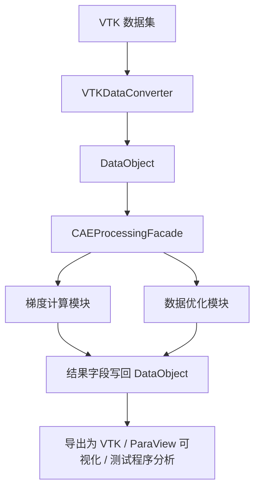

# 毕设汇报文档：系统结构、算法原理与问题分析

## 1. 项目目标与当前定位

本课题的目标是设计并实现一个面向 CAE/VTK 数据的梯度计算与数据优化原型系统。系统希望完成两类任务：

1. 对网格字段进行梯度计算。
2. 对原始场进行多尺度分解与融合，达到平滑、增强和重建的目的。

当前系统已经完成了统一的数据读入、内部表示、GPU 计算、结果写回和 VTK 导出流程。  
其中：

- 规则网格梯度计算模块较稳定，已经形成完整可演示主线。
- 非结构网格梯度计算模块已经实现了基于加权最小二乘的原型，但在复杂薄层/曲面型数据上仍存在明显精度问题，因此目前更适合定位为“探索性模块”。

建议向老师汇报时，将系统定位为：

“面向规则网格与部分非结构网格的梯度计算与多尺度优化原型系统。规则网格部分较成熟，非结构网格部分完成了基于最小二乘法的探索性实现，并对其失效原因进行了分析。”

---

## 2. 系统总体结构

系统主要由 5 个核心模块组成：

### 2.1 `CAEProcessingFacade`

这是系统的统一入口，负责：

- 读取数据集
- 管理数据集和字段
- 分派梯度计算方法
- 调用多尺度优化模块
- 回写结果并导出 VTK

从职责上看，它相当于“算法门面层”。

### 2.2 `VTKDataConverter`

该模块负责将 `vtkDataSet` 转换为系统内部统一的数据结构 `DataObject`，并在需要时再从 `DataObject` 恢复为 VTK 数据。  
主要工作包括：

- 提取点坐标、单元中心、点字段、单元字段
- 构建点邻域和单元邻域
- 识别规则网格或非结构网格

### 2.3 `DataObject`

这是系统内部的统一数据表示层。  
它将 VTK 的数据组织方式转换为适合算法和 GPU 处理的扁平数组结构，包括：

- 点坐标
- 单元中心
- 点邻域 / 单元邻域 CSR 结构
- 单元连接关系
- 点字段 / 单元字段数组

可以理解为：`DataObject` 是“算法真正面对的数据视图”。

### 2.4 `GLGradientEngine`

这是梯度计算的 GPU 执行层，包含 3 条主线：

- 规则网格有限差分 `FD`
- 非结构网格传统 `WLS`
- 非结构网格自适应 `AWLS`

本模块主要负责：

- 构建 SSBO
- 上传位置、邻域、字段和辅助信息
- 调用 OpenGL Compute Shader
- 取回梯度结果

### 2.5 `GLFilterEngine`

这是数据优化模块的 GPU 执行层，负责：

- 图双边滤波
- 多尺度细节融合

它服务于“原始场平滑、细节提取、特征增强与结果重建”。

---

## 3. 系统主流程

系统主流程可以概括为：

对于梯度计算：

- 规则网格走有限差分
- 非结构网格走自适应加权最小二乘

对于数据优化：

- 先做多层图双边滤波
- 再做细节层提取
- 最后做多尺度融合重建

---

## 4. 梯度计算算法原理

## 4.1 规则网格：有限差分

规则网格部分使用有限差分法计算梯度。  
其优点是：

- 邻域结构规则
- 网格方向明确
- 数值形式简单
- 计算稳定

因此规则网格部分是目前系统中最成熟、最可靠的部分。

---

## 4.2 非结构网格：加权最小二乘法

非结构网格部分采用的是加权最小二乘法，这是毕设要求中的核心方法。

基本思想是：  
在某个中心点（或中心单元）附近，假设局部场可以用一阶线性函数近似：

\[
\phi(\mathbf{x}_j)-\phi(\mathbf{x}_i)\approx \nabla \phi_i \cdot (\mathbf{x}_j-\mathbf{x}_i)
\]

对邻域内多个样本建立超定方程组，再用加权最小二乘求解局部梯度：

\[
\min_{\nabla \phi_i}\sum_{j\in N(i)} w_{ij}
\left(\phi_j-\phi_i-\nabla\phi_i\cdot(\mathbf{x}_j-\mathbf{x}_i)\right)^2
\]

系统中采用的权重形式为距离反比型权重：

\[
w_{ij}=\frac{1}{\|\mathbf{x}_j-\mathbf{x}_i\|^p}
\]

其中 `p` 为权重指数。

为避免矩阵病态，还加入了正则项 `lambda`。

---

## 4.3 非结构网格 AWLS 的实现流程

当前非结构网格梯度计算流程如下：

### 第一步：构建基础邻域

点邻域主要来自两部分：

- 拓扑邻域：通过共享单元得到相邻点
- 几何补点：当拓扑邻域不足时，用 KNN 补足

单元邻域优先按拓扑构建：

- 3D 单元优先共享面
- 2D 单元优先共享边
- 1D 单元优先共享点

### 第二步：构建自适应支撑域

在基础邻域上，系统会进一步构建自适应支撑信息，包括：

- 最终邻域 `offsets / neighbors`
- 局部主方向框架 `frames`
- 局部维度标签 `dimTags`
- 邻域质量 `quality`
- 局部平均邻距 `meanNeighborDistance`

具体做法是：

1. 对邻域点做局部协方差分析。
2. 通过特征值判断局部更接近 `1D / 2D / 3D`。
3. 根据主方向将邻域分桶，尽量保证方向分布均衡。
4. 选出用于最终拟合的稳定邻域。

### 第三步：GPU 求解 AWLS

GPU 端根据 `dimTag` 选择不同求解维度：

- `dim=1` 时做 1D 最小二乘
- `dim=2` 时做 2D 最小二乘
- `dim=3` 时做 3D 最小二乘

同时根据邻域质量 `quality` 自适应调整正则强度，目的是缓解病态邻域带来的不稳定性。

### 第四步：必要时回退到普通 WLS

如果自适应 AWLS 执行失败，系统会回退到传统 3D WLS，以保证流程完整可运行。

---

## 5. 数据优化模块原理

数据优化模块的目标不是直接求梯度，而是对原始场做“平滑 + 细节增强 + 重建”。

### 5.1 图双边滤波

在点图或单元图上，对每个样本进行邻域加权平均。权重由两部分组成：

1. 几何权重：距离越近，权重越大
2. 数值权重：数值越相近，权重越大

这样既能平滑噪声，又能尽量保护场中的突变或边缘特征。

### 5.2 多尺度分解

系统采用逐层平滑的方式构建尺度空间：

- 原始场记为 `smooth[0]`
- 每次双边滤波得到更平滑的 `smooth[1]、smooth[2]、smooth[3]`
- 相邻平滑层做差，得到细节层 `detail`

即：

\[
detail_l = smooth_l - smooth_{l+1}
\]

### 5.3 多尺度融合

最终重建结果由：

- 最深层平滑基底 `base`
- 多层细节 `detail0/detail1/detail2`

共同组成。

融合 shader 中定义了两个重要量：

### `feature`

\[
feature = |d_0| + |d_1| + |d_2|
\]

表示当前位置多尺度细节的总体强度。  
它越大，说明该位置更可能是特征区或变化剧烈区域。

### `atten`

\[
atten = \frac{feature}{feature + edgeSigma}
\]

表示对细节增强的抑制/放行程度。

- `feature` 小时，`atten` 小，说明这里更平滑，应减少细节增强
- `feature` 大时，`atten` 大，说明这里更可能是特征，应保留更多细节

因此数据优化模块本质上是一种“基于图结构、双边滤波和细节自适应加权”的多尺度融合方法。

---

## 6. 当前已经完成的工作

从系统实现角度看，目前已经完成了以下内容：

1. 完成 VTK 数据读入与导出。
2. 完成统一内部数据结构设计。
3. 完成规则网格梯度计算主线。
4. 完成非结构网格 WLS / AWLS 原型实现。
5. 完成点字段与单元字段两套处理路径。
6. 完成图双边滤波与多尺度融合模块。
7. 完成测试程序、误差统计和 ParaView 验证流程。

因此，系统并不是“没有做出来”，而是：

- 主框架已经完整
- 规则网格部分较成熟
- 非结构网格复杂场景下的精度仍不足

---

## 7. 当前发现的主要问题

实验中出现了一个比较典型的现象：

- `hexa.vtk`、`1_0.vtk` 上结果相对较好
- `ShipHull_0.vtk`、`notch_stress.vtk` 上结果明显较差

这说明当前非结构网格梯度模块不是“完全失效”，而是**适用范围有限**。  
问题主要集中在复杂几何、薄层结构、曲面型网格以及节点应力场上。

---

## 8. 原因分析

## 8.1 邻域构建对复杂网格不够准确

当前点邻域的构建方式本质上仍是：

- 先用共享单元关系建立邻域
- 邻域不足时再用 KNN 补点

这套方法对规则体网格或简单六面体网格是可行的，但对于曲面网格、薄层网格和高纵横比网格存在两个问题：

1. 同单元中的点未必都应该直接作为一阶几何邻点。
2. KNN 补点是欧氏距离意义上的最近点，不一定符合真实拓扑邻接关系。

结果就是：  
局部支撑域会被“过密、过宽或方向错误”的邻点污染，导致最小二乘拟合方向失真。

---

## 8.2 `ShipHull_0.vtk` 更接近曲面梯度问题

`ShipHull_0.vtk` 这类数据从几何上更接近曲面网格。  
对于曲面场，真正有意义的梯度往往是**切平面内的内在梯度**，而不是三维空间中的普通欧氏梯度。

但当前系统主要还是按 3D 邻域做局部拟合，因此会出现：

- 法向方向被误引入拟合
- 曲面切向变化被法向误差干扰
- 最终梯度方向和幅值偏差较大

换句话说，这不是简单的参数问题，而是“问题模型与算法模型不完全匹配”。

---

## 8.3 `notch_stress.vtk` 属于薄层/壳体型困难数据

`notch_stress.vtk` 的几何特征表现出明显薄层特性：

- 整体是三维拓扑
- 但几何分布更接近二维薄层

这类数据有一个典型困难：  
厚度方向尺寸很小，若直接按普通 3D 最小二乘拟合，法向方向会对结果产生不合理放大。

因此在这类数据上，更合适的做法通常是：

- 先识别局部曲面/薄层结构
- 再在切空间中做最小二乘拟合

而当前系统虽然已经尝试做局部维度自适应，但还不足以稳定处理这类困难场景。

---

## 8.4 节点应力场本身带有恢复误差

`notch_stress.vtk` 中使用的是节点应力 `Nodal Stress`。  
这一类场并不是最原始的“解析真值场”，而往往是由有限元后处理恢复得到的。

这意味着：

1. 原场本身就可能包含恢复误差或插值误差。
2. 在这种场上继续做梯度计算，相当于对“已经被恢复过一次的场”再做一次差分类操作。
3. 梯度对噪声和局部不连续更敏感，因此误差会进一步被放大。

也就是说，这类数据上“梯度算得不好”并不完全等价于程序写错了，而是与输入场的性质强相关。

---

## 8.5 当前方法默认的是普通欧氏局部光滑假设

当前 AWLS 的基本前提是：

- 在中心样本附近，字段可以用局部线性函数近似
- 邻域分布足够均衡
- 邻域是普通欧氏空间下可比较的局部点集

但在以下情况下，这一假设会被破坏：

- 曲面样本
- 薄层样本
- 应力集中区
- 高纵横比单元
- 混合单元或高阶单元

因此当前问题的本质更接近“模型适用范围不够宽”，而不是单纯代码小 bug。

---

## 9. 代码中有没有致命错误

从当前代码结构和运行现象来看，**没有发现那种会导致系统整体失效的致命实现错误**。  
系统具备如下特征：

- 模块职责清晰
- 数据流闭环完整
- 规则网格结果稳定
- 非结构网格在简单数据上有效
- 复杂数据上误差恶化具有明确的算法原因

因此更准确的判断是：

### 不是“程序根本写错了”

而是：

### “非结构网格梯度模块的建模假设、邻域构建和适用范围，还不足以覆盖复杂曲面/薄层/节点应力场”

如果一定要指出当前非结构模块中的关键薄弱点，可以概括为：

1. 点邻域构建过于粗粒度，缺少真正的边级/面级邻接控制。
2. 对曲面和薄层几何缺少稳定的切空间约束。
3. 对节点应力场这类恢复型场缺少专门处理。
4. 对网格类型没有做足够严格的适用范围限制。

---

## 10. 为什么简单数据效果好，而复杂数据效果差

这个现象可以直接向老师解释为：

### 简单数据效果好

如 `hexa.vtk`、`1_0.vtk`：

- 单元规整
- 邻域方向分布较均衡
- 局部几何接近普通体网格
- 最小二乘的局部线性假设更容易成立

因此结果较稳定。

### 复杂数据效果差

如 `ShipHull_0.vtk`、`notch_stress.vtk`：

- 几何更接近曲面或薄层
- 邻域拓扑更复杂
- 欧氏 3D 梯度不一定是合适建模方式
- 输入场可能本身已经带恢复误差

因此误差显著增大。

---

## 11. 建议的论文范围收缩方式

如果后续时间有限，建议不要再把目标表述为“任意非结构网格高精度梯度计算”，而应当收缩为：

### 推荐表述

“面向规则网格与部分规整非结构体网格的梯度计算与数据优化原型系统设计”

或者更明确一点：

“面向规则网格与一阶六面体非结构体网格的梯度计算方法研究与系统实现”

这样做的好处是：

1. 规则网格主线可以稳定支撑论文主体。
2. 非结构网格部分仍然保留了最小二乘法实现，满足课题探索要求。
3. 对复杂曲面/薄层数据的不理想结果可以合理解释为“超出当前原型适用范围”。

---

## 12. 后续可改进方向

后续如果继续深入，建议从以下方向改进：

1. 将非结构网格适用范围限制为一阶六面体体网格。
2. 点邻域从“共享单元”改为更严格的边级邻接。
3. 对曲面/薄层数据引入切平面最小二乘或内在梯度重建。
4. 对节点应力场先做应力恢复，再进行梯度重建。
5. 对网格质量、单元阶次、几何维度做前置筛选。

---

## 13. 汇报时可直接使用的结论表述

可以向老师这样汇报：

“目前系统已经完成了统一的数据处理、梯度计算和多尺度优化框架。规则网格部分采用有限差分，结果稳定；非结构网格部分实现了基于加权最小二乘法的梯度重建原型，在简单规整体网格上能够得到较合理结果。但在 `ShipHull_0` 和 `notch_stress` 这类曲面型、薄层型和节点应力场数据上，误差仍然较大。分析后认为，主要原因不是程序完全写错，而是当前邻域构建方式和普通三维最小二乘模型难以稳定适配这类复杂数据。因此后续论文中可将非结构网格模块定位为探索性实现，并将适用范围收缩到规则性较好的体网格，例如一阶六面体网格。” 

---

## 14. 最终结论

本系统当前的真实状态可以总结为：

- 主框架已经完成
- 规则网格部分成熟可用
- 数据优化模块完整可演示
- 非结构网格最小二乘模块已经实现，但当前更适合简单体网格
- 在复杂曲面/薄层/节点应力数据上存在明显局限

因此，本课题是“已经完成了一个可运行、可分析、可解释的原型系统”，而不是“完全没有做出来”。  
当前最合理的策略不是继续无限扩大支持范围，而是**明确系统边界，突出已完成成果，解释复杂数据失效原因，并给出后续改进方向**。
