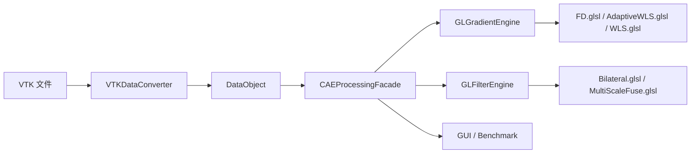

# OpenGLDP 系统接口文档

## 1. 文档目的

这份文档从系统结构、模块职责和执行路径三个层面说明当前版本的接口组织方式。

当前版本需要记住一句话：

> 规则网格走 FD，非结构网格走统一 AWLS。

## 2. 总体结构



## 3. 核心模块

| 文件 | 作用 |
| --- | --- |
| `VTKDataConverter.*` | VTK 与内部 `DataObject` 互转 |
| `DataObject.*` | 保存点、单元、邻接、数组等内部数据 |
| `CAEProcessingFacade.*` | 对外统一入口 |
| `GLGradientEngine.*` | GPU 梯度计算 |
| `GLFilterEngine.*` | 多尺度滤波与融合 |
| `app/MainWindow.*` | GUI |
| `TestGradient.cpp` | 梯度 benchmark |

## 4. 数据集类型映射

`VTKDataConverter::convertType()` 当前的映射关系是：

| VTK 类型 | 内部类型 |
| --- | --- |
| `vtkImageData` | `RegularGrid` |
| `vtkRectilinearGrid` | `RegularGrid` |
| `vtkStructuredGrid` | `RegularGrid` |
| `vtkUnstructuredGrid` | `Unstructured` |

## 5. 梯度模块公开接口

### 5.1 入口

```cpp
bool CAEProcessingFacade::computeGradient(const CAEGradientRequest& req,
                                          CAEGradientResultMeta& outMeta);
```

### 5.2 当前分发逻辑

```text
Auto
-> RegularGrid      -> FiniteDifference
-> UnstructuredGrid -> AdaptiveWeightedLeastSquares
```

### 5.3 结果数组命名

当前结果只保留两类公开命名：

- `源数组_grad_P_FD`
- `源数组_grad_C_FD`
- `源数组_grad_P_AWLS`
- `源数组_grad_C_AWLS`

## 6. 非结构网格统一 AWLS 接口链

当前主链如下：

```text
CAEProcessingFacade::computeGradient(...)
-> computeByAdaptiveWLS(...)
-> ensureAdaptiveSupport(...)
-> GLGradientEngine::computeUnstructuredAdaptiveWLS(...)
-> AdaptiveWLS.glsl
```

如果 AWLS 内核失败，内部才会回退到：

```text
GLGradientEngine::computeUnstructuredWLS(...)
-> WLS.glsl
```

## 7. `ensureAdaptiveSupport(...)` 输出什么

这一步会把点数据和单元数据都转换成统一的局部支撑描述：

| 字段 | 含义 |
| --- | --- |
| `offsets` | 每个样本邻域在邻居数组中的偏移 |
| `neighbors` | 邻域样本 id |
| `frames` | 局部正交坐标框架 |
| `dimTags` | 局部维数标签，表示更像线、面还是体 |
| `quality` | 邻域质量指标 |
| `meanNeighborDistance` | 平均邻居距离 |

## 8. 点数据和单元数据的接口差异

| 关联类型 | 样本位置 | 邻接图 |
| --- | --- | --- |
| `Point` | `data.points` | `pointNeighbors` |
| `Cell` | `data.cellCenters` | `cellNeighbors` |

接口层不再因为“点/单元”而切出两套完全不同的求导框架。

## 9. Shader 接口

当前梯度相关 shader 只有三份：

| Shader | 用途 |
| --- | --- |
| `Shaders/FD.glsl` | 规则网格有限差分 |
| `Shaders/AdaptiveWLS.glsl` | 非结构网格统一 AWLS 主线 |
| `Shaders/WLS.glsl` | 非结构网格内部回退 WLS |

已经不再使用：

- `SparseGradient.glsl`
- `SparseReconstruct.glsl`
- `RGGradient.glsl`
- `USGGradient.glsl`

## 10. benchmark 相关接口

`CAEProcessingFacade` 仍然保留：

```cpp
void setAnalyticBenchmarkEnabled(bool enabled);
bool isAnalyticBenchmarkEnabled() const;
```

但现在的设计约束很明确：

- 默认关闭
- GUI 不启用
- 只供 `TestGradient.cpp` 做解析场验证时使用

## 11. 对论文最重要的接口结论

从接口设计角度，当前版本已经可以很清楚地概括成：

1. 输入统一经过 `VTKDataConverter` 进入 `DataObject`。
2. 梯度统一由 `CAEProcessingFacade` 对外提供。
3. 规则网格使用 `FD.glsl`。
4. 非结构网格使用统一 `AdaptiveWLS.glsl`，必要时内部回退 `WLS.glsl`。
5. benchmark 解析数组是测试开关，不属于 GUI 主流程。
