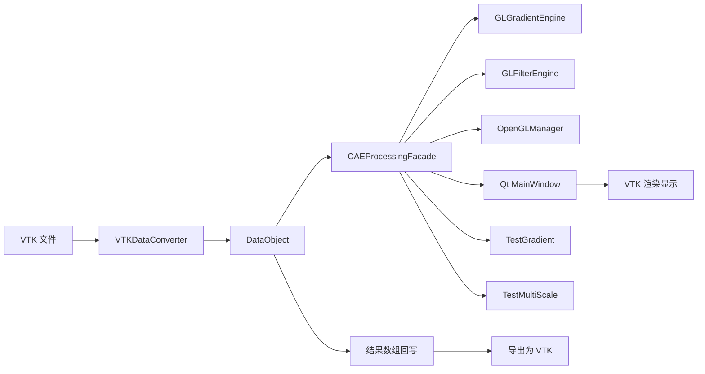

# OpenGLDP 系统接口文档

## 1. 文档说明

本文档从“系统结构、代码文件、核心变量、主要函数、数据流”五个角度，对当前 `OpenGLDP` 项目进行接口级说明。内容以当前仓库代码为准，重点覆盖：

- 主程序结构；
- 每个核心代码文件的作用；
- 主要类、结构体、成员变量、成员函数的职责；
- 关键测试程序和着色器文件的定位。

---

## 2. 系统总体结构



### 2.1 结构说明

- `VTKDataConverter` 负责 VTK 数据与内部统一数据结构之间的双向转换。
- `DataObject` 是系统内部统一数据模型。
- `CAEProcessingFacade` 是对外总入口。
- `GLGradientEngine` 负责梯度计算。
- `GLFilterEngine` 负责双边滤波、多尺度分解和加权融合。
- `OpenGLManager` 负责创建和维护计算用 OpenGL 上下文。
- `MainWindow` 负责界面交互。
- `TestGradient` 和 `TestMultiScale` 负责功能验证与性能测试。

---

## 3. 文件级接口总览

| 文件 | 类型 | 作用 |
| --- | --- | --- |
| `CMakeLists.txt` | 构建配置 | 定义库、可执行目标、依赖与资源复制 |
| `CAEInterfaceTypes.h` | 接口定义 | 定义对外枚举和请求/结果结构 |
| `DataObject.h/.cpp` | 数据模型 | 统一保存几何、邻接和场数据 |
| `VTKDataConverter.h/.cpp` | 转换模块 | `vtkDataSet` 与 `DataObject` 双向转换 |
| `OpenGLManager.h` | 平台支撑 | 管理 OpenGL 上下文与运行时信息 |
| `GLGradientEngine.h/.cpp` | 算法引擎 | GPU 梯度计算 |
| `GLFilterEngine.h/.cpp` | 算法引擎 | GPU 双边滤波与多尺度融合 |
| `CAEProcessingFacade.h/.cpp` | 门面层 | 对外统一服务接口 |
| `app/main.cpp` | GUI 入口 | 创建 Qt 应用与主窗口 |
| `app/MainWindow.h/.cpp` | GUI 主界面 | 文件加载、参数设置、计算触发、结果显示 |
| `TestGradient.cpp` | 测试程序 | 梯度结果与 `vtkGradientFilter` 对比 |
| `TestMultiScale.cpp` | 测试程序 | 多尺度优化功能与统计指标测试 |
| `TestConvert1.cpp` | 历史测试 | 早期 VTK 转换验证代码，目前整体被注释 |
| `FileName.cpp` | 历史草稿 | 旧实验代码草稿，目前整体被注释 |
| `Shaders/FD.glsl` | 着色器 | 规则网格有限差分梯度 |
| `Shaders/WLS.glsl` | 着色器 | 非结构网格加权最小二乘梯度 |
| `Shaders/Bilateral.glsl` | 着色器 | 图双边滤波 |
| `Shaders/MultiScaleFuse.glsl` | 着色器 | 多尺度细节加权融合 |
| `Shaders/RGGradient.glsl` | 着色器 | 历史规则网格梯度版本，当前未直接接入 CMake 主流程 |
| `Shaders/USGGradient.glsl` | 着色器 | 历史非结构网格梯度版本，当前未直接接入 CMake 主流程 |
| `gl_context_utils.h` | 辅助头文件 | VTK 上下文测试/创建辅助 |
| `glad.c`、`glad/`、`KHR/` | 第三方 | OpenGL 函数加载支持 |

---

## 4. 构建层接口

## 4.1 `CMakeLists.txt`

### 作用

- 指定 C++17。
- 查找 Qt5、VTK、OpenGL。
- 定义核心静态库 `opengldp_core`。
- 定义 3 个可执行程序：
  - `opengldp_gui`
  - `opengldp_benchmark`
  - `opengldp_multiscale_test`
- 在构建后复制 `Shaders/` 和 `Data/` 到运行目录。

### 当前值得注意的点

- `opengldp_core` 中包含：
  - `GLGradientEngine.*`
  - `GLFilterEngine.*`
  - `CAEProcessingFacade.*`
  - `VTKDataConverter.*`
  - `DataObject.*`
  - `OpenGLManager.h`
- GUI 与测试程序都通过同一个核心库调用算法。

---

## 5. 对外接口定义层

## 5.1 `CAEInterfaceTypes.h`

### 作用

定义整个系统对外公开的数据类型，供 GUI、测试程序和门面层统一使用。

### 枚举类型

| 名称 | 作用 |
| --- | --- |
| `CAEFieldAssociation` | 指定数组属于点数据还是单元数据 |
| `CAEGridClass` | 指定数据集属于规则网格还是非结构网格 |
| `CAEGradientMethod` | 指定梯度计算方法：自动/FD/WLS |

### 结构体

#### `CAEFieldInfo`

| 字段 | 作用 |
| --- | --- |
| `name` | 数组名 |
| `association` | 点或单元 |
| `numComponents` | 分量数 |
| `tupleCount` | 元组数 |

#### `CAEGradientRequest`

| 字段 | 作用 |
| --- | --- |
| `datasetId` | 数据集 ID |
| `inputArrayName` | 输入数组名 |
| `association` | 点/单元 |
| `method` | 梯度算法 |
| `wlsExponent` | WLS 距离权重指数 |
| `wlsLambda` | WLS 正则项 |

#### `CAEGradientResultMeta`

| 字段 | 作用 |
| --- | --- |
| `resultArrayName` | 新生成的梯度数组名 |
| `sourceArrayName` | 原数组名 |
| `association` | 点/单元 |
| `method` | 实际使用的方法 |
| `inputComponents` | 输入分量数 |
| `outputComponents` | 输出分量数，通常为 `3 * inputComponents` |
| `computeWallMs` | CPU 侧总耗时 |
| `computeGpuMs` | GPU 纯计算耗时 |

#### `CAEMultiScaleRequest`

| 字段 | 作用 |
| --- | --- |
| `datasetId` | 数据集 ID |
| `inputArrayName` | 输入数组名 |
| `association` | 点/单元 |
| `levels` | 多尺度层数 |
| `iterationsPerLevel` | 每层迭代次数 |
| `spatialSigmaFactor` | 空间尺度系数 |
| `rangeSigmaFactor` | 值域尺度系数 |
| `levelScale` | 层间尺度放大因子 |
| `edgeSigmaFactor` | 融合抑制系数 |
| `detailGain0/1/2` | 各层细节增益 |
| `storeIntermediate` | 是否回写中间结果 |

#### `CAEMultiScaleResultMeta`

| 字段 | 作用 |
| --- | --- |
| `sourceArrayName` | 输入数组名 |
| `association` | 点/单元 |
| `numLevels` | 实际层数 |
| `inputComponents` | 输入分量数 |
| `smoothArrayNames` | 平滑层结果名列表 |
| `detailArrayNames` | 细节层结果名列表 |
| `baseArrayName` | 基底层数组名 |
| `fusedArrayName` | 融合结果数组名 |
| `computeWallMs` | CPU 总耗时 |
| `computeGpuMs` | GPU 总耗时 |

#### `CAEDatasetSummary`

| 字段 | 作用 |
| --- | --- |
| `datasetId` | 数据集 ID |
| `displayName` | 显示名称 |
| `gridClass` | 网格类型 |
| `pointCount` | 点数 |
| `cellCount` | 单元数 |
| `fields` | 字段列表 |
| `results` | 梯度结果历史列表 |

---

## 6. 内部数据模型层

## 6.1 `DataObject.h/.cpp`

### 作用

`DataObject` 是系统内部统一数据结构，负责保存：

- 点坐标
- 单元拓扑
- 邻接关系
- 规则网格维度
- 点/单元数据数组

### 枚举与结构

#### `DataArrayType`

| 名称 | 作用 |
| --- | --- |
| `POINT_DATA` | 点关联数组 |
| `CELL_DATA` | 单元关联数组 |

#### `DataArray`

| 字段 | 作用 |
| --- | --- |
| `name` | 数组名 |
| `data` | 扁平化浮点数据 |
| `numComponents` | 每个元组的分量数 |
| `dataType` | 点数据或单元数据 |

#### `GridType`

| 名称 | 作用 |
| --- | --- |
| `DATA_OBJECT_TYPE_RegularGrid` | 规则网格 |
| `DATA_OBJECT_TYPE_UNSTRUCTURED` | 非结构网格 |

### `DataObject` 主要成员变量

| 变量 | 作用 |
| --- | --- |
| `gridType` | 网格类型 |
| `points` | 点坐标 `[x0,y0,z0,...]` |
| `cellCenters` | 单元中心坐标 |
| `dataArrays` | 所有场数据 |
| `pointNeighbors` | 点邻接索引 |
| `pointNeighborOffsets` | 点邻接 CSR 偏移 |
| `pointInCellNeighbors` | 点所属单元索引 |
| `pointInCellNeighborOffsets` | 点所属单元 CSR 偏移 |
| `cells` | 单元点连接关系 |
| `cellTypes` | 单元类型 |
| `cellOffsets` | 单元连接偏移 |
| `cellNeighbors` | 单元邻接索引 |
| `cellNeighborsOffsets` | 单元邻接 CSR 偏移 |
| `dimensions[3]` | 规则网格尺寸 `(nx, ny, nz)` |

### 主要成员函数

| 函数 | 作用 |
| --- | --- |
| `findDataArray(name, type)` | 查找可写数组 |
| `findDataArray(name, type) const` | 查找只读数组 |
| `upsertDataArray(name, data, numComponents, type)` | 更新或插入数组 |
| `pointCount()` | 返回点数 |
| `cellCount()` | 返回单元数 |

---

## 7. 数据转换层

## 7.1 `VTKDataConverter.h/.cpp`

### 作用

负责：

- `vtkDataSet -> DataObject`
- `DataObject -> vtkDataSet`

### 成员变量

| 变量 | 作用 |
| --- | --- |
| `vtkData` | 当前绑定的 VTK 数据对象 |
| `internalData` | 当前绑定的内部数据对象 |

### 总入口函数

| 函数 | 作用 |
| --- | --- |
| `bindVTKDataAndInternalData(vtkData, internalData)` | 绑定输入输出对象 |
| `convertVTKToInternal()` | 正向转换总入口 |
| `convertInternalToVTK()` | 反向转换总入口 |

### 正向转换子函数

| 函数 | 作用 |
| --- | --- |
| `convertType()` | 识别规则/非结构网格 |
| `convertPoints()` | 提取点坐标 |
| `convertDataArrays()` | 提取点数组和单元数组 |
| `convertDimensions()` | 提取规则网格维度 |
| `convertCellCenters()` | 计算单元中心 |
| `convertCell()` | 提取单元连接与类型 |
| `convertPointInCellNeighbors()` | 建立点所属单元 CSR |
| `convertPointNeighbors()` | 建立拓扑点邻接 |
| `convertPointNeighborsByKNN(k)` | KNN 点邻接 |
| `convertPointNeighborsRobust(minK, knnK)` | 拓扑邻接不足时以 KNN 补全 |
| `convertCellNeighbors()` | 建立拓扑单元邻接 |
| `convertCellNeighborsByKNN(k)` | KNN 单元邻接 |
| `convertRegularGrid()` | 规则网格转换流程 |
| `convertUnstructuredGrid()` | 非结构网格转换流程 |

### 当前实现特点

- 对非结构网格优先使用 `convertPointNeighborsRobust(12, 24)`。
- 如果鲁棒邻接失败，会回退到拓扑邻接。
- 在反向导出时，会依据 `dataType` 决定把数组写回 `PointData` 还是 `CellData`。

---

## 8. OpenGL 支撑层

## 8.1 `OpenGLManager.h`

### 作用

在 Windows 平台下创建一个计算专用的 OpenGL 上下文，为计算着色器执行提供环境。

### 结构体 `OpenGLRuntimeInfo`

| 字段 | 作用 |
| --- | --- |
| `vendor` | GPU 厂商 |
| `renderer` | 渲染器信息 |
| `version` | OpenGL 版本 |
| `glsl` | GLSL 版本 |
| `major/minor` | 主次版本号 |

### 主要成员函数

| 函数 | 作用 |
| --- | --- |
| `initialize(offscreen)` | 创建上下文并加载 GLAD |
| `isReady()` | 判断上下文是否可用 |
| `makeCurrent()` | 将该上下文设为当前 |
| `info()` | 获取运行时信息 |

### 平台相关函数

| 函数 | 作用 |
| --- | --- |
| `createContext(offscreen)` | 创建 Win32 窗口、像素格式和上下文 |
| `destroyContext()` | 释放上下文 |
| `wndProc(...)` | 虚拟窗口过程 |

---

## 9. 梯度计算引擎层

## 9.1 `GLGradientEngine.h/.cpp`

### 作用

负责通过 OpenGL 计算着色器完成梯度计算。

### 内部结构体

| 结构体 | 字段 | 作用 |
| --- | --- | --- |
| `RegularParams` | `dims[3]` | 规则网格维度 |
| `RegularParams` | `origin[3]` | 预留参数 |
| `RegularParams` | `spacing[3]` | 预留参数 |
| `WLSParams` | `wExponent` | 距离权重指数 |
| `WLSParams` | `lambda` | 正则项 |

### 主要成员变量

| 变量 | 作用 |
| --- | --- |
| `shaderDir` | 着色器目录 |
| `progRegular` | FD 计算程序对象 |
| `progWLS` | WLS 计算程序对象 |
| `ssbo0`~`ssbo4` | 输入/输出缓冲区 |
| `enableGpuTiming` | 是否开启 GPU 计时 |
| `timeQuery` | OpenGL 时间查询对象 |
| `lastGpuTimeMs` | 最近一次 GPU 耗时 |

### 主要成员函数

| 函数 | 作用 |
| --- | --- |
| `setShaderDir(dir)` | 设置着色器目录 |
| `init()` | 编译并链接 FD/WLS 着色器 |
| `release()` | 释放着色器和缓冲对象 |
| `computeRegularFD(...)` | 规则网格有限差分梯度 |
| `computeUnstructuredWLS(...)` | 非结构网格 WLS 梯度 |
| `setEnableGpuTiming(on)` | GPU 计时开关 |
| `getLastGpuTimeMs()` | 获取最近一次 GPU 时间 |
| `buildComputeFromFile(path)` | 从文件编译计算着色器 |
| `ensureBuffer(id, bytes, usage)` | 确保 SSBO 已创建并分配空间 |

### `GLGradientEngine.cpp` 中的静态辅助函数

| 函数 | 作用 |
| --- | --- |
| `readFileText(path)` | 读取 GLSL 源码文本 |

---

## 10. 数据优化引擎层

## 10.1 `GLFilterEngine.h/.cpp`

### 作用

负责：

- 图双边滤波；
- 多尺度细节融合。

### 内部结构体

| 结构体 | 字段 | 作用 |
| --- | --- | --- |
| `BilateralParams` | `spatialSigma` | 空间尺度参数 |
| `BilateralParams` | `rangeSigma` | 值域尺度参数 |
| `FusionParams` | `levelCount` | 使用的细节层数 |
| `FusionParams` | `edgeSigma` | 边缘抑制系数 |
| `FusionParams` | `detailGains[3]` | 三层细节增益 |

### 主要成员变量

| 变量 | 作用 |
| --- | --- |
| `shaderDir` | 着色器目录 |
| `progBilateral` | 双边滤波程序对象 |
| `progFusion` | 融合程序对象 |
| `ssbo0`~`ssbo4` | 输入/输出缓冲区 |
| `enableGpuTiming` | 是否启用 GPU 计时 |
| `timeQuery` | 时间查询对象 |
| `lastGpuTimeMs` | 最近一次 GPU 耗时 |

### 主要成员函数

| 函数 | 作用 |
| --- | --- |
| `setShaderDir(dir)` | 设置着色器目录 |
| `init()` | 编译 `Bilateral.glsl` 和 `MultiScaleFuse.glsl` |
| `release()` | 释放资源 |
| `bilateralGraph(...)` | 图双边滤波 |
| `fuseMultiScale(...)` | 三层细节加权融合 |
| `setEnableGpuTiming(on)` | 启用/关闭 GPU 时间查询 |
| `getLastGpuTimeMs()` | 获取最近一次 GPU 时间 |
| `buildComputeFromFile(path)` | 编译计算着色器 |
| `ensureBuffer(id, bytes, usage)` | 创建/重建 SSBO |

### `GLFilterEngine.cpp` 中的静态辅助函数

| 函数 | 作用 |
| --- | --- |
| `readFileText(path)` | 读取着色器文本 |

---

## 11. 门面层接口

## 11.1 `CAEProcessingFacade.h/.cpp`

### 作用

这是整个系统最关键的对外统一入口，负责把：

- 数据读取
- 数据查询
- 梯度计算
- 多尺度分解与融合
- 数据导出

封装成统一 API。

### 私有结构 `DatasetRecord`

| 字段 | 作用 |
| --- | --- |
| `id` | 数据集唯一 ID |
| `displayName` | 显示名称 |
| `data` | 内部 `DataObject` |
| `sourceVtk` | 原始 VTK 数据对象 |
| `results` | 梯度结果历史 |

### 主要成员变量

| 变量 | 作用 |
| --- | --- |
| `m_gl` | OpenGL 上下文管理器 |
| `m_engine` | 梯度引擎 |
| `m_filter` | 数据优化引擎 |
| `m_initialized` | 是否初始化成功 |
| `m_records` | 数据集仓库 |
| `m_nextId` | 自增数据集编号 |
| `m_lastComputeWallMs` | 最近一次 CPU 耗时 |
| `m_lastComputeGpuMs` | 最近一次 GPU 耗时 |

### 对外公开函数

| 函数 | 作用 |
| --- | --- |
| `initialize(shaderDir)` | 初始化 OpenGL、梯度引擎、滤波引擎 |
| `loadDatasetFromVTKFile(filePath)` | 加载数据文件并生成数据集 ID |
| `listDatasets()` | 获取所有数据集摘要 |
| `getDatasetSummary(datasetId, outSummary)` | 获取单个数据集摘要 |
| `listFields(datasetId, assoc, outFields)` | 列出某类数组 |
| `computeGradient(req, outMeta)` | 计算梯度 |
| `computeMultiScaleDecompositionAndFusion(req, outMeta)` | 多尺度分解与融合 |
| `exportDatasetToVTK(datasetId, outVtk)` | 导出为 VTK 内存对象 |
| `saveDatasetToVTKFile(datasetId, filePath, binary)` | 保存到 VTK 文件 |
| `getArrayData(datasetId, arrayName, assoc, outData, outComps)` | 读出数组数据 |
| `getLastComputeWallMs()` | 最近一次 CPU 时间 |
| `getLastComputeGpuMs()` | 最近一次 GPU 时间 |

### 私有辅助函数

| 函数 | 作用 |
| --- | --- |
| `toGridClass(t)` | `GridType -> CAEGridClass` |
| `toDataArrayType(a)` | `CAEFieldAssociation -> DataArrayType` |
| `toAssociation(t)` | `DataArrayType -> CAEFieldAssociation` |
| `fileNameFromPath(path)` | 取文件名 |
| `makeResultName(src, assoc, method)` | 梯度结果命名 |
| `computeByFD(rec, src, outGrad)` | 执行 FD 梯度 |
| `computeByWLS(rec, src, assoc, exp, lambda, outGrad)` | 执行 WLS 梯度 |

### `CAEProcessingFacade.cpp` 中的静态辅助函数

| 函数 | 作用 |
| --- | --- |
| `assocTag(a)` | 返回 `P` 或 `C` |
| `makeSmoothName(src, assoc, level)` | 平滑层命名 |
| `makeDetailName(src, assoc, level)` | 细节层命名 |
| `makeBaseName(src, assoc)` | 基底层命名 |
| `makeFusedName(src, assoc)` | 融合结果命名 |
| `buildRegularNeighbors(nx, ny, nz, offsets, neighbors)` | 构建规则网格六邻域 |
| `buildFilterGraph(data, assoc, positions, offsets, neighbors)` | 构建滤波图 |
| `estimateMeanNeighborDistance(...)` | 估计平均邻接距离 |
| `estimateStdDev(values)` | 估计值域标准差 |
| `subtractField(a, b, out)` | 字段逐元素相减 |

---

## 12. GUI 层接口

## 12.1 `app/main.cpp`

### 作用

- 设置 QVTK 默认格式；
- 创建 `QApplication`；
- 创建 `MainWindow`；
- 进入 Qt 事件循环。

### 主要函数

| 函数 | 作用 |
| --- | --- |
| `main(argc, argv)` | GUI 程序入口 |

## 12.2 `app/MainWindow.h/.cpp`

### 作用

提供用户界面，完成：

- 打开 VTK 文件；
- 选择数据集和数组；
- 设置梯度参数；
- 设置数据优化参数；
- 触发计算；
- 显示日志；
- 渲染当前数组。

### 私有成员变量

| 变量 | 作用 |
| --- | --- |
| `m_facade` | 门面对象 |
| `m_initialized` | 初始化状态 |
| `m_datasetList` | 数据集列表 |
| `m_summaryLabel` | 数据集摘要标签 |
| `m_assocBox` | 点/单元选择 |
| `m_arrayBox` | 输入数组选择 |
| `m_methodBox` | 方法选择 |
| `m_wExpSpin` | WLS 指数 |
| `m_lambdaSpin` | WLS 正则项 |
| `m_componentSpin` | 可视化分量 |
| `m_openBtn` | 打开文件按钮 |
| `m_exportBtn` | 导出按钮 |
| `m_computeBtn` | 梯度计算按钮 |
| `m_optimizeBtn` | 多尺度优化按钮 |
| `m_msLevelsSpin` | 层数 |
| `m_msIterSpin` | 每层迭代次数 |
| `m_msSpatialSigmaFactorSpin` | 空间尺度系数 |
| `m_msRangeSigmaFactorSpin` | 值域尺度系数 |
| `m_msLevelScaleSpin` | 层级尺度放大 |
| `m_msEdgeSigmaFactorSpin` | 边缘抑制系数 |
| `m_msGain0Spin` | 第 0 层增益 |
| `m_msGain1Spin` | 第 1 层增益 |
| `m_msGain2Spin` | 第 2 层增益 |
| `m_msStoreIntermediateCheck` | 是否保存中间层 |
| `m_vtkWidget` | VTK 渲染控件 |
| `m_log` | 日志文本框 |
| `m_renderWindow` | VTK 渲染窗口 |
| `m_renderer` | VTK 渲染器 |

### 主要成员函数

| 函数 | 作用 |
| --- | --- |
| `buildUi()` | 构建界面布局与控件 |
| `bindSignals()` | 建立信号槽连接 |
| `appendLog(text)` | 追加日志 |
| `selectedDatasetId()` | 获取当前选中数据集 ID |
| `currentAssociation()` | 获取当前点/单元模式 |
| `currentMethod()` | 获取当前梯度方法 |
| `refreshFieldList()` | 刷新数组列表 |
| `refreshSummary()` | 刷新摘要信息 |
| `refreshResultLog()` | 刷新结果数量日志 |
| `renderSelectedArray()` | 导出当前数据集并渲染选中数组 |
| `openFile()` | 打开 VTK 文件 |
| `exportCurrentDataset()` | 导出当前数据集 |
| `computeGradient()` | 执行梯度计算 |
| `computeMultiScaleOptimization()` | 执行多尺度优化 |
| `handleDatasetChanged()` | 数据集切换时刷新 |
| `handleAssociationChanged()` | 点/单元模式切换时刷新 |
| `handleArrayChanged()` | 数组切换时更新分量与渲染 |

### `MainWindow.cpp` 中的局部辅助函数

| 函数 | 作用 |
| --- | --- |
| `toStdString(const QString&)` | `QString -> std::string` |

---

## 13. 测试程序接口

## 13.1 `TestGradient.cpp`

### 作用

验证梯度模块的：

- 功能正确性；
- 运行时间；
- 与 `vtkGradientFilter` 的差异。

### 主要流程

1. 初始化 `CAEProcessingFacade`。
2. 加载数据集。
3. 列出可用数组。
4. 计算 OpenGL 梯度。
5. 调用 `vtkGradientFilter` 作为参考。
6. 输出时间和误差指标。

## 13.2 `TestMultiScale.cpp`

### 作用

用于测试数据优化模块，包括：

- 多尺度分解是否成功；
- 加权融合是否成功；
- 输出平滑度和粗糙度统计；
- 导出包含结果的新数据集。

### 局部辅助函数

| 函数 | 作用 |
| --- | --- |
| `buildRegularNeighbors(nx, ny, nz, offsets, neighbors)` | 构造规则邻域 |
| `buildStatGraph(data, assoc, offsets, neighbors)` | 构造统计分析图 |
| `computeStdDev(values)` | 计算标准差 |
| `computeMeanAbsDelta(a, b)` | 计算平均绝对差 |
| `computeGraphRoughness(values, comps, offsets, neighbors)` | 计算图粗糙度 |
| `main(argc, argv)` | 入口，负责运行多尺度测试 |

## 13.3 `gl_context_utils.h`

### 作用

提供一个基于 VTK 的持久 OpenGL 上下文创建工具，主要用于测试或独立验证时创建计算环境。

---

## 14. 着色器接口说明

| 文件 | 作用 | 主要输入 | 主要输出 |
| --- | --- | --- | --- |
| `FD.glsl` | 规则网格梯度 | 点坐标、数值、网格尺寸 | 梯度数组 |
| `WLS.glsl` | 非结构网格梯度 | 位置、邻接、数值、权重参数 | 梯度数组 |
| `Bilateral.glsl` | 图双边滤波 | 位置、邻接、数值、`sigma` | 平滑场 |
| `MultiScaleFuse.glsl` | 多尺度融合 | 基底层、细节层、增益 | 融合场 |
| `RGGradient.glsl` | 历史规则网格版本 | 历史实现 | 当前未接入 |
| `USGGradient.glsl` | 历史非结构网格版本 | 历史实现 | 当前未接入 |

---

## 15. 历史/草稿文件说明

### `TestConvert1.cpp`

- 整体已注释；
- 主要用于早期验证 `VTKDataConverter` 的转换正确性；
- 包含大量打印、比较、邻接检查辅助函数。

### `FileName.cpp`

- 目前整体注释；
- 属于较早阶段的实验代码草稿；
- 不纳入当前系统正式模块。

---

## 16. 当前接口调用关系总结

### GUI 计算梯度

```text
MainWindow::computeGradient
-> CAEProcessingFacade::computeGradient
-> CAEProcessingFacade::computeByFD / computeByWLS
-> GLGradientEngine::computeRegularFD / computeUnstructuredWLS
-> 新数组回写 DataObject
-> MainWindow::renderSelectedArray
```

### GUI 执行数据优化

```text
MainWindow::computeMultiScaleOptimization
-> CAEProcessingFacade::computeMultiScaleDecompositionAndFusion
-> buildFilterGraph
-> GLFilterEngine::bilateralGraph
-> GLFilterEngine::fuseMultiScale
-> 新数组回写 DataObject
-> MainWindow::renderSelectedArray
```

### 导出 VTK

```text
MainWindow::exportCurrentDataset
-> CAEProcessingFacade::saveDatasetToVTKFile
-> CAEProcessingFacade::exportDatasetToVTK
-> VTKDataConverter::convertInternalToVTK
```

---

## 17. 使用建议

本文档适合直接用于以下内容整理：

- 毕设论文“系统设计”章节；
- 答辩 PPT 中的“系统架构”和“模块划分”；
- 中后期报告中的“软件实现”部分；
- 后续扩展模块时的代码索引。
