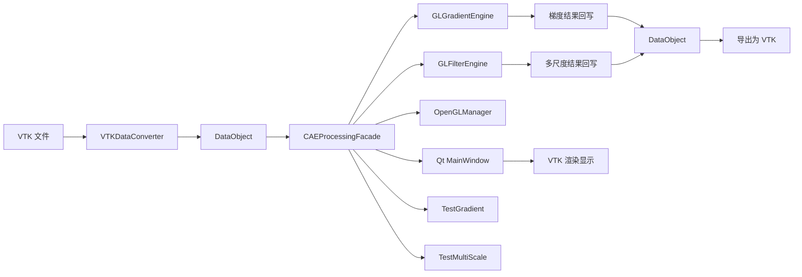

# OpenGLDP 系统接口文档

## 1. 文档说明

本文档从“对外接口、核心类、关键数据结构、模块数据流、梯度与多尺度执行路径”五个角度，对当前 `OpenGLDP` 项目做接口级说明。

本文档强调两点：

1. 说明以当前代码仓库为准。
2. 梯度模块部分已经同步到最近一轮“保持最小二乘法不变、修正 mixed-cell / 孤立点 / 邻域膨胀问题”后的实现。

---

## 2. 系统总体结构



### 2.1 模块分工

- `VTKDataConverter`
  - 负责 `vtkDataSet` 与内部 `DataObject` 的双向转换。
- `DataObject`
  - 是系统内部统一数据模型。
- `CAEProcessingFacade`
  - 是整个项目最重要的统一入口。
- `GLGradientEngine`
  - 负责梯度相关 GPU 计算。
- `GLFilterEngine`
  - 负责图双边滤波、多尺度分解与融合。
- `OpenGLManager`
  - 负责创建计算用 OpenGL 上下文。
- `MainWindow`
  - 负责 GUI 交互。
- `TestGradient` / `TestMultiScale`
  - 负责命令行验证和定量测试。

---

## 3. 文件级接口总览

| 文件 | 类型 | 作用 |
| --- | --- | --- |
| `CMakeLists.txt` | 构建配置 | 定义库、可执行目标、依赖与资源复制 |
| `CAEInterfaceTypes.h` | 接口定义 | 对外枚举、请求结构、结果结构 |
| `DataObject.h/.cpp` | 数据模型 | 保存几何、邻接、字段数组 |
| `VTKDataConverter.h/.cpp` | 转换模块 | `vtkDataSet <-> DataObject` |
| `OpenGLManager.h` | 平台支撑 | 创建并维护 GL 上下文 |
| `GLGradientEngine.h/.cpp` | 梯度引擎 | FD、WLS、Adaptive WLS、稀疏重构、稀疏梯度 |
| `GLFilterEngine.h/.cpp` | 滤波引擎 | 图双边滤波与多尺度融合 |
| `CAEProcessingFacade.h/.cpp` | 门面层 | 对外统一服务接口 |
| `app/main.cpp` | GUI 入口 | 创建 Qt 应用与主窗口 |
| `app/MainWindow.h/.cpp` | GUI 主界面 | 文件加载、参数设置、结果显示 |
| `TestGradient.cpp` | 测试程序 | 与 `vtkGradientFilter` 对比 |
| `TestMultiScale.cpp` | 测试程序 | 多尺度优化与统计验证 |
| `Shaders/FD.glsl` | 着色器 | 规则网格有限差分梯度 |
| `Shaders/WLS.glsl` | 着色器 | 非结构网格通用 WLS |
| `Shaders/AdaptiveWLS.glsl` | 着色器 | 非结构网格自适应 WLS |
| `Shaders/SparseReconstruct.glsl` | 着色器 | 稀疏线性重构 |
| `Shaders/SparseGradient.glsl` | 着色器 | 稀疏梯度算子 |
| `Shaders/Bilateral.glsl` | 着色器 | 图双边滤波 |
| `Shaders/MultiScaleFuse.glsl` | 着色器 | 多尺度细节融合 |

---

## 4. 对外接口定义层

## 4.1 `CAEInterfaceTypes.h`

### 作用

定义 GUI、测试程序与门面层共用的统一接口类型。

### 4.1.1 枚举类型

| 名称 | 含义 |
| --- | --- |
| `CAEFieldAssociation::Point` | 点数据 |
| `CAEFieldAssociation::Cell` | 单元数据 |
| `CAEGridClass::Regular` | 规则网格 |
| `CAEGridClass::Unstructured` | 非结构网格 |
| `CAEGradientMethod::Auto` | 自动选择 |
| `CAEGradientMethod::FiniteDifference` | 规则网格有限差分 |
| `CAEGradientMethod::WeightedLeastSquares` | 非结构网格 WLS |
| `CAEGradientMethod::AdaptiveWeightedLeastSquares` | 非结构网格自适应 WLS |

### 4.1.2 `CAEFieldInfo`

描述一个可选输入数组：

| 字段 | 含义 |
| --- | --- |
| `name` | 数组名 |
| `association` | 点或单元 |
| `numComponents` | 每个元组分量数 |
| `tupleCount` | 元组数 |

### 4.1.3 `CAEGradientRequest`

描述一次梯度请求：

| 字段 | 含义 |
| --- | --- |
| `datasetId` | 数据集 ID |
| `inputArrayName` | 输入数组名 |
| `association` | 点 / 单元 |
| `method` | `Auto / FD / WLS / AWLS` |
| `wlsExponent` | 距离权重指数 |
| `wlsLambda` | WLS 正则项 |
| `useAdaptiveNeighborhood` | 是否启用自适应邻域 |
| `useAdaptiveDimension` | 是否启用自适应维数 |
| `useAdaptiveRegularization` | 是否启用自适应正则 |
| `minNeighbors` | 最小邻居数 |
| `targetNeighbors` | 目标邻居数 |
| `maxNeighbors` | 最大邻居数 |
| `radiusScale` | 邻域半径放大因子 |
| `planeEigenRatio` | 近共面判断阈值 |
| `lineEigenRatio` | 近共线判断阈值 |
| `lambdaAmplify` | 低质量邻域正则放大因子 |

说明：

- 对规则网格，这些 WLS 参数不会生效。
- 对非结构网格，当前实现会优先尝试局部最小二乘算子缓存；只有缓存不可用时，这些参数才主要作用于 fallback WLS / Adaptive WLS。

### 4.1.4 `CAEGradientResultMeta`

描述一次梯度结果：

| 字段 | 含义 |
| --- | --- |
| `resultArrayName` | 新生成数组名 |
| `sourceArrayName` | 原数组名 |
| `association` | 点 / 单元 |
| `method` | 实际采用的方法 |
| `inputComponents` | 输入分量数 |
| `outputComponents` | 输出分量数，通常为 `3 * inputComponents` |
| `computeWallMs` | CPU 总耗时 |
| `computeGpuMs` | GPU 耗时 |

### 4.1.5 `CAEMultiScaleRequest`

描述多尺度优化请求：

| 字段 | 含义 |
| --- | --- |
| `datasetId` | 数据集 ID |
| `inputArrayName` | 输入数组名 |
| `association` | 点 / 单元 |
| `levels` | 分解层数 |
| `iterationsPerLevel` | 每层双边滤波迭代次数 |
| `spatialSigmaFactor` | 空间尺度因子 |
| `rangeSigmaFactor` | 值域尺度因子 |
| `levelScale` | 层间尺度放大倍数 |
| `edgeSigmaFactor` | 融合边缘抑制因子 |
| `detailGain0/1/2` | 三层细节增益 |
| `storeIntermediate` | 是否回写中间结果 |

### 4.1.6 `CAEMultiScaleResultMeta`

描述多尺度优化结果：

| 字段 | 含义 |
| --- | --- |
| `sourceArrayName` | 原数组名 |
| `association` | 点 / 单元 |
| `numLevels` | 实际层数 |
| `inputComponents` | 输入分量数 |
| `smoothArrayNames` | 平滑层数组名 |
| `detailArrayNames` | 细节层数组名 |
| `baseArrayName` | 基底层数组名 |
| `fusedArrayName` | 融合结果数组名 |
| `computeWallMs` | CPU 总耗时 |
| `computeGpuMs` | GPU 总耗时 |

### 4.1.7 `CAEDatasetSummary`

描述一个已加载数据集：

| 字段 | 含义 |
| --- | --- |
| `datasetId` | 数据集 ID |
| `displayName` | 显示名称 |
| `gridClass` | 网格类型 |
| `pointCount` | 点数 |
| `cellCount` | 单元数 |
| `fields` | 字段列表 |
| `results` | 梯度结果历史 |

---

## 5. 内部数据模型层

## 5.1 `DataObject.h/.cpp`

### 作用

`DataObject` 是系统内部统一数据结构，负责保存：

- 点坐标
- 单元拓扑
- 邻接关系
- 规则网格尺寸
- 点数组和单元数组

### 5.1.1 关键枚举和结构

| 名称 | 含义 |
| --- | --- |
| `DataArrayType::POINT_DATA` | 点关联数组 |
| `DataArrayType::CELL_DATA` | 单元关联数组 |
| `GridType::DATA_OBJECT_TYPE_RegularGrid` | 规则网格 |
| `GridType::DATA_OBJECT_TYPE_UNSTRUCTURED` | 非结构网格 |

### 5.1.2 `DataArray`

| 字段 | 含义 |
| --- | --- |
| `name` | 数组名 |
| `data` | 扁平化浮点数组 |
| `numComponents` | 分量数 |
| `dataType` | 点或单元 |

### 5.1.3 `DataObject` 重要成员

| 成员 | 含义 |
| --- | --- |
| `gridType` | 网格类型 |
| `points` | 点坐标 |
| `cellCenters` | 单元中心 |
| `dataArrays` | 所有字段数组 |
| `cells` | 单元连接 |
| `cellOffsets` | 单元 CSR 偏移 |
| `cellTypes` | 单元类型 |
| `pointNeighbors` | 点邻接 |
| `pointNeighborOffsets` | 点邻接偏移 |
| `pointInCellNeighbors` | 点所属单元 |
| `pointInCellNeighborOffsets` | 点所属单元偏移 |
| `cellNeighbors` | 单元邻接 |
| `cellNeighborsOffsets` | 单元邻接偏移 |
| `dimensions[3]` | 规则网格尺寸 |

### 5.1.4 主要成员函数

| 函数 | 作用 |
| --- | --- |
| `findDataArray(name, type)` | 查找数组 |
| `upsertDataArray(...)` | 更新或插入数组 |
| `pointCount()` | 点数 |
| `cellCount()` | 单元数 |

---

## 6. 数据转换层

## 6.1 `VTKDataConverter.h/.cpp`

### 作用

负责双向转换：

- `vtkDataSet -> DataObject`
- `DataObject -> vtkDataSet`

### 6.1.1 总入口函数

| 函数 | 作用 |
| --- | --- |
| `bindVTKDataAndInternalData(...)` | 绑定输入输出对象 |
| `convertVTKToInternal()` | 正向转换总入口 |
| `convertInternalToVTK()` | 反向转换总入口 |

### 6.1.2 正向转换中的关键步骤

| 函数 | 作用 |
| --- | --- |
| `convertType()` | 判断规则 / 非结构 |
| `convertPoints()` | 提取点坐标 |
| `convertDataArrays()` | 提取点数组和单元数组 |
| `convertDimensions()` | 提取规则网格维度 |
| `convertCellCenters()` | 计算单元中心 |
| `convertCell()` | 提取连接和单元类型 |
| `convertPointInCellNeighbors()` | 建点所属单元 CSR |
| `convertPointNeighbors()` | 建拓扑点邻接 |
| `convertPointNeighborsByKNN(k)` | KNN 点邻接 |
| `convertPointNeighborsRobust(minK, knnK)` | 拓扑不足时补邻域 |
| `convertCellNeighbors()` | 建单元邻接 |

### 6.1.3 与梯度模块直接相关的当前实现特点

1. 对非结构网格，优先尝试 `convertPointNeighborsRobust(12, 24)`。
2. 在 `convertPointNeighborsRobust(...)` 中，只有点至少属于一个单元时，才允许 KNN 补邻域。
3. 这避免了孤立点被错误补成“有几何邻域”的情况。

---

## 7. OpenGL 支撑层

## 7.1 `OpenGLManager.h`

### 作用

在 Windows 上创建一个计算专用 OpenGL 上下文，供计算着色器使用。

### 7.1.1 `OpenGLRuntimeInfo`

| 字段 | 含义 |
| --- | --- |
| `vendor` | GPU 厂商 |
| `renderer` | 渲染器信息 |
| `version` | OpenGL 版本 |
| `glsl` | GLSL 版本 |
| `major/minor` | 主次版本号 |

### 7.1.2 主要函数

| 函数 | 作用 |
| --- | --- |
| `initialize(offscreen)` | 创建上下文并加载 GLAD |
| `isReady()` | 上下文是否可用 |
| `makeCurrent()` | 设为当前上下文 |
| `info()` | 获取运行时信息 |

---

## 8. 梯度引擎层

## 8.1 `GLGradientEngine.h/.cpp`

### 作用

负责梯度相关的 GPU 执行，包括：

- 规则网格 FD
- 非结构网格通用 WLS
- 非结构网格 Adaptive WLS
- 稀疏值重构
- 稀疏梯度算子执行

### 8.1.1 参数结构

#### `RegularParams`

| 字段 | 含义 |
| --- | --- |
| `dims[3]` | 规则网格维度 |
| `origin[3]` | 预留原点参数 |
| `spacing[3]` | 预留间距参数 |

#### `WLSParams`

| 字段 | 含义 |
| --- | --- |
| `wExponent` | 距离权重指数 |
| `lambda` | 正则项 |
| `planeEigenRatio` | 近共面阈值 |
| `lineEigenRatio` | 近共线阈值 |
| `lambdaAmplify` | 正则放大倍数 |
| `enableAdaptiveDimension` | 是否启用自适应维数 |
| `enableAdaptiveRegularization` | 是否启用自适应正则 |

### 8.1.2 对外主要函数

| 函数 | 作用 |
| --- | --- |
| `setShaderDir(dir)` | 设置着色器目录 |
| `init()` | 初始化所有梯度着色器 |
| `release()` | 释放 GL 资源 |
| `computeRegularFD(...)` | 规则网格 FD 梯度 |
| `computeUnstructuredWLS(...)` | 非结构网格通用 WLS |
| `computeUnstructuredAdaptiveWLS(...)` | 非结构网格 Adaptive WLS |
| `reconstructSparseValues(...)` | 稀疏线性重构 |
| `applySparseGradientOperator(...)` | 稀疏梯度算子执行 |
| `setEnableGpuTiming(on)` | GPU 时间统计开关 |
| `getLastGpuTimeMs()` | 最近一次 GPU 时间 |

### 8.1.3 当前梯度引擎初始化的着色器

当前 `init()` 会初始化：

- `FD.glsl`
- `WLS.glsl`
- `AdaptiveWLS.glsl`
- `SparseReconstruct.glsl`
- `SparseGradient.glsl`

这与旧版只强调 FD/WLS 的接口文档不同，当前项目已经把“局部最小二乘算子 + GPU 稀疏执行”接入主流程。

---

## 9. 多尺度滤波引擎层

## 9.1 `GLFilterEngine.h/.cpp`

### 作用

负责：

- 图双边滤波
- 多尺度细节融合

### 9.1.1 参数结构

#### `BilateralParams`

| 字段 | 含义 |
| --- | --- |
| `spatialSigma` | 空间尺度参数 |
| `rangeSigma` | 值域尺度参数 |

#### `FusionParams`

| 字段 | 含义 |
| --- | --- |
| `levelCount` | 使用层数 |
| `edgeSigma` | 边缘抑制参数 |
| `detailGains[3]` | 三层细节增益 |

### 9.1.2 对外主要函数

| 函数 | 作用 |
| --- | --- |
| `setShaderDir(dir)` | 设置着色器目录 |
| `init()` | 初始化滤波与融合着色器 |
| `release()` | 释放资源 |
| `bilateralGraph(...)` | 图双边滤波 |
| `fuseMultiScale(...)` | 多尺度融合 |
| `setEnableGpuTiming(on)` | GPU 计时开关 |
| `getLastGpuTimeMs()` | 最近一次 GPU 时间 |

---

## 10. 门面层接口

## 10.1 `CAEProcessingFacade.h/.cpp`

### 作用

这是整个系统最关键的外部入口，负责把：

- 数据加载
- 数据查询
- 梯度计算
- 多尺度优化
- 数据导出

封装成统一 API。

### 10.1.1 `DatasetRecord`

`DatasetRecord` 是门面层内部的单个数据集记录，当前除了基本信息外，还维护了梯度相关缓存。

#### 基本字段

| 字段 | 含义 |
| --- | --- |
| `id` | 数据集唯一 ID |
| `displayName` | 显示名称 |
| `data` | 内部 `DataObject` |
| `sourceVtk` | 原始 VTK 对象 |
| `results` | 梯度结果历史 |

#### Adaptive 支撑字段

| 字段 | 含义 |
| --- | --- |
| `pointSupport` | 点数据 AWLS 支撑 |
| `cellSupport` | 单元数据 AWLS 支撑 |

每个 `AdaptiveGradientSupport` 中包含：

- 邻域 CSR
- 局部帧 `frames`
- 维数标签 `dimTags`
- 质量指标 `quality`
- 平均邻边长度 `meanNeighborDistance`

#### 局部最小二乘算子缓存

| 字段 | 含义 |
| --- | --- |
| `lsqOperatorCacheBuilt` | 是否已经尝试构建缓存 |
| `lsqOperatorCacheSupported` | 当前数据集是否支持该缓存 |
| `lsqPointGradOffsets / Sources / Coeffs4` | 点梯度稀疏算子 |
| `lsqPointValueOffsets / Sources / Weights` | 单元到点重构算子 |
| `lsqCellGradOffsets / Sources / Coeffs4` | 单元梯度稀疏算子 |

### 10.1.2 对外公开函数

| 函数 | 作用 |
| --- | --- |
| `initialize(shaderDir)` | 初始化 GL、梯度引擎、滤波引擎 |
| `setAnalyticBenchmarkEnabled(enabled)` | 控制加载时是否追加解析 benchmark 数组，默认关闭 |
| `loadDatasetFromVTKFile(filePath)` | 加载 VTK 文件 |
| `listDatasets()` | 列出数据集摘要 |
| `getDatasetSummary(datasetId, outSummary)` | 获取单个摘要 |
| `listFields(datasetId, assoc, outFields)` | 获取字段列表 |
| `computeGradient(req, outMeta)` | 计算梯度 |
| `computeMultiScaleDecompositionAndFusion(req, outMeta)` | 多尺度优化 |
| `exportDatasetToVTK(datasetId, outVtk)` | 导出为 VTK 内存对象 |
| `saveDatasetToVTKFile(datasetId, filePath, binary)` | 保存为 VTK 文件 |
| `getArrayData(datasetId, arrayName, assoc, outData, outComps)` | 读取数组数据 |
| `getLastComputeWallMs()` | 最近一次 CPU 时间 |
| `getLastComputeGpuMs()` | 最近一次 GPU 时间 |

### 10.1.3 梯度内部辅助函数

| 函数 | 作用 |
| --- | --- |
| `computeByFD(...)` | 规则网格 FD |
| `computeByWLS(...)` | 非结构网格 WLS |
| `computeByAdaptiveWLS(...)` | 非结构网格 AWLS |
| `ensureAdaptiveSupport(...)` | 构建 AWLS 支撑数据 |
| `ensureLeastSquaresOperatorCache(...)` | 构建局部最小二乘算子缓存 |
| `tryComputeByLeastSquaresOperators(...)` | 优先尝试局部算子路线 |

这意味着当前非结构网格梯度真正的内部优先顺序是：

1. `tryComputeByLeastSquaresOperators(...)`
2. 若失败，再退到 `WLS` 或 `AdaptiveWLS`

---

## 11. 梯度模块接口行为总结

## 11.1 VTK 数据集类型到主入口

| VTK 数据集类型 | 内部 `gridType` | `Auto` 选择 | 主入口 |
| --- | --- | --- | --- |
| `vtkImageData` | `RegularGrid` | `FiniteDifference` | `computeByFD(...) -> GLGradientEngine::computeRegularFD(...)` |
| `vtkRectilinearGrid` | `RegularGrid` | `FiniteDifference` | `computeByFD(...) -> GLGradientEngine::computeRegularFD(...)` |
| `vtkStructuredGrid` | `RegularGrid` | `FiniteDifference` | `computeByFD(...) -> GLGradientEngine::computeRegularFD(...)` |
| `vtkUnstructuredGrid` | `Unstructured` | `AdaptiveWeightedLeastSquares` | 先尝试更贴近局部导数结构的专用路线，再退回 `WLS/AWLS` |

## 11.2 非结构网格点数据按单元类型的实际路径

| 单元类别 | 典型 VTK 类型 | 优先路径 | 失败后的退路 |
| --- | --- | --- | --- |
| `3D 体单元` | `VTK_TETRA`、`VTK_VOXEL`、`VTK_HEXAHEDRON`、`VTK_WEDGE`、`VTK_PYRAMID`、`VTK_PENTAGONAL_PRISM`、`VTK_HEXAGONAL_PRISM` 及其高阶版本、`VTK_POLYHEDRON` | `computeVolumePointGradientByCellPatches(...)`，先在单元中心用 `vtkCell::Derivatives(...)` 求局部导数，再做点 patch 恢复 | 若该路线失败，再尝试局部算子缓存；缓存仍失败则退到 `computeUnstructuredAdaptiveWLS(...)` 或 `computeUnstructuredWLS(...)` |
| `2D 表面单元` | `VTK_TRIANGLE`、`VTK_TRIANGLE_STRIP`、`VTK_POLYGON`、`VTK_PIXEL`、`VTK_QUAD`、`VTK_QUADRATIC_TRIANGLE`、`VTK_QUADRATIC_QUAD`、`VTK_BIQUADRATIC_QUAD`、`VTK_QUADRATIC_LINEAR_QUAD`、`VTK_BIQUADRATIC_TRIANGLE` 等 | 先构建 `buildPointGradientOperator(...)`，再由 `applySparseGradientOperator(...)` 在 GPU 批量应用 | 若缓存构造失败，退到 `computeUnstructuredAdaptiveWLS(...)` 或 `computeUnstructuredWLS(...)` |
| `2D 四边形 4 节点特例` | `VTK_QUAD` | 在局部算子构造时走 `buildQuadLeastSquaresGradientCoefficients(...)` 的专门双线性参数面路线 | 若该特例失败，自动退回一般平面单元 LSQ |
| `1D 线单元` | `VTK_LINE`、`VTK_POLY_LINE`、`VTK_QUADRATIC_EDGE`、`VTK_CUBIC_LINE` | 一般无法构造 2D/3D 局部算子缓存，通常直接退到 `computeUnstructuredAdaptiveWLS(...)` 或 `computeUnstructuredWLS(...)` | 无额外专用路线 |
| `0D / 退化单元` | `VTK_VERTEX`、`VTK_POLY_VERTEX`、`VTK_EMPTY_CELL` | 不提供稳定的单元局部导数结构 | 只能依赖点邻域 WLS/AWLS；若邻域也不足，则结果可能为零或无效 |

## 11.3 非结构网格单元数据按单元类型的实际路径

| 单元类别 | 典型 VTK 类型 | 优先路径 | 失败后的退路 |
| --- | --- | --- | --- |
| `2D 表面单元` | 三角形、Polygon、Pixel、Quad 以及大多数高阶平面单元 | `buildPointValueReconstructionFromCells(...) -> reconstructSparseValues(...) -> buildCellGradientOperator(...) -> applySparseGradientOperator(...)` | `computeUnstructuredCellDataWLS(...)` |
| `3D 体单元` | 四面体、六面体、棱柱、金字塔、Polyhedron 及其高阶版本 | 局部算子缓存通常不支持，直接走 `computeUnstructuredCellDataWLS(...)` | 在 `fitDim == 3` 且邻域充分时，内部优先 `fitCellGradientFromNeighborCenters3D(...)`；否则回到“单元到点重构 + 局部拟合” |
| `1D 线单元` | `VTK_LINE`、`VTK_POLY_LINE`、`VTK_QUADRATIC_EDGE`、`VTK_CUBIC_LINE` | 直接走 `computeUnstructuredCellDataWLS(...)`，在主方向上做 `fitDim = 1` 的局部拟合 | 若顶点样本不足，会补充邻近单元中心样本 |
| `0D / 退化单元` | `VTK_VERTEX`、`VTK_POLY_VERTEX`、`VTK_EMPTY_CELL` | 局部几何维度无法可靠建立，通常不作为主要支持对象 | 结果依赖退化处理，不能作为主验证样例 |

---

## 12. 测试程序接口

## 12.1 `TestGradient.cpp`

作用：

- 加载数据集
- 调用 `CAEProcessingFacade::computeGradient(...)`
- 用 `vtkGradientFilter` 生成参考结果
- 统计 `VecErr_MAE_abs / VecErr_RMSE_abs / VecErr_MAX_abs / NMAE_vec / NRMSE_vec / SoftRel_median / SoftRel_P90 / Angle_mean_deg / Angle_P90_deg / ScaleBias`

典型调用格式：

```powershell
opengldp_benchmark [vtk文件路径] [point|cell] [数组名] [重复次数] [--analytic-bench]
```

说明：

- `--analytic-bench` 默认关闭。
- 只有显式打开时，测试程序才会通过 `setAnalyticBenchmarkEnabled(true)` 让加载后的数据集附带 `benchmark_*` 与 `*_exact_grad` 数组。
- GUI 不调用这个开关，因此不会使用解析 benchmark 数组。

## 12.2 `TestMultiScale.cpp`

作用：

- 调用多尺度优化接口
- 输出标准差、粗糙度等统计指标
- 可选导出带结果的 VTK 文件

---

## 13. 结果命名规则

### 13.1 梯度结果

命名规则：

```text
<源数组名>_grad_<P或C>_<FD或WLS或AWLS>
```

例如：

- `pressure_grad_P_FD`
- `temperature_grad_C_WLS`
- `S_Mises_grad_C_AWLS`

注意：

- 即使 `AWLS` 对外显示为 `AWLS`，内部实际仍可能先命中局部最小二乘算子缓存。

### 13.2 多尺度结果

平滑层：

```text
<源数组名>_ms_s<层号>_<P或C>
```

细节层：

```text
<源数组名>_ms_d<层号>_<P或C>
```

基底层：

```text
<源数组名>_ms_base_<P或C>
```

融合结果：

```text
<源数组名>_ms_fused_<P或C>
```

---

## 14. 当前接口设计的特点

1. 对外统一，内部分层清晰  
   GUI、测试程序和后续扩展模块都只需要面向 `CAEProcessingFacade`。

2. 数据结构统一  
   `DataObject` 同时兼容规则网格和非结构网格。

3. 算法执行与业务编排分离  
   门面层决定路线，引擎层负责执行。

4. 当前梯度接口已经支持“局部最小二乘算子缓存”  
   这比旧版接口文档中只强调 WLS 更接近当前真实实现。

5. 支持 CPU/GPU 时间统计  
   便于做性能测试和论文实验。

---

## 15. 建议的扩展方向

如果后续继续扩展系统接口，建议优先从下面三个方向入手：

1. 在 `CAEGradientResultMeta` 中增加“实际执行路径”字段  
   例如明确记录是 `LSQOperator`、`WLS` 还是 `AdaptiveWLS`。

2. 在 `CAEProcessingFacade` 中增加调试接口  
   例如导出局部算子缓存、邻域统计、维数标签。

3. 在 `VTKDataConverter` 中增加更明确的数据质量诊断接口  
   例如统计孤立点、退化单元、混合单元比例。

这样系统接口会更适合做工程调试和论文实验复现。
