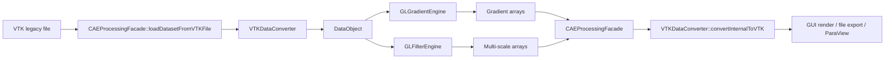
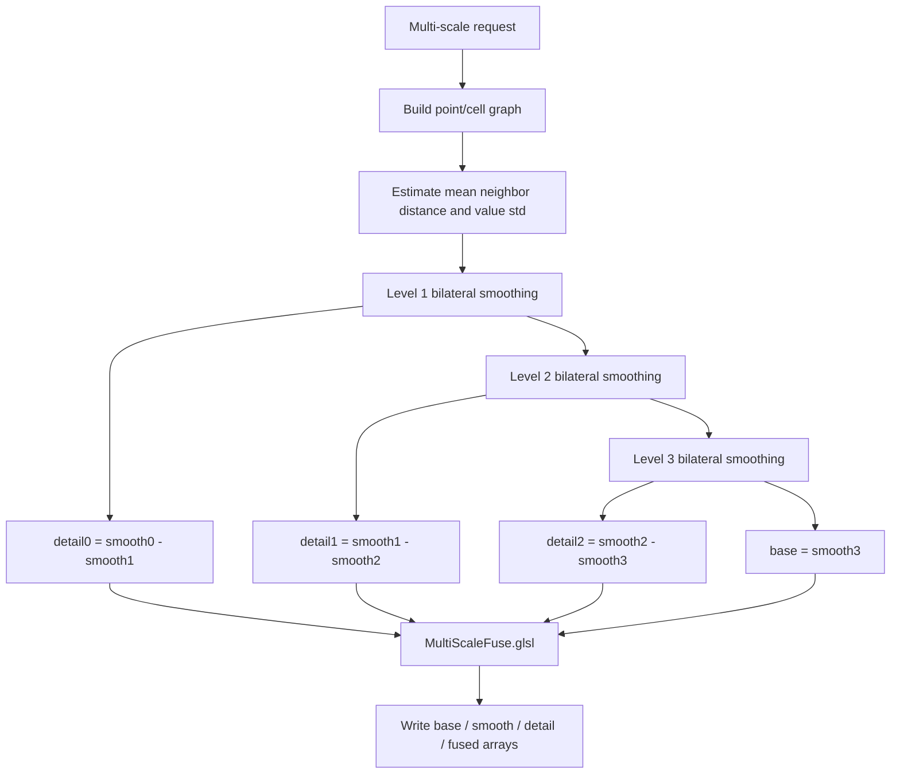

# 系统设计文档

## 1. 设计目标

本系统的设计目标有三条：

1. 形成统一的数据处理主线，使 GUI、测试程序和算法核心共享同一套底层实现。
2. 将梯度计算与数据优化从 VTK 原生数组接口中解耦，改为面向 GPU 友好的内部扁平数据表示。
3. 为论文实验提供可重复的输入、算法、计时、评价和导出流程。

对应的总体入口文件为：

- [CMakeLists.txt](../CMakeLists.txt)
- [CAEProcessingFacade.h](../CAEProcessingFacade.h)
- [CAEProcessingFacade.cpp](../CAEProcessingFacade.cpp)

## 2. 总体架构

### 2.1 架构图



### 2.2 分层说明

| 层次 | 职责 | 关键文件 |
| --- | --- | --- |
| 界面与测试层 | 接收用户输入、组织实验、显示与导出结果 | [app/MainWindow.cpp](../app/MainWindow.cpp), [TestGradient.cpp](../TestGradient.cpp), [TestMultiScale.cpp](../TestMultiScale.cpp), [TestFieldMetrics.cpp](../TestFieldMetrics.cpp) |
| 门面层 | 统一调度数据加载、算法分派、结果写回、计时与导出 | [CAEProcessingFacade.h](../CAEProcessingFacade.h), [CAEProcessingFacade.cpp](../CAEProcessingFacade.cpp) |
| 数据表示层 | 用统一扁平数组表示点、单元、邻域、字段与连接关系 | [DataObject.h](../DataObject.h), [DataObject.cpp](../DataObject.cpp) |
| 数据桥接层 | 完成 VTK 与内部表示之间的双向转换 | [VTKDataConverter.h](../VTKDataConverter.h), [VTKDataConverter.cpp](../VTKDataConverter.cpp) |
| 计算执行层 | 在 OpenGL 独立上下文中执行 GPU 算法 | [OpenGLManager.h](../OpenGLManager.h), [GLGradientEngine.cpp](../GLGradientEngine.cpp), [GLFilterEngine.cpp](../GLFilterEngine.cpp) |
| 着色器层 | 真正完成数值计算 | [Shaders](../Shaders) |

## 3. 关键模块设计

### 3.1 `DataObject`：统一内部数据表示

`DataObject` 的设计目标是把规则网格与非结构网格都变成 GPU 容易处理的扁平数组与 CSR 邻接结构。定义见 [DataObject.h](../DataObject.h)。

核心字段包括：

1. `points`：按 `[x0,y0,z0,x1,y1,z1,...]` 存储点坐标。
2. `cellCenters`：按同样格式存储单元中心。
3. `dataArrays`：统一存储点字段和单元字段。
4. `pointNeighbors` / `pointNeighborOffsets`：点邻域 CSR。
5. `cellNeighbors` / `cellNeighborsOffsets`：单元邻域 CSR。
6. `cells` / `cellOffsets` / `cellTypes`：单元连接关系与类型。
7. `dimensions`：规则网格逻辑维度。

这种表示方式的优点是：

1. 着色器端可直接按线性索引访问数据。
2. 规则网格与非结构网格可共用测试统计逻辑。
3. 字段写回、导出和结果缓存都更统一。

### 3.2 `VTKDataConverter`：桥接层

`VTKDataConverter` 位于 [VTKDataConverter.h](../VTKDataConverter.h) / [VTKDataConverter.cpp](../VTKDataConverter.cpp)，负责两类转换：

1. `vtkDataSet -> DataObject`
2. `DataObject -> vtkDataSet`

在非结构网格路径上，它会额外构建：

1. 点所属单元列表 `pointInCellNeighbors`
2. 点邻域图 `pointNeighbors`
3. 单元邻域图 `cellNeighbors`

设计上优先使用拓扑邻接，必要时通过 KNN 补足点邻域，使后续算法有更稳定的样本支持。

### 3.3 `OpenGLManager`：独立计算上下文

`OpenGLManager` 位于 [OpenGLManager.h](../OpenGLManager.h)，在 Windows 下创建独立的 WGL 上下文，用于：

1. 编译 Compute Shader
2. 绑定 SSBO
3. 进行 GPU 计时

这一设计避免 GUI 渲染上下文与计算上下文相互干扰。

### 3.4 `GLGradientEngine`：梯度引擎

定义见 [GLGradientEngine.h](../GLGradientEngine.h)。当前提供的接口包括：

1. `computeRegularFD`
2. `computeUnstructuredWLS`
3. `computeUnstructuredAdaptiveWLS`
4. `computeUnstructuredShapeFunctionPoint`
5. `computeUnstructuredShapeFunctionCell`

对应着色器分别为：

- [Shaders/FD.glsl](../Shaders/FD.glsl)
- [Shaders/WLS.glsl](../Shaders/WLS.glsl)
- [Shaders/AdaptiveWLS.glsl](../Shaders/AdaptiveWLS.glsl)
- [Shaders/ShapePointGradient.glsl](../Shaders/ShapePointGradient.glsl)
- [Shaders/ShapeCellGradient.glsl](../Shaders/ShapeCellGradient.glsl)
- [Shaders/CellDataToPointLift.glsl](../Shaders/CellDataToPointLift.glsl)

### 3.5 `GLFilterEngine`：数据优化引擎

定义见 [GLFilterEngine.h](../GLFilterEngine.h)。当前提供的核心能力包括：

1. 图双边滤波 `bilateralGraph`
2. 多尺度细节融合 `fuseMultiScale`

对应着色器为：

- [Shaders/Bilateral.glsl](../Shaders/Bilateral.glsl)
- [Shaders/MultiScaleFuse.glsl](../Shaders/MultiScaleFuse.glsl)

### 3.6 `CAEProcessingFacade`：统一调度入口

`CAEProcessingFacade` 是系统的核心调度器。其职责包括：

1. 初始化 OpenGL 与着色器环境。
2. 维护多数据集缓存。
3. 自动区分规则网格与非结构网格。
4. 统一记录 CPU/GPU 时间。
5. 为 GUI 和测试程序提供稳定调用界面。

## 4. 主要数据流设计

### 4.1 梯度模块数据流

```mermaid
flowchart TD
    A["Gradient request"] --> B["Validate dataset and field"]
    B --> C{"Grid class / method"}
    C -->|Regular or FD| D["FD.glsl"]
    C -->|Unstructured + Shape(Point)| E["ShapePointGradient.glsl"]
    E --> F{"All-zero output?"}
    F -->|Yes| G["ShapeCellGradient.glsl + CellDataToPointLift.glsl"]
    F -->|No| H["Accept result"]
    C -->|Unstructured + Shape(Cell)| I["CellDataToPointLift.glsl -> ShapeCellGradient.glsl"]
    C -->|Unstructured + AWLS| J["AdaptiveWLS.glsl or WLS.glsl"]
    D --> K["Write result array"]
    G --> K
    H --> K
    I --> K
    J --> K
    K --> L["Record wall time / GPU time"]
```

### 4.2 数据优化模块数据流



## 5. 算法原理

### 5.1 规则网格有限差分

`FD.glsl` 的核心做法不是简单假设正交均匀网格，而是采用“参数空间差分 + Jacobian 映射”的形式，因此可处理结构化但几何上弯曲的采样布局。

对每个采样点：

1. 沿 `xi`、`eta`、`zeta` 三个逻辑方向取前后邻点。
2. 计算参数空间导数 `du/dxi`、`du/deta`、`du/dzeta`。
3. 由邻点坐标近似构造局部 Jacobian。
4. 通过链式法则映射到物理空间梯度。

### 5.2 非结构网格形函数导数法

#### 5.2.1 基本公式

设单元的参数坐标为 `xi`，节点坐标为 `x_a`，节点值为 `u_a`，则：

`x(xi) = sum(N_a(xi) x_a)`

`u(xi) = sum(N_a(xi) u_a)`

先计算参考单元中的形函数导数：

`grad_xi(u) = sum(u_a grad_xi(N_a))`

对于满维单元，物理空间梯度可由 Jacobian 变换得到：

`grad_x(u) = J^{-T} grad_xi(u)`

对于三维空间中的曲面单元或线单元，当前实现采用等价的最小范数映射：

`grad_x(u) = J (J^T J)^{-1} grad_xi(u)`

这与着色器中对 `dim=1/2/3` 分别处理的逻辑一致。

#### 5.2.2 点数据梯度

点数据梯度的本质是：对一个采样点，将其所关联的若干单元提供的局部梯度信息做汇聚。当前着色器支持：

- 线单元
- 三角形
- 像素/四边形
- 四面体
- 体素/六面体
- 棱柱

对论文主线而言，建议正式宣称并验证：

- 一阶三角形
- 一阶四边形
- 一阶四面体
- 一阶六面体

#### 5.2.3 单元数据梯度

单元数据梯度采用“单元值先提升为点值，再在单元中心重构梯度”的两步式设计：

1. `CellDataToPointLift.glsl` 对每个点收集其关联单元值并平均。
2. `ShapeCellGradient.glsl` 在单元中心处计算形函数导数梯度。

该策略的优点是：

1. 重用点值型形函数框架；
2. 统一单元梯度和点梯度的几何映射逻辑；
3. 着色器实现更紧凑。

### 5.3 AWLS 简述

AWLS 路径仍保留在系统中，其核心是通过邻域几何与字段差分构造局部最小二乘问题。当前门面层仍支持该方法，但论文主线应聚焦形函数导数法，避免实验范围过散。

### 5.4 图双边滤波与多尺度融合

对每个图节点 `i`，双边滤波计算为：

`u_i' = sum_j w_ij u_j / sum_j w_ij`

其中：

`w_ij = exp(-||x_i-x_j||^2 / (2 sigma_s^2)) * exp(-||u_i-u_j||^2 / (2 sigma_r^2))`

系统并不直接要求用户输入绝对 `sigma`，而是先由门面层估计：

1. `meanNeighborDistance`
2. `valueStd`

然后把无量纲参数换算到当前数据尺度上，使不同数据集上的实验更容易保持可比性。

多尺度融合中：

- `smooth_l` 表示第 `l` 层平滑结果；
- `detail_l = smooth_l - smooth_{l+1}`；
- 最终 `fused = base + g0*detail0 + g1*detail1 + g2*detail2`。

## 6. 测试程序设计

### 6.1 梯度测试程序 `opengldp_benchmark`

源码：[TestGradient.cpp](../TestGradient.cpp)

设计目标：

1. 与 GUI 共用同一门面接口。
2. 支持解析场与 VTK 双参考模式。
3. 输出可直接写入 CSV 的定量指标。

主要模式：

- `single`：单案例调试
- `benchmarks`：批量解析基准场测试
- `fields`：真实字段测试

### 6.2 多尺度测试程序 `opengldp_multiscale_test`

源码：[TestMultiScale.cpp](../TestMultiScale.cpp)

设计目标：

1. 在真实网格上构造干净场与噪声场。
2. 调用多尺度优化模块。
3. 输出 CSV 与 VTK 文件，方便 ParaView 观察。

### 6.3 字段评价程序 `opengldp_field_metrics`

源码：[TestFieldMetrics.cpp](../TestFieldMetrics.cpp)

设计目标：

1. 当输入场、参考场和优化场已分别存在时，独立完成误差与粗糙度评价。
2. 不强依赖重新运行优化模块，适合离线复核。

## 7. 指标设计与计算方法

### 7.1 梯度误差指标

设 `g_i` 为系统结果，`r_i` 为参考结果，`M` 为参与比较的三维梯度向量数，则：

| 指标 | 公式 | 含义 |
| --- | --- | --- |
| `MAE_abs` | `1/M * sum ||g_i-r_i||_2` | 平均绝对向量误差 |
| `RMSE_abs` | `sqrt(1/M * sum ||g_i-r_i||_2^2)` | 均方根向量误差 |
| `MAX_abs` | `max ||g_i-r_i||_2` | 最大向量误差 |
| `RMS_ref` | `sqrt((1/M) * sum ||r_i||_2^2)` | 参考梯度尺度 |
| `NMAE` | `sum ||g_i-r_i||_2 / sum ||r_i||_2` | 归一化 MAE |
| `NRMSE` | `sqrt(sum ||g_i-r_i||_2^2 / sum ||r_i||_2^2)` | 归一化 RMSE |

对应实现见 [TestGradient.cpp](../TestGradient.cpp) 中 `CompareMetrics` 的计算逻辑。

### 7.2 Soft Relative Error

为避免参考梯度很小时相对误差失真，程序定义：

`tau = max(1e-12, 0.05 * RMS_ref)`

`softRel_i = ||g_i-r_i||_2 / max(||r_i||_2, tau)`

并统计：

- `softRelMean`
- `softRelMedian`
- `softRelP90`

若 `||r_i|| < tau`，则该样本记入 `lowRefCount`，并从 `stable` 子集统计中剔除。

### 7.3 方向与尺度指标

| 指标 | 公式 | 含义 |
| --- | --- | --- |
| `angle_i` | `acos( dot(g_i,r_i) / (||g_i|| ||r_i||) )` | 方向夹角 |
| `scaleBias` | `sum dot(g_i,r_i) / sum ||r_i||^2` | 整体尺度偏差 |

其中 `scaleBias` 接近 `1` 表示整体尺度较一致。

### 7.4 曲面场的切向投影指标

对曲面型数据，环境三维梯度会包含法向分量惩罚。为此，程序还会根据局部几何框架将梯度投影到内蕴切空间：

`g_intrinsic = sum_{k=1..d} (g · e_k) e_k`

其中 `d` 为局部几何维度标签，`e_k` 为局部正交基。实现见 [TestHarnessUtils.h](../TestHarnessUtils.h) 中 `projectGradientToIntrinsic()`。

### 7.5 图粗糙度

对字段 `u`，图粗糙度定义为所有邻接边两端差值的平均绝对值：

`roughness = mean_{(i,j) in E, c} |u_i^c - u_j^c|`

实现见 [TestHarnessUtils.h](../TestHarnessUtils.h) 中 `computeGraphRoughness()`。

### 7.6 邻域相关性

噪声邻域相关性按图边上的协方差与方差比值定义：

`corr = covariance_edge / variance_edge`

其值越大，说明噪声在邻域图上越平滑、越具有相关性。实现见 [TestHarnessUtils.h](../TestHarnessUtils.h) 中 `computeNeighborCorrelation()`。

### 7.7 优化改进率

对数据优化模块，常用改进率包括：

| 指标 | 公式 |
| --- | --- |
| `maeImprovementRatio` | `fused_mae / input_mae` |
| `rmseImprovementRatio` | `fused_rmse / input_rmse` |
| `roughnessRatio` | `fused_roughness / input_roughness` |

这些量小于 `1` 时通常表示优化后优于输入。

## 8. 当前设计边界

1. 计算核心已转到 OpenGL，但数据输入、导出和渲染仍依赖 VTK。
2. 论文主验证范围建议限制在一阶三角形、四边形、四面体和六面体。
3. `notch_stress` 的点梯度仍存在稳定性问题，不宜作为当前主定量案例。

## 9. 相关文档

- [API文档](./API文档.md)
- [用户使用说明](./用户使用说明.md)
- [实验方案文档](./实验方案文档.md)
- [AI交接文档](./AI交接文档.md)
- [TestGradient测试说明.md](./TestGradient测试说明.md)
- [TestMultiScale测试说明.md](./TestMultiScale测试说明.md)
- [TestFieldMetrics测试说明.md](./TestFieldMetrics测试说明.md)

