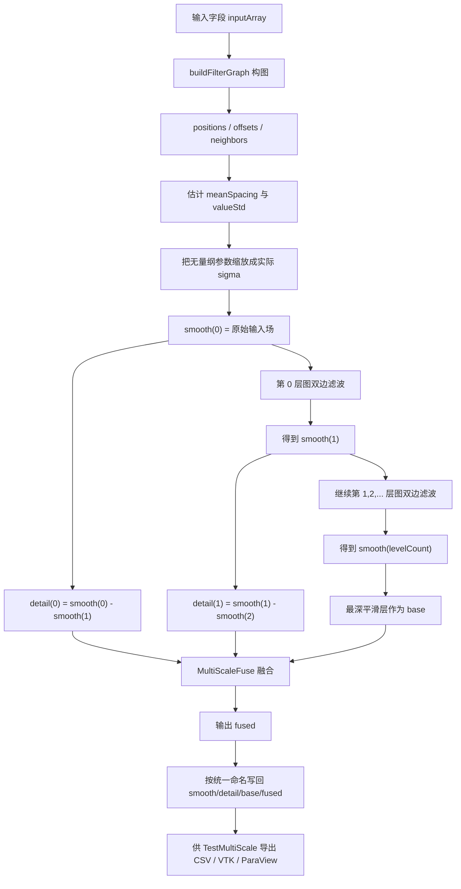
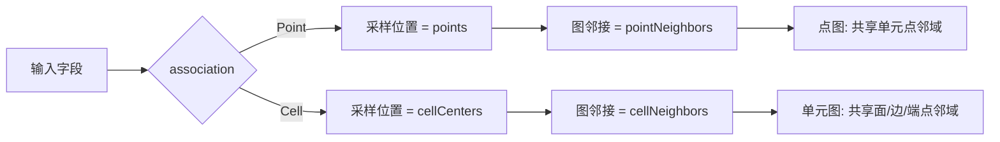
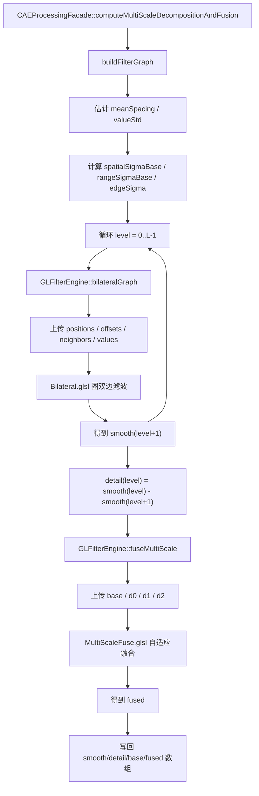
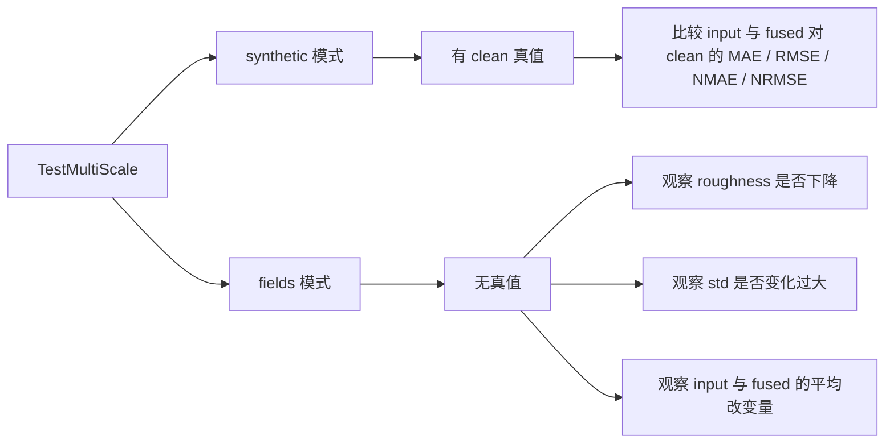

# 数据优化模块流程图

本文件按当前工程中“数据优化模块”的真实实现整理，对应代码主线为：

- [CAEProcessingFacade.cpp](/C:/Users/lenovo/Desktop/bishe/myProj/OpenGLDP/CAEProcessingFacade.cpp)
- [GLFilterEngine.cpp](/C:/Users/lenovo/Desktop/bishe/myProj/OpenGLDP/GLFilterEngine.cpp)
- [Bilateral.glsl](/C:/Users/lenovo/Desktop/bishe/myProj/OpenGLDP/Shaders/Bilateral.glsl)
- [MultiScaleFuse.glsl](/C:/Users/lenovo/Desktop/bishe/myProj/OpenGLDP/Shaders/MultiScaleFuse.glsl)
- [TestMultiScale.cpp](/C:/Users/lenovo/Desktop/bishe/myProj/OpenGLDP/TestMultiScale.cpp)

## 1. 模块作用

当前“数据优化模块”不是简单的一次平滑，而是一个**多尺度分解与融合模块**：

1. 先在图结构上做多层双边滤波，得到越来越平滑的 `smooth` 层；
2. 用相邻平滑层之差构造 `detail` 细节层；
3. 取最深层平滑结果作为 `base`；
4. 按边缘强度和各层细节幅值，对 `detail` 做自适应加权融合；
5. 生成最终的 `fused` 优化结果。

## 2. 总体流程

## 3. 构图方式

数据优化模块和梯度模块共用同一套图结构构造逻辑：

也就是说，优化模块不是在规则网格卷积意义下做滤波，而是**在非结构图上做图双边滤波**。

## 4. 多尺度分解公式

设原始输入场为：

\[
S^{(0)} = X
\]

第 `l` 层平滑场由上一层平滑场继续双边滤波得到：

\[
S^{(l+1)} = \mathcal{B}(S^{(l)})
\]

如果每层设置 `iterationsPerLevel > 1`，则会在同一层上重复若干次 `\mathcal{B}`。

细节层定义为相邻平滑层之差：

\[
D^{(l)} = S^{(l)} - S^{(l+1)}
\]

最深层平滑场作为基底层：

\[
Base = S^{(L)}
\]

其中 `L = levelCount`。

## 5. 图双边滤波的数学形式

对图上样本 `i` 的第 `c` 个分量，当前 shader 实际计算的是：

\[
\tilde{x}_i^{(c)} =
\frac{x_i^{(c)} + \sum_{j\in N(i)} w_{ij}^{(c)} x_j^{(c)}}
{1 + \sum_{j\in N(i)} w_{ij}^{(c)}}
\]

权重由**空间项**和**数值项**相乘组成：

\[
w_{ij}^{(c)} = w_{ij}^{space} \cdot w_{ij}^{range}
\]

\[
w_{ij}^{space} =
\exp\left(
-\frac{\|p_j-p_i\|^2}{2\sigma_s^2}
\right)
\]

\[
w_{ij}^{range} =
\exp\left(
-\frac{(x_j^{(c)}-x_i^{(c)})^2}{2\sigma_r^2}
\right)
\]

其中：

- `p_i` 是点或单元中心位置
- `N(i)` 是图邻域
- `sigma_s = spatialSigma`
- `sigma_r = rangeSigma`

这部分实现对应：

- [Bilateral.glsl:47](/C:/Users/lenovo/Desktop/bishe/myProj/OpenGLDP/Shaders/Bilateral.glsl#L47)
- [Bilateral.glsl:48](/C:/Users/lenovo/Desktop/bishe/myProj/OpenGLDP/Shaders/Bilateral.glsl#L48)
- [Bilateral.glsl:55](/C:/Users/lenovo/Desktop/bishe/myProj/OpenGLDP/Shaders/Bilateral.glsl#L55)

## 6. 融合模块的数学形式

当前融合模块不是简单地

\[
Base + g_0 D_0 + g_1 D_1 + g_2 D_2
\]

而是一个**按局部细节强度自适应衰减的加权融合**。

先定义局部三层细节的幅值：

\[
m_0 = |D_0|,\quad m_1 = |D_1|,\quad m_2 = |D_2|
\]

\[
feature = m_0 + m_1 + m_2
\]

边缘/细节激活系数为：

\[
atten = \frac{feature}{feature + edgeSigma}
\]

再按各层细节幅值占比和预设增益分配权重：

\[
w_0 = atten \cdot \frac{m_0}{m_0+m_1+m_2+\epsilon} \cdot gain_0
\]

\[
w_1 = atten \cdot \frac{m_1}{m_0+m_1+m_2+\epsilon} \cdot gain_1
\]

\[
w_2 = atten \cdot \frac{m_2}{m_0+m_1+m_2+\epsilon} \cdot gain_2
\]

最终融合结果为：

\[
Fused = Base + w_0 D_0 + w_1 D_1 + w_2 D_2
\]

对应实现见：

- [MultiScaleFuse.glsl:30](/C:/Users/lenovo/Desktop/bishe/myProj/OpenGLDP/Shaders/MultiScaleFuse.glsl#L30)
- [MultiScaleFuse.glsl:31](/C:/Users/lenovo/Desktop/bishe/myProj/OpenGLDP/Shaders/MultiScaleFuse.glsl#L31)
- [MultiScaleFuse.glsl:34](/C:/Users/lenovo/Desktop/bishe/myProj/OpenGLDP/Shaders/MultiScaleFuse.glsl#L34)
- [MultiScaleFuse.glsl:38](/C:/Users/lenovo/Desktop/bishe/myProj/OpenGLDP/Shaders/MultiScaleFuse.glsl#L38)

## 7. 参数是怎么设置的

### 7.1 用户侧默认参数

在 [CAEInterfaceTypes.h](/C:/Users/lenovo/Desktop/bishe/myProj/OpenGLDP/CAEInterfaceTypes.h) 中，当前多尺度请求默认参数为：

- `levels = 3`
- `iterationsPerLevel = 1`
- `spatialSigmaFactor = 1.5`
- `rangeSigmaFactor = 0.5`
- `levelScale = 1.8`
- `edgeSigmaFactor = 0.35`
- `detailGain0 = 1.0`
- `detailGain1 = 0.75`
- `detailGain2 = 0.5`
- `storeIntermediate = true`

### 7.2 代码内部的尺度自适应缩放

模块不会直接拿这些因子当 shader 参数，而是先结合当前数据集的几何尺度和数值尺度进行缩放，见 [CAEProcessingFacade.cpp:1539](/C:/Users/lenovo/Desktop/bishe/myProj/OpenGLDP/CAEProcessingFacade.cpp#L1539)。

当前定义为：

\[
spatialSigmaBase = spatialSigmaFactor \cdot meanSpacing
\]

\[
rangeSigmaBase = rangeSigmaFactor \cdot valueStd
\]

\[
edgeSigma = edgeSigmaFactor \cdot valueStd
\]

其中：

- `meanSpacing` 是图上平均邻接距离
- `valueStd` 是输入字段的标准差

然后第 `l` 层的空间尺度为：

\[
\sigma_s^{(l)} = spatialSigmaBase \cdot levelScale^l
\]

而数值尺度 `sigma_r` 在各层保持不变：

\[
\sigma_r^{(l)} = rangeSigmaBase
\]

这意味着：

- 层数越深，空间平滑范围越大
- 但对数值差异的敏感阈值不随层数扩张

## 8. GPU 执行流程

## 9. 结果数组如何命名

由 [CAEProcessingFacade.cpp](/C:/Users/lenovo/Desktop/bishe/myProj/OpenGLDP/CAEProcessingFacade.cpp) 中的命名函数生成：

- 平滑层：
  - `src_ms_s1_P`
  - `src_ms_s2_P`
  - `src_ms_s3_P`
- 细节层：
  - `src_ms_d0_P`
  - `src_ms_d1_P`
  - `src_ms_d2_P`
- 基底层：
  - `src_ms_base_P`
- 融合结果：
  - `src_ms_fused_P`

如果是单元场，则后缀会变成 `_C`。

## 10. TestMultiScale 如何评估结果

测试模块分两类模式：

### 10.1 roughness 的定义

`roughness` 在 [TestHarnessUtils.h:251](/C:/Users/lenovo/Desktop/bishe/myProj/OpenGLDP/TestHarnessUtils.h#L251) 中定义为：

> 对图上每条邻接边，统计两端数值差的绝对值，再取平均。

写成公式近似就是：

\[
Roughness =
\frac{1}{|E| \cdot comps}
\sum_{(i,j)\in E}\sum_c |x_i^{(c)} - x_j^{(c)}|
\]

它越小，说明场在图邻域上越平滑。

### 10.2 synthetic 模式下的误差指标

若有干净真值 `clean`，则比较：

- `inputError`
- `fusedError`
- `maeImprovementRatio = fused_mae / input_mae`
- `rmseImprovementRatio = fused_rmse / input_rmse`

如果这两个 ratio 小于 1，说明优化后更接近真值。

## 11. 与 results 文件夹的关系

当前 `TestMultiScale` 的默认输出路径是：

- CSV 报告：`results\multiscale_report.csv`
- VTK 导出：`results\multiscale_report.vtk`

测试时若开启批量 case，导出路径会自动扩展成多份 `.vtk` 文件，便于在 ParaView 中逐个查看。

当前 `results` 目录里还没有现成的 `multiscale_report.csv`，说明这套多尺度测试近期还没有在当前工作区导出新结果；但代码已经完整支持该输出流程。

## 12. 可直接写进论文的简述

可表述为：

> 本文的数据优化模块采用基于图结构的多尺度双边滤波与细节自适应融合策略。首先根据点或单元的拓扑邻接关系构造图结构，并以原始场为第 0 层输入；随后在多层尺度上迭代执行图双边滤波，获得由浅至深的平滑层，并通过相邻平滑层之差构造多层细节分量；最后以最深层平滑结果作为基底层，并结合局部细节强度、边缘抑制参数和分层增益系数，对多层细节进行自适应加权融合，从而在抑制噪声的同时尽可能保留结构细节。

## 13. 一句话理解这个模块

这个模块本质上做的是：

**“先把输入场拆成 base + 多层 detail，再按局部特征强度选择性地把 detail 加回去。”**
