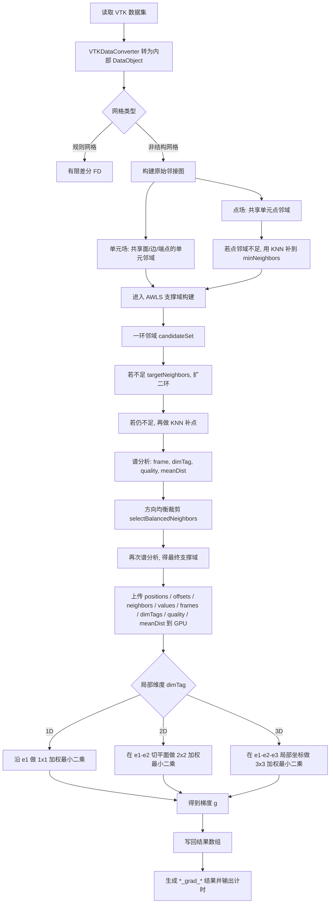
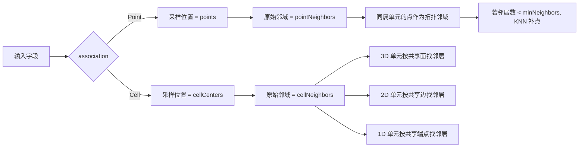
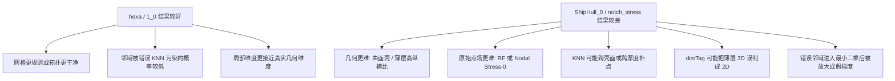

# 非结构网格梯度计算流程图

本文件按当前工程的真实实现整理，便于写毕设时直接引用。

相关结果文件：

- `hexa.vtk` 对应 [hexa.txt](/C:/Users/lenovo/Desktop/bishe/myProj/OpenGLDP/results/hexa.txt)
- `1_0.vtk` 对应 [1.txt](/C:/Users/lenovo/Desktop/bishe/myProj/OpenGLDP/results/1.txt)
- `ShipHull_0.vtk` 对应 [ShipHull_0.txt](/C:/Users/lenovo/Desktop/bishe/myProj/OpenGLDP/results/ShipHull_0.txt)
- `notch_stress.vtk` 对应 [notch_stress.txt](/C:/Users/lenovo/Desktop/bishe/myProj/OpenGLDP/results/notch_stress.txt)

## 1. 总体流程

## 2. 点场与单元场的邻域来源

## 3. AWLS 数学形式

对当前样本 `i` 及其邻域 `j in N(i)`，代码实际求解的是局部加权最小二乘问题：

\[
\min_{\beta}\sum_{j \in N(i)} w_{ij}\left(\beta^T \xi_{ij} - (\phi_j-\phi_i)\right)^2 + \lambda_{\text{eff}}\|\beta\|^2
\]

其中：

- `\xi_{ij}` 是邻居位移在局部坐标系中的投影
- `\beta` 是局部梯度系数
- 最终全局梯度为 `g = beta_1 e1 + beta_2 e2 + beta_3 e3`

对应法方程为：

\[
(A + \lambda_{\text{eff}} I)\beta = b
\]

\[
A = \sum_j w_{ij}\xi_{ij}\xi_{ij}^T,\qquad
b = \sum_j w_{ij}(\phi_j-\phi_i)\xi_{ij}
\]

## 4. 权重与正则

### 4.1 距离权重

当前距离权重为：

\[
w_{ij} = \frac{1}{\max(\|x_j-x_i\|,10^{-6})^p}
\]

其中默认 `p = wlsExponent = 1.0`。

### 4.2 自适应正则

当前 AWLS 会根据邻域质量 `quality` 放大正则：

\[
\lambda_{\text{scale}} = 1 + \text{lambdaAmplify}(1-q)
\]

\[
\lambda_{\text{eff}} =
\max\left(
\lambda \cdot \lambda_{\text{scale}} \cdot \max\left(\frac{\text{trace}}{\text{count}}, h^2\right),
10^{-6}\text{trace},
10^{-8}
\right)
\]

其中：

- `q = quality`
- `h = meanNeighborDistance`
- 默认 `lambda = 1e-3`
- 默认 `lambdaAmplify = 4.0`

## 5. 为什么四个算例表现不同

## 6. 与结果文件的对应解释

- [hexa.txt](/C:/Users/lenovo/Desktop/bishe/myProj/OpenGLDP/results/hexa.txt)
  说明常规体网格上，当前 WLS/AWLS 主流程是能工作的。
- [1.txt](/C:/Users/lenovo/Desktop/bishe/myProj/OpenGLDP/results/1.txt)
  说明单元场路径也基本可用，但局部仍有偏差。
- [ShipHull_0.txt](/C:/Users/lenovo/Desktop/bishe/myProj/OpenGLDP/results/ShipHull_0.txt)
  说明曲面点场上，当前“环境 3D 对照 + 复杂邻域”口径并不稳定。
- [notch_stress.txt](/C:/Users/lenovo/Desktop/bishe/myProj/OpenGLDP/results/notch_stress.txt)
  说明薄层高纵横比和结点应力场会显著放大邻域污染与维度误判问题。

## 7. 可直接写进论文的简述

可表述为：

> 本文对非结构网格采用基于局部支撑域的加权最小二乘梯度重建方法。首先由网格拓扑构造点或单元的原始邻接图，并结合二环扩张、有限半径 KNN 补点和方向均衡裁剪形成最终支撑域；随后对局部邻域进行谱分析，估计主方向框架、局部维度与邻域质量；最后在 1D/2D/3D 局部坐标系内建立带距离权重和自适应正则项的最小二乘系统，求得局部梯度并映射回全局坐标系。

## 8. 现阶段最关键的风险点

- 点场邻域存在“两次 KNN 扩张”的风险。
- 曲面壳和薄层几何中，欧氏 KNN 容易跨层补点。
- `dimTag` 的 2D/3D 判定对强各向异性几何较敏感。
- `ShipHull_0` 和 `notch_stress` 的输入场并不是最理想的梯度 benchmark 场。
