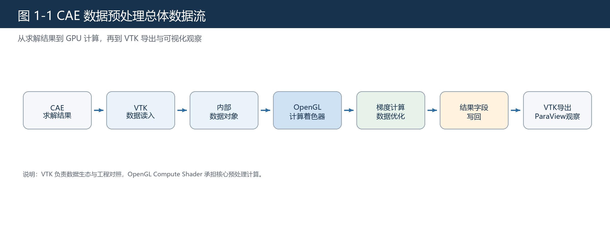
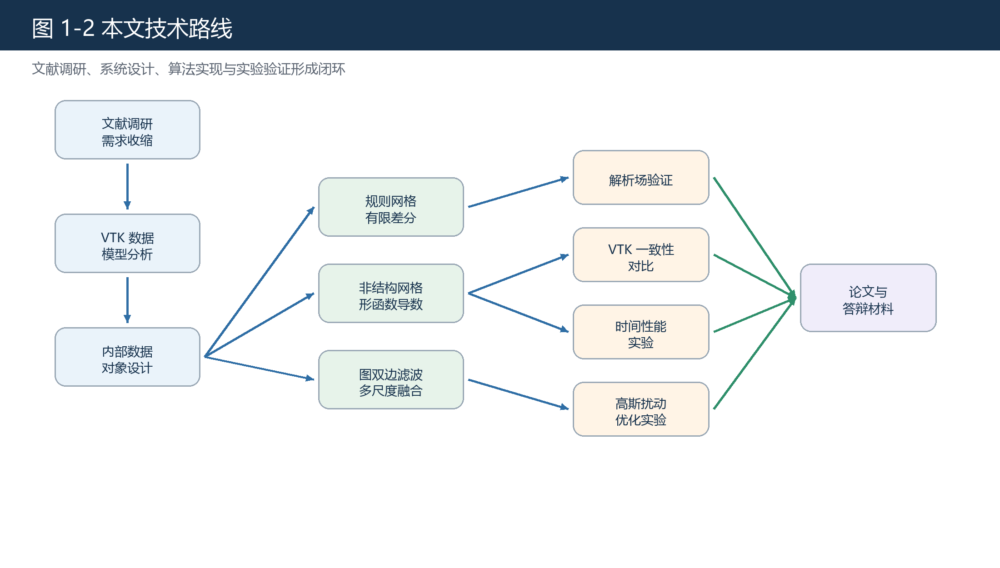

# 第一章 绪论

## 1.1 研究背景

CAE 技术通过数值方法对结构、热、流体和多物理场问题进行求解，是现代工程设计的重要支撑。求解器输出的结果通常由网格几何、单元拓扑、节点场、单元场和派生变量组成。工程人员无法仅凭原始离散数据直接进行判断，必须借助后处理工具完成字段派生、局部分析和可视化展示。后处理并不只是“把数据画出来”，其前端往往包含梯度计算、字段转换、局部平滑、异常观察和结果导出等数据预处理任务。

科学可视化工具链中，VTK 和 ParaView 已经形成成熟生态。ParaView 文档将 VTK 数据模型概括为 mesh 和 attributes，其中 mesh 由 points 和 cells 组成，attributes 则以点数据或单元数据等形式附着在数据集上[4]。这种数据模型与 CAE 网格结果天然对应，因此本文选择 VTK 作为数据读写、工程对照和结果导出的基础。但本文的研究重点不是封装现有过滤器，而是围绕 OpenGL 计算管线实现一条自有的预处理主流程。

随着 GPU 可编程能力增强，图形处理器已不再只服务于图像渲染。GPGPU 综述指出，图形硬件在可编程性和吞吐能力上的提升使其成为通用计算的重要平台[8]。OpenGL Compute Shader 提供了在 OpenGL 环境内执行通用并行计算的能力，SSBO 又允许着色器读写较大规模结构化数据[1][2]。这使得 CAE 后处理中的一部分局部并行计算可以迁移到 GPU 端完成。

图 1-1 给出了本文课题的总体数据流。与一般软件系统类本科论文相似，本文也需要说明需求、设计、实现和测试；但由于课题包含数值计算和科学可视化背景，论文还必须补充算法公式、实验指标和工程对照。

## 1.2 国内外研究现状

CAE 后处理和科学可视化领域已经形成了较成熟的软件生态。VTK 提供网格、属性、过滤器和读写接口，ParaView 在 VTK 基础上提供交互式分析环境[3][4][6]。这些工具适合承担数据读写、参考对照和结果观察任务，但如果课题只调用现有过滤器，难以体现对数据组织、并行计算和算法实现的理解。因此，本文选择保留 VTK/ParaView 的工程生态价值，同时在 OpenGL 计算管线中实现自有的数据预处理流程。

在并行计算方面，GPU 通用计算已经被广泛用于科学可视化和数值处理任务。GPGPU 综述指出，图形硬件在吞吐能力和可编程性方面的发展，使其逐渐成为通用并行计算平台[8]。VTK-m 等研究进一步说明，科学可视化框架也在面向多核 CPU 和 GPU 等大规模线程架构演进[7]。OpenGL Compute Shader 和 SSBO 为本文提供了在图形 API 内部组织通用计算任务的技术基础[1][2]。

在算法层面，规则网格、曲线网格和非结构化网格通常采用不同的梯度计算路径。规则网格具有逻辑索引，可在参数方向上进行有限差分，并通过坐标映射和 Jacobian 关系恢复物理空间梯度[25][26]；非结构化网格则更适合使用单元形函数导数和有限元几何映射描述梯度[9][10]。对于数据优化问题，双边滤波和网格双边去噪研究表明，结合空间邻近性与字段相似性可以在平滑局部扰动的同时保留主要边缘结构[11][12]。这些研究共同构成本文系统设计和实验验证的理论背景。

## 1.3 问题提出

本文研究的问题可以概括为：如何在 CAE 后处理数据预处理场景中，构建一条从 VTK 数据输入到 GPU 计算再到结果导出的完整原型流程。该问题有三个关键点。

第一，网格类型不同导致计算方式不同。规则网格具有明确逻辑维度，可以先在逻辑/参数方向上使用有限差分，再通过 Jacobian 和链式法则映射到物理空间梯度[25][26]；非结构化网格通过单元连接描述拓扑，更适合从单元形函数导数和几何映射角度计算梯度。若论文不区分两类网格，算法说明会不严谨。

第二，正确性和工程一致性不是同一件事。解析场实验能够提供真值，用于验证算法本身；真实字段与 vtkGradientFilter 的对比能够说明系统结果与成熟工具是否一致。VTK 文档说明 vtkGradientFilter 是用于估计数据集字段梯度的一般过滤器，输出数组与输入字段关联方式一致，并按输入分量输出三方向导数[3]。因此本文把它作为工程基线，但不把它当作解析真值。

第三，数据优化必须收敛适用范围。CAE 仿真数据中的扰动来源复杂，本文只讨论一类表现为局部随机高频波动的数值扰动，并使用高斯扰动作为代理模型。双边滤波的经典思想是根据空间接近性和数值相似性进行局部平滑，同时保留边缘[11]；网格双边去噪研究也表明，该类思想可从图像扩展到网格局部邻域处理[12]。本文的数据优化模块正是在这一思想下进行工程化实现。

## 1.4 研究目标与边界

本文目标包括四项：设计统一内部数据表示；实现规则网格有限差分梯度和非结构化网格形函数导数梯度；实现面向局部随机高频扰动的数据优化模块；建立解析场、VTK 一致性、时间性能和优化效果四类实验。

课题边界也必须明确。本文不是求解器，不负责生成仿真结果；不是完整 ParaView 替代品，不覆盖完整可视分析功能；也不是通用数据清洗框架，只讨论当前定义的一类局部随机高频扰动。边界收敛并不会削弱论文价值，反而能让研究目标、实现内容和实验数据保持一致。

## 1.5 技术路线

本文技术路线如下。

图 1-2 说明本文不是先写界面再补实验，而是围绕数据结构、算法实现和实验验证组织系统开发，使系统功能、论文论证和实验数据保持同一条技术主线。

## 1.6 本章参考文献

本章引用文献：[1]、[2]、[3]、[4]、[6]、[7]、[8]、[9]、[10]、[11]、[12]、[25]、[26]。
