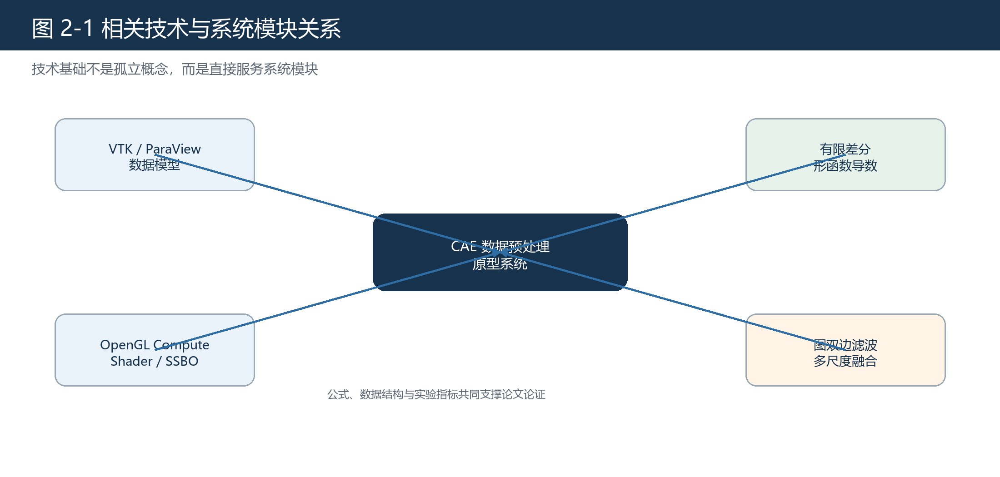

# 第二章 相关技术与理论基础

## 2.1 技术体系概述

本文系统由数据模型、GPU 并行计算、梯度计算、数据优化和实验评价五部分共同支撑。VTK/ParaView 数据模型为数据读写、字段关联方式和工程对照提供基础；OpenGL Compute Shader 与 SSBO 为 GPU 侧并行计算提供执行机制；规则网格有限差分和非结构化网格形函数导数构成梯度计算的两条主线；图双边滤波和多尺度融合用于处理局部随机高频数值扰动；平均相对误差、时间对比和改进比用于支撑实验结论。

图 2-1 展示本章技术与系统模块之间的关系。

## 2.2 CAE 后处理数据模型

CAE 后处理数据通常由网格和属性两部分组成。网格描述空间离散结构，属性描述物理量在网格上的分布。ParaView 文档将 VTK 数据模型概括为 mesh 和 attributes，其中 mesh 包含 points 和 cells，cells 可表示四面体、六面体等离散单元[4]。这与有限元和工程仿真数据的组织方式一致。

点数据和单元数据是本文必须区分的两个概念。点数据定义在网格节点上，适合表示节点位移、节点温度或节点场变量；单元数据定义在单元上，常用于表示单元平均值、单元应力或单元级结果。vtkGradientFilter 文档也说明，梯度结果会保持输入字段的关联方式，即点数据输入得到点数据梯度，单元数据输入得到单元数据梯度[3]。因此本文系统在内部字段描述中保留字段名称、分量数和关联方式，避免计算和导出时混淆。

设网格点集合为

$$
\mathcal{P}=\{\boldsymbol{x}_i\in\mathbb{R}^3\mid i=1,2,\ldots,n_p\},
$$

单元集合为

$$
\mathcal{C}=\{c_e=(i_1,i_2,\ldots,i_{n_e})\mid e=1,2,\ldots,n_c\}.
$$

其中 \(\boldsymbol{x}_i=(x_i,y_i,z_i)^T\) 表示第 \(i\) 个点坐标，\(c_e\) 表示第 \(e\) 个单元的节点索引序列，\(n_e\) 表示该单元的节点数。该符号与有限元文献中常用的节点坐标和单元连接记法一致[9]。

## 2.3 VTK、ParaView 与本文系统的关系

VTK 是科学可视化的基础工具库，提供数据结构、读写接口、过滤器和渲染支持。ParaView 则在 VTK 基础上提供交互式可视化环境。本文使用 VTK 的目的不是减少工作量，而是利用其成熟的数据生态：一方面，VTK 能读取和写出实验数据；另一方面，vtkGradientFilter 可以作为真实字段工程一致性对照；此外，导出的 VTK 文件可以在 ParaView 中继续观察。

vtkGradientFilter 是本文实验中的重要参考。文档说明，该过滤器用于估计数据集中字段的梯度，计算方式与输入数据集类型有关，输出分量顺序为每个输入分量对应 \(x,y,z\) 三个方向导数[3]。若输入标量场为 \(u\)，则输出梯度为

$$
\nabla u =
\begin{bmatrix}
\dfrac{\partial u}{\partial x}\\[4pt]
\dfrac{\partial u}{\partial y}\\[4pt]
\dfrac{\partial u}{\partial z}
\end{bmatrix}.
$$

若输入为 \(m\) 分量向量场 \(\boldsymbol{u}=(u_1,\ldots,u_m)^T\)，则每个分量分别输出三方向导数，输出分量数为 \(3m\)。这与本文系统的梯度数组组织方式一致。

## 2.4 OpenGL Compute Shader 与 GPU 缓冲

OpenGL Compute Shader 是 OpenGL 中用于通用计算的着色器阶段。它通过工作组和线程编号执行任务，不直接依赖传统渲染图元。Khronos 文档说明，Compute Shader 可以用于图形管线外的通用 GPU 计算[1]。本文将每个点或单元的局部计算映射为一个或一组线程，使梯度计算和滤波计算能够并行执行。

SSBO 是本文数据传输的重要机制。Khronos 文档说明，Shader Storage Buffer Object 能够在 GLSL 中存储和读取数据，并且容量大于传统 uniform buffer，支持着色器端读写[2]。本文将点坐标、字段值、单元连接、单元类型、邻域偏移和输出结果组织为连续数组并上传到 GPU 缓冲区。着色器端通过索引访问这些数组，避免复杂对象结构进入 GPU 端。

设第 \(g\) 个 GPU 线程处理第 \(i\) 个采样位置，可写作

$$
i = g,\qquad g=\texttt{gl\_GlobalInvocationID.x}.
$$

对规则网格，线程编号还可恢复为

$$
i_x = i \bmod n_x,\quad
i_y = \left\lfloor \frac{i}{n_x} \right\rfloor \bmod n_y,\quad
i_z = \left\lfloor \frac{i}{n_xn_y} \right\rfloor.
$$

该映射使规则网格有限差分能够在 GPU 上按点并行执行。

## 2.5 规则网格有限差分与链式法则

有限差分法适用于具有规则逻辑索引的数据。需要注意的是，本文规则网格路径并不是简单假设物理空间一定为正交均匀网格，而是先在规则网格的逻辑/参数坐标中做差分，再通过链式法则映射到物理空间。该处理方式与曲线网格或结构网格中常见的“计算坐标到物理坐标映射”写法一致，相关数值计算文献也通常先在变换后的规则计算域中离散，再由 Jacobian 关系恢复物理空间导数[25][26]。

设规则网格的逻辑坐标为

$$
\boldsymbol{\xi}=(\xi,\eta,\zeta)^T,
$$

物理坐标为

$$
\boldsymbol{x}=\boldsymbol{x}(\boldsymbol{\xi})=(x(\boldsymbol{\xi}),y(\boldsymbol{\xi}),z(\boldsymbol{\xi}))^T.
$$

对标量场 \(u\)，先在参数空间中估计

$$
\nabla_{\boldsymbol{\xi}}u
=
\begin{bmatrix}
\dfrac{\partial u}{\partial \xi}\\[4pt]
\dfrac{\partial u}{\partial \eta}\\[4pt]
\dfrac{\partial u}{\partial \zeta}
\end{bmatrix}.
$$

在内部点处，三个参数方向上的中心差分可写为

$$
\left.\frac{\partial u}{\partial \xi}\right|_{i,j,k}
\approx
\frac{u_{i+1,j,k}-u_{i-1,j,k}}{2},
$$

$$
\left.\frac{\partial u}{\partial \eta}\right|_{i,j,k}
\approx
\frac{u_{i,j+1,k}-u_{i,j-1,k}}{2},\qquad
\left.\frac{\partial u}{\partial \zeta}\right|_{i,j,k}
\approx
\frac{u_{i,j,k+1}-u_{i,j,k-1}}{2}.
$$

边界点缺少一侧邻点时使用单边差分，例如左边界 \(i=0\) 可写为

$$
\left.\frac{\partial u}{\partial \xi}\right|_{0,j,k}
\approx
u_{1,j,k}-u_{0,j,k}.
$$

与此同时，还需要用相同的差分模板估计几何映射导数，构造局部 Jacobian：

$$
\mathbf{J}
=
\frac{\partial\boldsymbol{x}}{\partial\boldsymbol{\xi}}
=
\begin{bmatrix}
\dfrac{\partial x}{\partial \xi} & \dfrac{\partial x}{\partial \eta} & \dfrac{\partial x}{\partial \zeta}\\[6pt]
\dfrac{\partial y}{\partial \xi} & \dfrac{\partial y}{\partial \eta} & \dfrac{\partial y}{\partial \zeta}\\[6pt]
\dfrac{\partial z}{\partial \xi} & \dfrac{\partial z}{\partial \eta} & \dfrac{\partial z}{\partial \zeta}
\end{bmatrix}.
$$

根据链式法则，有

$$
\nabla_{\boldsymbol{\xi}}u
=
\mathbf{J}^{T}\nabla_{\boldsymbol{x}}u,
$$

因此物理空间梯度为

$$
\nabla_{\boldsymbol{x}}u
=
\mathbf{J}^{-T}\nabla_{\boldsymbol{\xi}}u.
$$

若把逆 Jacobian 写成

$$
\mathbf{J}^{-1}
=
\frac{\partial\boldsymbol{\xi}}{\partial\boldsymbol{x}}
=
\begin{bmatrix}
\xi_x & \xi_y & \xi_z\\
\eta_x & \eta_y & \eta_z\\
\zeta_x & \zeta_y & \zeta_z
\end{bmatrix},
$$

则物理空间三个方向的梯度分量可展开为

$$
\begin{aligned}
u_x &= \xi_x u_{\xi}+\eta_x u_{\eta}+\zeta_x u_{\zeta},\\
u_y &= \xi_y u_{\xi}+\eta_y u_{\eta}+\zeta_y u_{\zeta},\\
u_z &= \xi_z u_{\xi}+\eta_z u_{\eta}+\zeta_z u_{\zeta}.
\end{aligned}
$$

该展开式也解释了规则网格着色器实现中的两个步骤：先对字段值和样本坐标分别做参数方向差分，构造 \(\nabla_{\boldsymbol{\xi}}u\) 与 \(\mathbf{J}\)；再用 \(\mathbf{J}^{-T}\) 将参数空间导数映射为物理空间梯度。`FD.glsl` 中的 `xix`、`etax`、`zetax` 等变量正对应 \(\xi_x\)、\(\eta_x\)、\(\zeta_x\) 等逆 Jacobian 系数。若物理网格恰好是正交均匀笛卡尔网格，则 \(\mathbf{J}\) 退化为对角尺度矩阵，上式自然退化为常见的 \(\Delta x,\Delta y,\Delta z\) 有限差分公式。

## 2.6 非结构化网格形函数导数理论

非结构化网格由不同单元拼接而成，缺少规则索引关系。本文采用基于形函数导数的方法计算其梯度。有限元理论中，单元内部字段通常由节点值和形函数插值表示[9]。对第 \(e\) 个单元，设局部坐标为 \(\boldsymbol{\xi}=(\xi,\eta,\zeta)^T\)，节点数为 \(n_e\)，节点值为 \(u_a\)，形函数为 \(N_a(\boldsymbol{\xi})\)，则单元内字段近似为

$$
u^e(\boldsymbol{\xi})=\sum_{a=1}^{n_e}N_a(\boldsymbol{\xi})u_a.
$$

物理坐标同样由节点坐标插值得到：

$$
\boldsymbol{x}^e(\boldsymbol{\xi})
=\sum_{a=1}^{n_e}N_a(\boldsymbol{\xi})\boldsymbol{x}_a.
$$

局部坐标到物理坐标的 Jacobian 矩阵为

$$
\mathbf{J}
=
\frac{\partial \boldsymbol{x}}{\partial \boldsymbol{\xi}}
=
\sum_{a=1}^{n_e}\boldsymbol{x}_a
\left(\nabla_{\boldsymbol{\xi}}N_a\right)^T.
$$

形函数物理空间导数由链式法则得到：

$$
\nabla_{\boldsymbol{x}}N_a
=
\mathbf{J}^{-T}\nabla_{\boldsymbol{\xi}}N_a.
$$

因此单元内梯度可写为

$$
\nabla_{\boldsymbol{x}}u^e
=
\sum_{a=1}^{n_e}u_a\nabla_{\boldsymbol{x}}N_a.
$$

该组公式采用有限元文献中常见的 \(N_a\)、\(\boldsymbol{\xi}\)、\(\boldsymbol{x}\)、\(\mathbf{J}\) 和 \(\nabla_{\boldsymbol{x}}\) 记法[9][10]，与本文非结构化网格形函数导数路径一致。

## 2.7 图双边滤波与多尺度融合

数据优化模块的理论基础来自保边平滑。Tomasi 和 Manduchi 提出的双边滤波同时考虑空间接近性和数值相似性，能够在平滑图像的同时保留边缘[11]。Fleishman 等将类似思想扩展到网格去噪，说明局部邻域滤波可以在几何数据上抑制噪声并保留特征[12]。

设采样位置 \(i\) 的坐标为 \(\boldsymbol{x}_i\)，字段值为 \(u_i\)，邻域为 \(\mathcal{N}(i)\)。图双边滤波可写为

$$
\tilde{u}_i
=
\frac{1}{W_i}
\sum_{j\in\mathcal{N}(i)}
w_{ij}u_j,
\qquad
W_i=\sum_{j\in\mathcal{N}(i)}w_{ij}.
$$

权重由空间项和值域项相乘：

$$
w_{ij}
=
\exp\left(-\frac{\|\boldsymbol{x}_i-\boldsymbol{x}_j\|^2}{2\sigma_s^2}\right)
\exp\left(-\frac{(u_i-u_j)^2}{2\sigma_r^2}\right).
$$

其中 \(\sigma_s\) 控制空间邻近尺度，\(\sigma_r\) 控制字段值差异尺度。多尺度融合可写为

$$
u^{(0)}=u,\qquad
u^{(\ell+1)}=B_{\sigma_s^{(\ell)},\sigma_r}\left(u^{(\ell)}\right),
$$

$$
d^{(\ell)}=u^{(\ell)}-u^{(\ell+1)},\qquad
\hat{u}=u^{(L)}+\sum_{\ell=0}^{L-1}\alpha_\ell d^{(\ell)}.
$$

其中 \(B\) 表示双边滤波算子，\(d^{(\ell)}\) 表示第 \(\ell\) 层细节，\(\alpha_\ell\) 表示细节回注权重。本文实验只使用高斯扰动代理局部随机高频扰动，不将该模块扩展为通用异常值处理。

## 2.8 实验评价指标

解析场实验使用平均相对误差。设系统结果为 \(g_i\)，参考结果为 \(g_i^\ast\)，样本数为 \(n\)，则可写为

$$
E_{\mathrm{rel}}
=
\frac{1}{n}\sum_{i=1}^{n}
\frac{\|g_i-g_i^\ast\|_2}{\|g_i^\ast\|_2+\varepsilon},
$$

其中 \(\varepsilon\) 为防止分母为零的稳定项。时间实验使用加速比：

$$
S_{\mathrm{VTK}}
=
\frac{T_{\mathrm{VTK}}}{T_{\mathrm{sys}}},
$$

其中 \(T_{\mathrm{VTK}}\) 为 VTK 并行时间，\(T_{\mathrm{sys}}\) 为系统总时间。数据优化实验使用改进比：

$$
R_{\mathrm{imp}}
=
\frac{E_{\mathrm{after}}}{E_{\mathrm{before}}}.
$$

当 \(R_{\mathrm{imp}}<1\) 时，表示优化后误差低于输入误差。

## 2.9 本章参考文献

本章引用文献：[1]、[2]、[3]、[4]、[6]、[8]、[9]、[10]、[11]、[12]、[25]、[26]。
