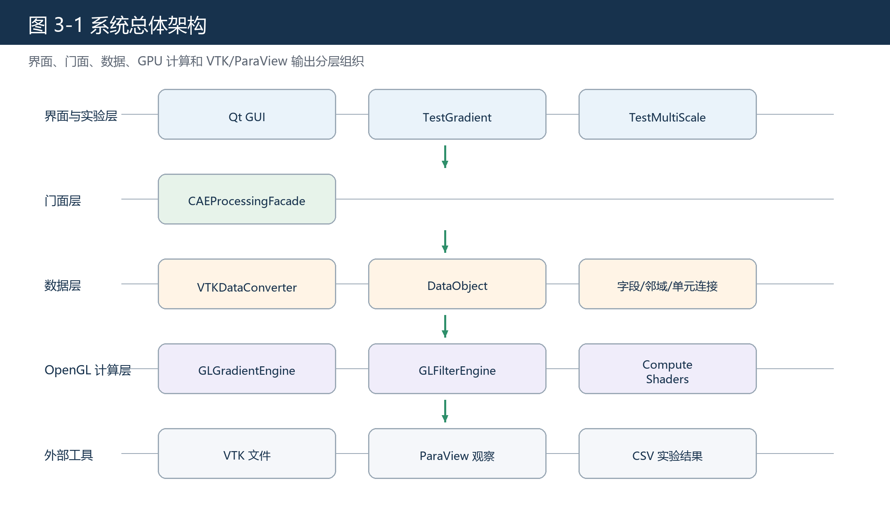

# 第三章 系统需求分析与总体设计

## 3.1 需求分析概述

本文系统面向 CAE 后处理阶段的数据预处理任务，核心需求不是提供完整可视分析平台，而是形成一条从 VTK 数据读入、内部数据转换、GPU 计算、结果写回到 VTK 导出的闭环流程。需求分析围绕数据输入、内部表示、梯度计算、数据优化、结果导出和实验复现展开，后续总体架构、算法实现和实验设计均与这些需求对应。

## 3.2 功能需求

系统功能需求包括五类。第一，数据加载需求。系统应能读取 VTK 格式数据，获得点坐标、单元连接、单元类型、点数据和单元数据。第二，数据转换需求。系统应能把 VTK 数据转换为统一内部数据对象，使规则网格和非结构化网格都能进入同一处理框架。第三，梯度计算需求。系统应根据网格类型选择规则网格有限差分或非结构化网格形函数导数方法。第四，数据优化需求。系统应能针对局部随机高频数值扰动执行平滑与边缘保持处理。第五，结果导出需求。系统应能将派生字段写回数据对象并导出为 VTK 文件。

| 需求类别 | 具体内容 | 对应章节 |
| --- | --- | --- |
| 数据加载 | 读取 VTK 文件，提取点、单元和字段 | 第三章、第四章 |
| 梯度计算 | 规则网格有限差分，非结构化网格形函数导数 | 第四章、第五章 |
| 数据优化 | 高斯扰动代理下的局部高频扰动抑制 | 第四章、第五章 |
| 结果导出 | 写回字段并导出 VTK | 第三章、第四章 |
| 实验复现 | 输出解析场、VTK 对照、时间和优化结果 | 第五章 |

## 3.3 非功能需求

非功能需求主要包括可复现性、可扩展性、性能和口径一致性。可复现性要求实验程序能够重复生成论文中的表格数据。可扩展性要求内部数据结构能够继续支持更多字段和更多单元类型。性能要求核心计算尽可能利用 GPU 并行能力，并在实验中与 VTK 并行时间进行对照。口径一致性要求 GUI、测试程序和论文描述使用同一底层逻辑，避免演示功能与实验功能不一致。

## 3.4 总体架构

图 3-1 展示系统总体架构。该结构对应工程型论文中常见的分层设计写法[19][21]：界面与实验层负责操作入口，门面层负责业务调度，数据层负责结构转换，OpenGL 计算层负责核心算法。

## 3.5 内部数据对象设计

内部数据对象需要同时适配 CPU 管理和 GPU 访问。点坐标保存为连续浮点数组，单元连接保存为索引数组，单元偏移用于确定每个单元包含的点范围，单元类型用于区分三角形、四边形、四面体和六面体等类型。字段数组保存字段名、分量数、关联方式和扁平数据。

设字段 \(u\) 有 \(m\) 个分量，点数据数组可表示为

$$
\mathbf{U}_{p}\in\mathbb{R}^{n_p\times m},
$$

单元数据数组可表示为

$$
\mathbf{U}_{c}\in\mathbb{R}^{n_c\times m}.
$$

梯度输出对应为

$$
\nabla \mathbf{U}_{p}\in\mathbb{R}^{n_p\times 3m},\qquad
\nabla \mathbf{U}_{c}\in\mathbb{R}^{n_c\times 3m}.
$$

这一表示与 vtkGradientFilter 的输出分量组织保持一致[3]，也便于导出后在 ParaView 中观察。

## 3.6 门面层设计

门面层承担统一调度职责。加载数据时，它调用转换模块生成内部数据对象并保存数据集记录。执行梯度计算时，它检查字段是否存在，再根据网格类型选择有限差分或形函数导数。执行数据优化时，它读取字段和邻域图，调用滤波与融合引擎。计算结束后，门面层统一记录结果字段名、源字段、字段关联方式、输出分量数和时间信息。

## 3.7 GUI 与测试程序设计

GUI 主要用于演示和基础操作，包括打开 VTK 文件、选择字段、执行梯度计算、执行数据优化和导出结果。测试程序主要用于生成实验数据，包括解析场验证、VTK 一致性对比、时间对比和数据优化实验。两者共享同一底层接口，保证论文表格与系统演示使用同一实现路径。

## 3.8 本章参考文献

本章引用文献：[3]、[4]。
