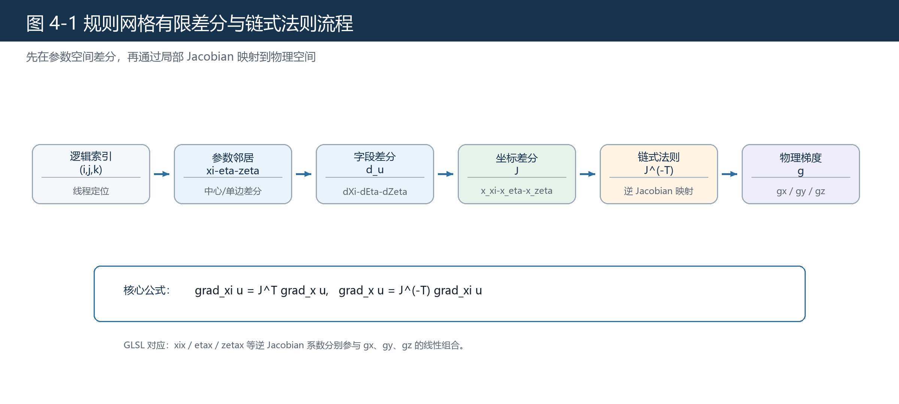
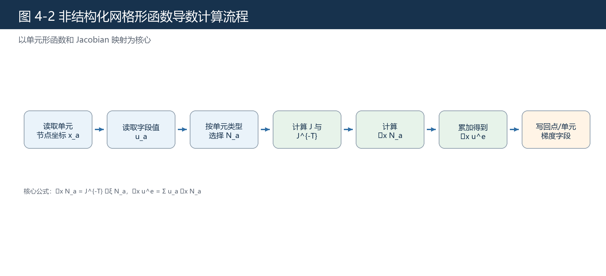
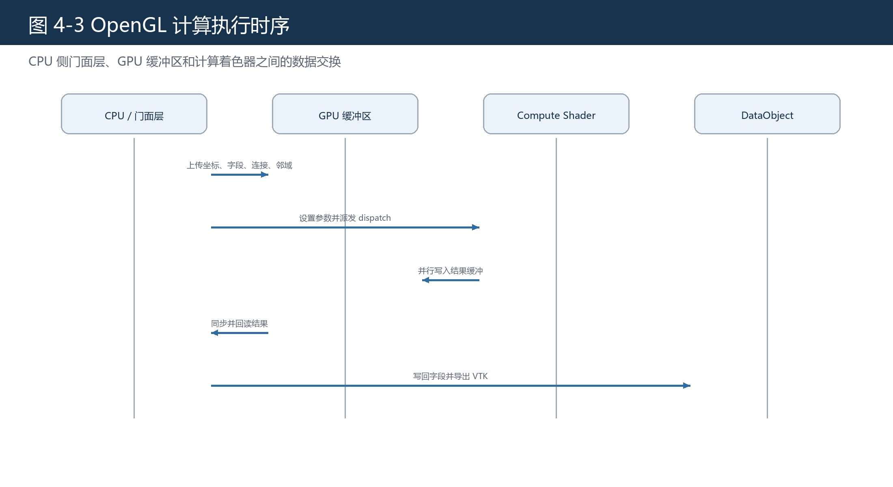

# 第四章 核心算法设计与实现

## 4.1 算法实现概述

本文核心算法围绕梯度计算和数据优化两类任务展开。梯度计算部分根据网格类型分为规则网格有限差分路径和非结构化网格形函数导数路径；数据优化部分以图双边滤波和多尺度融合为基础，面向局部随机高频数值扰动进行平滑与边缘保持处理。算法均以连续数组和 GPU 缓冲为输入输出，并由 OpenGL Compute Shader 并行执行。

## 4.2 规则网格有限差分梯度

规则网格具有明确的逻辑维度。本文实现中，规则网格梯度计算包含两个阶段：第一阶段在逻辑/参数坐标 \(\boldsymbol{\xi}=(\xi,\eta,\zeta)^T\) 上进行有限差分；第二阶段通过链式法则将参数空间导数映射到物理空间 \(\boldsymbol{x}=(x,y,z)^T\)。这一点与 `Shaders/FD.glsl` 中的实现一致。

图 4-1 展示规则网格有限差分算法的实际计算顺序。该算法的差分模板作用在 \(\xi,\eta,\zeta\) 三个参数方向上，最终通过 Jacobian 逆转置得到 \(x,y,z\) 物理方向梯度。

对内部点，字段值在三个参数方向上的差分为

$$
d_{\xi}u
\approx
\frac{u_{i+1,j,k}-u_{i-1,j,k}}{2},\qquad
d_{\eta}u
\approx
\frac{u_{i,j+1,k}-u_{i,j-1,k}}{2},
$$

$$
d_{\zeta}u
\approx
\frac{u_{i,j,k+1}-u_{i,j,k-1}}{2}.
$$

边界点采用单边差分，例如

$$
d_{\xi}u\big|_{0,j,k}
\approx
u_{1,j,k}-u_{0,j,k}.
$$

同一组邻居也用于估计几何映射导数。例如，

$$
\frac{\partial \boldsymbol{x}}{\partial \xi}
\approx
\frac{\boldsymbol{x}_{i+1,j,k}-\boldsymbol{x}_{i-1,j,k}}{2},
$$

边界处则退化为

$$
\frac{\partial \boldsymbol{x}}{\partial \xi}\bigg|_{0,j,k}
\approx
\boldsymbol{x}_{1,j,k}-\boldsymbol{x}_{0,j,k}.
$$

由三个参数方向的几何导数可构造 Jacobian：

$$
\mathbf{J}
=
\left[
\frac{\partial\boldsymbol{x}}{\partial\xi}\quad
\frac{\partial\boldsymbol{x}}{\partial\eta}\quad
\frac{\partial\boldsymbol{x}}{\partial\zeta}
\right].
$$

参数空间梯度为

$$
\nabla_{\boldsymbol{\xi}}u
=
\begin{bmatrix}
d_{\xi}u\\
d_{\eta}u\\
d_{\zeta}u
\end{bmatrix}.
$$

根据链式法则，

$$
\nabla_{\boldsymbol{x}}u
=
\mathbf{J}^{-T}\nabla_{\boldsymbol{\xi}}u.
$$

将 \(\mathbf{J}^{-1}\) 的分量记为

$$
\mathbf{J}^{-1}
=
\begin{bmatrix}
\xi_x & \xi_y & \xi_z\\
\eta_x & \eta_y & \eta_z\\
\zeta_x & \zeta_y & \zeta_z
\end{bmatrix},
$$

则着色器最终输出的三个物理梯度分量为

$$
\begin{aligned}
g_x &= \xi_x d_{\xi}u+\eta_x d_{\eta}u+\zeta_x d_{\zeta}u,\\
g_y &= \xi_y d_{\xi}u+\eta_y d_{\eta}u+\zeta_y d_{\zeta}u,\\
g_z &= \xi_z d_{\xi}u+\eta_z d_{\eta}u+\zeta_z d_{\zeta}u.
\end{aligned}
$$

表 4-1 给出数学符号与 `FD.glsl` 变量的对应关系。

| 数学量 | `FD.glsl` 中的对应变量 | 含义 |
|---|---|---|
| \(\partial\boldsymbol{x}/\partial\xi\) | `xxi`、`yxi`、`zxi` | \(\xi\) 方向坐标差分，构成 Jacobian 第一列 |
| \(\partial\boldsymbol{x}/\partial\eta\) | `xeta`、`yeta`、`zeta` | \(\eta\) 方向坐标差分，构成 Jacobian 第二列 |
| \(\partial\boldsymbol{x}/\partial\zeta\) | `xzeta`、`yzeta`、`zzeta` | \(\zeta\) 方向坐标差分，构成 Jacobian 第三列 |
| \(\det(\mathbf{J})\) | `aj` | 判断局部几何映射是否退化 |
| \(\xi_x,\eta_x,\zeta_x\) | `xix`、`etax`、`zetax` | 参与 \(g_x\) 的逆 Jacobian 系数 |
| \(\xi_y,\eta_y,\zeta_y\) | `xiy`、`etay`、`zetay` | 参与 \(g_y\) 的逆 Jacobian 系数 |
| \(\xi_z,\eta_z,\zeta_z\) | `xiz`、`etaz`、`zetaz` | 参与 \(g_z\) 的逆 Jacobian 系数 |
| \(u_{\xi},u_{\eta},u_{\zeta}\) | `dXi`、`dEta`、`dZeta` | 字段值在参数方向上的有限差分 |

在着色器实现中，程序先读取 \(i,j,k\) 三个方向的前后邻居，分别计算字段差分和坐标差分；坐标差分构造局部 Jacobian，字段差分构造 \(\nabla_{\boldsymbol{\xi}}u\)；随后显式计算逆 Jacobian 对应的系数，将参数空间导数组合成 \(g_x,g_y,g_z\)。若 Jacobian 退化，程序会将逆映射压为零，避免无效值继续扩散。对于多分量字段，系统对每个分量分别执行上述过程，输出分量数为输入分量数的三倍。

## 4.3 非结构化网格形函数导数梯度

非结构化网格通过单元连接描述拓扑关系。本文支持一阶三角形、四边形、四面体和六面体四类单元。对单元 \(e\)，字段插值写为

$$
u^e(\boldsymbol{\xi})
=
\sum_{a=1}^{n_e} N_a(\boldsymbol{\xi})u_a,
$$

物理坐标映射写为

$$
\boldsymbol{x}^e(\boldsymbol{\xi})
=
\sum_{a=1}^{n_e} N_a(\boldsymbol{\xi})\boldsymbol{x}_a.
$$

根据有限元理论[9]，Jacobian 和形函数物理导数分别为

$$
\mathbf{J}
=
\frac{\partial\boldsymbol{x}}{\partial\boldsymbol{\xi}},\qquad
\nabla_{\boldsymbol{x}} N_a
=
\mathbf{J}^{-T}\nabla_{\boldsymbol{\xi}}N_a.
$$

因此单元内梯度为

$$
\nabla_{\boldsymbol{x}}u^e
=
\sum_{a=1}^{n_e}u_a\nabla_{\boldsymbol{x}}N_a.
$$

图 4-2 展示非结构化网格形函数导数计算流程。

## 4.4 数据优化算法

设采样位置 \(i\) 的坐标为 \(\boldsymbol{x}_i\)，字段值为 \(u_i\)，邻域为 \(\mathcal{N}(i)\)。双边滤波结果为

$$
\tilde{u}_i
=
\frac{1}{W_i}
\sum_{j\in\mathcal{N}(i)}w_{ij}u_j,
\qquad
W_i=\sum_{j\in\mathcal{N}(i)}w_{ij}.
$$

权重为

$$
w_{ij}
=
\exp\left(-\frac{\|\boldsymbol{x}_i-\boldsymbol{x}_j\|^2}{2\sigma_s^2}\right)
\exp\left(-\frac{(u_i-u_j)^2}{2\sigma_r^2}\right).
$$

该公式沿用双边滤波中空间核和值域核相乘的写法[11]。对于多尺度融合，设 \(u^{(0)}=u\)，第 \(\ell\) 层平滑结果为

$$
u^{(\ell+1)}
=
B_{\sigma_s^{(\ell)},\sigma_r}(u^{(\ell)}),
$$

细节层和最终融合结果为

$$
d^{(\ell)}=u^{(\ell)}-u^{(\ell+1)},\qquad
\hat{u}=u^{(L)}+\sum_{\ell=0}^{L-1}\alpha_\ell d^{(\ell)}.
$$

本文实验仅验证该模块对高斯扰动代理的局部随机高频扰动有效，不扩展到所有噪声类型。

## 4.5 OpenGL 计算流程

图 4-3 展示 OpenGL 计算流程。SSBO 支持较大规模结构化数据读写[2]，适合保存 CAE 数据中的坐标、字段和连接关系。

## 4.6 本章参考文献

本章引用文献：[1]、[2]、[3]、[9]、[10]、[11]、[12]、[25]、[26]。
