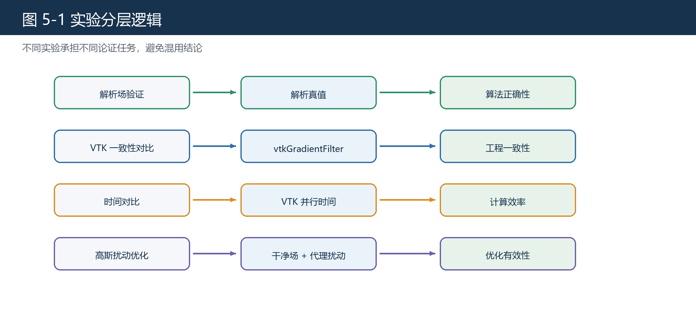
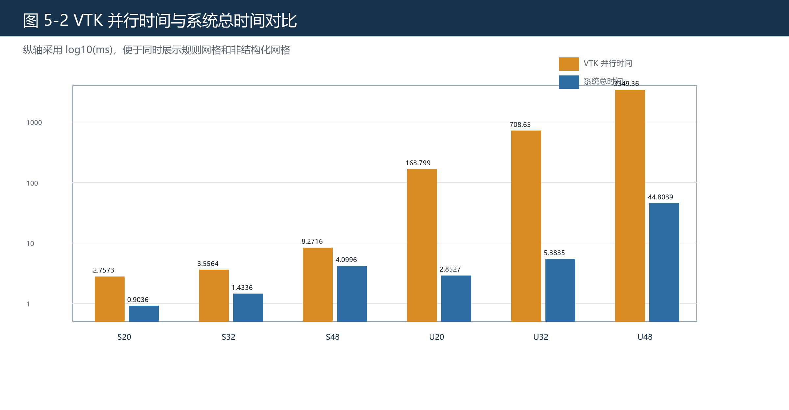
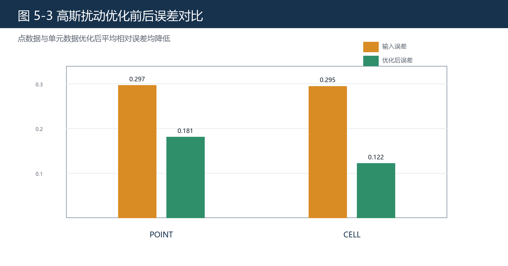

# 第五章 实验设计与结果分析

## 5.1 实验目标与组织

本文实验分为四组：解析场验证、与 VTK 结果一致性对比、与 VTK 的时间对比、数据优化实验。四组实验分别支撑算法正确性、工程一致性、性能表现和优化有效性。解析场实验使用已知真值验证梯度计算是否正确；VTK 一致性实验使用 vtkGradientFilter 作为工程参考；时间实验比较系统总时间、GPU 计算时间与 VTK 并行时间；数据优化实验使用高斯扰动代理局部随机高频扰动，比较优化前后的误差变化。

图 5-1 展示本文实验分层逻辑。

## 5.2 实验指标

解析场和 VTK 对照使用平均相对误差：

$$
E_{\mathrm{rel}}
=
\frac{1}{n}\sum_{i=1}^{n}
\frac{\|g_i-g_i^\ast\|_2}{\|g_i^\ast\|_2+\varepsilon}.
$$

其中 \(g_i\) 为系统计算结果，\(g_i^\ast\) 为解析真值或 VTK 参考结果，\(\varepsilon\) 为稳定项。时间实验使用 VTK 并行时间、系统总时间和 GPU 计算时间。加速比定义为

$$
S_{\mathrm{VTK}}
=
\frac{T_{\mathrm{VTK}}}{T_{\mathrm{sys}}}.
$$

数据优化实验使用改进比

$$
R_{\mathrm{imp}}
=
\frac{E_{\mathrm{after}}}{E_{\mathrm{before}}}.
$$

当 \(R_{\mathrm{imp}}<1\) 时，表示优化后误差降低。

## 5.3 解析场验证实验

解析场验证的目标是证明算法本身正确。由于解析场具有已知真值，系统计算结果可以直接与真值比较。本文分别构造线性标量场和线性向量场。三维数据集在归一化局部坐标上构造一次函数，1_0 数据集在曲面局部切向坐标上构造一次函数。

### 5.3.1 线性标量场

| 数据集 | 场函数说明 | 平均相对误差 |
| --- | --- | --- |
| SampleStructGrid | 三维线性标量场 | 2.82038e-07 |
| hexa | 三维线性标量场 | 1.57998e-07 |
| 1_0 | 曲面切向线性标量场 | 1.68088e-07 |

### 5.3.2 线性向量场

| 数据集 | 场函数说明 | 平均相对误差 |
| --- | --- | --- |
| SampleStructGrid | 三维线性向量场 | 3.30256e-07 |
| hexa | 三维线性向量场 | 2.36149e-07 |
| 1_0 | 曲面切向线性向量场 | 1.32859e-07 |

从结果看，所有平均相对误差均处于 \(10^{-7}\) 量级。SampleStructGrid 结果说明规则网格有限差分路径正确；hexa 结果说明三维非结构化网格形函数导数路径正确；1_0 结果说明曲面切向场构造下二维非结构化曲面网格也能得到稳定结果。因此，解析场验证可以作为梯度模块正确性的直接证据。

## 5.4 与 VTK 结果一致性对比实验

真实字段通常没有解析真值，因此本文使用 vtkGradientFilter 作为工程参考。VTK 文档说明该过滤器用于估计数据集字段梯度，且输出字段关联方式与输入一致[3]。因此，本文将系统结果与 VTK 结果进行对比，用于说明工程输出一致性。

### 5.4.1 点数据对比

| 数据集 | 字段 | 平均相对误差 |
| --- | --- | --- |
| SampleStructGrid | scalars | 8.22437e-08 |
| hexa | scalars | 6.27285e-08 |
| 1_0 | RF | 5.63477e-08 |

### 5.4.2 单元数据对比

| 数据集 | 字段 | 平均相对误差 |
| --- | --- | --- |
| SampleStructGrid | scalars | 7.62786e-07 |
| limb | chem_0 | 3.89516e-07 |
| 1_0 | S_Mises | 7.77806e-08 |

点数据实验中，三个数据集误差均为 \(10^{-8}\) 量级。单元数据实验中，误差为 \(10^{-7}\) 到 \(10^{-6}\) 量级。该结果说明系统在真实字段上与 VTK 保持较高一致性。需要强调，这组实验不替代解析场验证，而是补充说明系统在工程数据上的输出可信度。

## 5.5 与 VTK 的时间对比实验

时间实验使用统一生成的同构网格族，而不是任意真实模型。这样可以减少模型差异对时间结果的影响，使数据规模和计算时间之间的关系更清晰。实验记录 VTK 并行线程数、VTK 并行时间、系统总时间和 GPU 计算时间。

### 5.5.1 规则网格时间对比

| 数据集 | 点数/单元数 | VTK 并行线程数 | VTK 并行时间/ms | 系统总时间/ms | GPU计算时间/ms |
| --- | --- | --- | --- | --- | --- |
| timing_struct_20x20x20 | 8000 / 6859 | 16 | 2.7573 | 0.9036 | 0.025272 |
| timing_struct_32x32x32 | 32768 / 29791 | 16 | 3.5564 | 1.4336 | 0.043732 |
| timing_struct_48x48x48 | 110592 / 103823 | 16 | 8.2716 | 4.0996 | 0.107692 |

规则网格实验中，系统总时间从 0.9036 ms 增至 4.0996 ms，GPU 计算时间从 0.025272 ms 增至 0.107692 ms。对应 VTK 并行时间从 2.7573 ms 增至 8.2716 ms。系统总时间始终低于 VTK 并行时间，说明有限差分路径在当前测试条件下具有较好的执行效率。

### 5.5.2 非结构化网格时间对比

| 数据集 | 点数/单元数 | VTK 并行线程数 | VTK 并行时间/ms | 系统总时间/ms | GPU计算时间/ms |
| --- | --- | --- | --- | --- | --- |
| timing_uhex_20x20x20 | 8000 / 6859 | 16 | 163.799 | 2.8527 | 0.623896 |
| timing_uhex_32x32x32 | 32768 / 29791 | 16 | 708.650 | 5.3835 | 2.53781 |
| timing_uhex_48x48x48 | 110592 / 103823 | 16 | 3349.36 | 44.8039 | 7.91991 |

非结构化网格实验中，系统总时间从 2.8527 ms 增至 44.8039 ms，GPU 计算时间从 0.623896 ms 增至 7.91991 ms。对应 VTK 并行时间从 163.799 ms 增至 3349.36 ms。结果表明，随着规模增大，OpenGL 实现仍保持明显时间优势。该结论只针对当前硬件、数据和 VTK 并行配置，不应泛化为所有环境下的绝对结论。

## 5.6 数据优化实验

数据优化实验的目标是验证系统对局部随机高频数值扰动的抑制能力。实验在 ShipHull_0 数据集上构造干净场，并叠加高斯扰动作为代理模型。随后运行数据优化模块，比较输入数据和优化后数据的平均相对误差。

| 关联方式 | 输入数据平均相对误差 | 优化后数据平均相对误差 | 改进比 |
| --- | --- | --- | --- |
| POINT | 0.296642 | 0.180858 | 0.610772 |
| CELL | 0.294558 | 0.121921 | 0.414806 |

POINT 关联方式下，平均相对误差由 0.296642 降至 0.180858，改进比为 0.610772。CELL 关联方式下，平均相对误差由 0.294558 降至 0.121921，改进比为 0.414806。两类字段优化后误差均低于输入误差，说明该模块对目标扰动具有稳定抑制效果。

## 5.7 实验讨论

本文实验设计的关键是分层论证。解析场验证回答“算法是否正确”，VTK 一致性回答“工程输出是否可靠”，时间实验回答“当前实现是否具有效率优势”，数据优化实验回答“目标扰动下是否有效”。如果将这些实验混在一起，论文结论会变得不清晰。

实验结果也有边界。第一，解析场主要覆盖线性标量场和线性向量场，能够证明当前路径对线性场的正确性，但不等于覆盖所有复杂物理场。第二，VTK 对照说明系统与成熟工具接近，但 VTK 本身不是解析真值。第三，时间结果依赖当前硬件、驱动、VTK 构建和数据规模。第四，数据优化实验只使用高斯扰动代理局部随机高频扰动，不能扩展为对所有噪声类型有效。

## 5.8 本章参考文献

本章引用文献：[3]、[4]、[11]、[12]。
