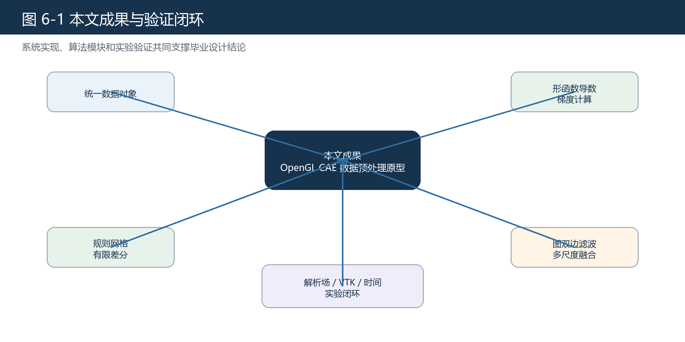

# 第六章 总结与展望

## 6.1 本章概述

本章对全文工作进行总结，说明系统实现、算法验证、工程一致性、时间性能和数据优化实验所支撑的结论，并在当前实现边界内分析不足和后续改进方向。本文结论只针对当前系统、当前数据集和当前实验环境，不将原型系统泛化为完整 CAE 后处理平台。

## 6.2 工作总结

本文围绕 CAE 后处理阶段的数据预处理问题，完成了一套基于 OpenGL 的原型系统。系统以 VTK 数据读写为基础，以统一内部数据结构为核心，以 OpenGL Compute Shader 为计算执行手段，实现了规则网格梯度计算、非结构化网格梯度计算、局部随机高频扰动优化、结果写回和 VTK 导出。

在梯度计算方面，本文将技术路线收敛为规则网格有限差分法和非结构化网格形函数导数法。规则网格路径利用网格逻辑维度在参数方向上计算字段差分和坐标差分，再通过局部 Jacobian 与链式法则映射到物理空间梯度；非结构化网格路径利用单元形函数导数和几何映射计算梯度。解析场验证表明，两条路径在对应数据集上均达到 \(10^{-7}\) 量级误差。

在工程一致性方面，本文将系统结果与 vtkGradientFilter 进行对比。点数据真实字段误差达到 \(10^{-8}\) 量级，单元数据真实字段误差主要处于 \(10^{-7}\) 到 \(10^{-6}\) 量级。该结果说明当前系统输出与 VTK 参考结果具有较高一致性。

在性能方面，本文使用统一生成的规则网格族和非结构化六面体网格族进行时间实验。结果显示，系统总时间和 GPU 计算时间均明显低于当前测试条件下的 VTK 并行时间，说明 OpenGL 实现具有较好的并行效率。

在数据优化方面，本文将模块定位为面向一类局部随机高频数值扰动的抑制与边缘保持处理。实验使用高斯扰动作为代理模型。结果显示，点数据和单元数据优化后平均相对误差均低于输入误差，说明该模块在目标场景下有效。

图 6-1 总结了本文完成的主要内容。

## 6.3 本文特点

本文第一个特点是系统链路完整。项目不是单独实现一个公式或一个界面，而是形成了从 VTK 数据输入、内部数据转换、GPU 计算、结果写回到 VTK 导出的闭环。这种闭环能够支撑答辩时的功能演示和实验复现。

第二个特点是实验口径清晰。解析场验证、VTK 一致性、时间对比和数据优化实验承担不同论证任务。这样的组织方式符合工程型论文写法，也符合本科论文对逻辑构建和专业能力的要求[14][15]。

第三个特点是结论边界明确。本文没有把系统描述为完整 CAE 后处理平台，也没有把数据优化模块描述为通用噪声处理器，而是严格围绕当前实现和实验数据展开。这种收敛后的表述更符合本科毕业设计的实际完成情况。

## 6.4 不足之处

当前系统仍然是原型系统。首先，非结构化网格单元类型支持范围有限，目前主要覆盖一阶三角形、四边形、四面体和六面体。真实工程数据中可能存在更多高阶单元、混合单元或特殊单元，后续仍需扩展。

其次，数据优化实验使用高斯扰动作为代理模型，能够说明模块对一类局部随机高频扰动有效，但不能覆盖所有真实 CAE 扰动来源。真实工程结果中的误差可能与求解器、网格质量、边界条件、材料模型和后处理恢复方式有关，需要更丰富实验进一步验证。

第三，系统 GUI 目前主要服务于基础演示和结果导出，还不具备完整可视分析软件的交互能力。若要发展为更完整工具，还需要增加渲染控制、字段管理、参数调节、批处理配置和异常提示等功能。

第四，本文时间实验虽然显示当前系统具有优势，但实验环境仍有限。不同 GPU、不同驱动、不同 VTK 并行后端和不同数据规模都可能影响结果。后续若要形成更强工程结论，需要在更多环境中复现实验。

## 6.5 后续展望

后续工作可以从四个方面展开。第一，扩展更多单元类型和更复杂字段类型，使系统能够处理更广泛的工程数据。第二，完善数据优化实验，引入更接近真实 CAE 误差来源的扰动模型和评价指标。第三，增加自动化测试和批处理能力，使实验结果更容易复现。第四，将预处理模块与后续可视化模块更紧密结合，形成更完整的后处理数据准备流程。

从技术发展角度看，VTK-m 等工作说明科学可视化框架正在面向大规模线程架构演进[7]。本文虽然没有使用 VTK-m，但其思路与“将可视化和数据处理算法映射到并行硬件”这一趋势一致。后续可以继续比较 OpenGL、CUDA、VTK-m 等不同技术路线的适用性。

## 6.6 本章参考文献

本章引用文献：[7]、[25]、[26]。
